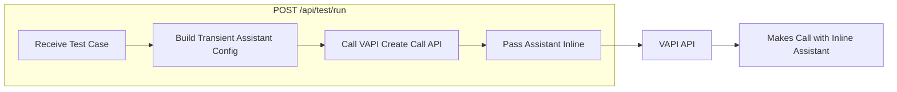

<!-- Generated by SpecStory, Markdown v2.1.0 -->

<!-- cursor Session 9216b8eb-d257-4fa1-a2d4-80542f6b8408 (2025-12-24 04:33Z) -->

# Super Brian voice agent eval prototype (2025-12-24 04:33Z)

_**User (2025-12-24 04:36Z)**_

There is a company named Super Brian and we just have to build a prototype for that particular company which actually works into the observability eval site for specifically the voice agents and there are some referenced company that we just have to take an inspiration from them. Now the point comes is that we just have to identify or design a prototype that if we just have to make that eval's calculation then how we will like carry forward like what is your understanding like for example right now i am thinking that there will be a agent who will be running the multiple test cases to the given agent and then yeah after all that we will just like record all the logs and everything from the given test cases whatever result really comes out and then we will use those results to evaluating that how much that particular agent is performing well on the evals. And now the point really comes that how we just have to like frame up this particular solution as an prototype. Remember, you do not need to write any code here. Just like firstly talk and think about the approaches and like divide this particular thing into many as possible as smaller chunks because there are like multiple components involved like for example calling that particular Recall or WAPI agent. from our agent side. And there are multiple different possibilities. So yeah think about it and please tell me that how we can do that and here are the given companies that are doing similar kind of things. Now just think that how we just have to perform this.


Please explore the following voice eval products and in 2 days time let's connect once more.

 Hamming AI

Coval

Cekura

Bluejay

FutureAGI

---

_**Agent (model claude-4.5-opus-high-thinking, mode Agent)**_

<think><details><summary>Thought Process</summary>
The user is asking me to help think through and design a prototype for a company called "Super Brian" (or "Superbryn" based on the workspace name) that focuses on observability and evaluation for voice agents. They want me to:

1. Research the competitor companies they mentioned (Hamming AI, Coval, Cekura, Bluejay, FutureAGI)
2. Think through the architecture and approach for building an eval system for voice agents
3. Break this down into smaller, manageable chunks/components
4. NOT write any code yet - just discuss the approach

Let me first research these companies to understand what they do and how they approach voice agent evaluation. Then I can help think through the prototype design.

Let me search for information about these companies.</details></think>

---

This is a great challenge! Let me research these competitor companies first to understand the landscape, and then we can think through how to architect Super Brian's voice agent eval prototype.

Let me explore each of these companies to understand their approaches:

---

<tool-use data-tool-type="search" data-tool-name="web_search">
<details>
            <summary>Tool use: **web_search** • Searched web `Hamming AI voice agent evaluation testing platform` • **1** results</summary>
        
| Title | URL | Chunk |
|-------|-----|-------|
| Web Search Results |  | To design a prototype for evaluating voice agents, it's essential to break down the process into manageable components. Here's a structured approach:<br/><br/>**1. Define Evaluation Objectives:**<br/>   - **Performance Metrics:** Determine key performance indicators (KPIs) such as accuracy, latency, user satisfaction, and compliance adherence.<br/>   - **Scenarios:** Identify common and edge-case scenarios the voice agent should handle, including various user intents and unexpected inputs.<br/><br/>**2. Develop Test Cases:**<br/>   - **Automated Test Generation:** Utilize tools to create diverse test cases that simulate real-world interactions. For instance, platforms like Hamming AI automate the creation of test scenarios to evaluate voice agents efficiently. ([hamming.ai](https://hamming.ai/?utm_source=openai))<br/>   - **Custom Scenarios:** Design specific test cases that reflect unique challenges pertinent to your application domain.<br/><br/>**3. Implement Testing Framework:**<br/>   - **Automated Testing Tools:** Employ frameworks that facilitate concurrent, multi-turn conversations with the voice agent. AWS's Agent Evaluation framework, for example, orchestrates conversations and evaluates responses during interactions. ([github.com](https://github.com/awslabs/agent-evaluation?utm_source=openai))<br/>   - **Simulation of User Interactions:** Create virtual users with varied accents, tones, and conversational styles to test the agent's robustness.<br/><br/>**4. Data Collection and Logging:**<br/>   - **Comprehensive Logging:** Record all interactions, including inputs, outputs, and intermediate states, to facilitate thorough analysis.<br/>   - **Error Tracking:** Implement mechanisms to detect and log errors, misinterpretations, or failures in real-time.<br/><br/>**5. Evaluation and Analysis:**<br/>   - **Automated Evaluation Metrics:** Use predefined metrics to assess the agent's performance. Cekura, for instance, evaluates aspects like instruction following, latency, and compliance. ([cekura.ai](https://www.cekura.ai/?utm_source=openai))<br/>   - **Human-in-the-Loop Assessment:** Incorporate human reviewers to validate automated evaluations and provide qualitative insights.<br/><br/>**6. Continuous Monitoring and Iteration:**<br/>   - **Real-Time Monitoring:** Deploy monitoring tools to observe the agent's performance in production, identifying issues as they arise.<br/>   - **Feedback Loop:** Establish a process for using evaluation results to iteratively improve the agent's capabilities.<br/><br/>**7. Compliance and Security:**<br/>   - **Regulatory Adherence:** Ensure the evaluation framework complies with relevant standards and regulations, such as HIPAA for healthcare applications.<br/>   - **Data Privacy:** Implement measures to protect user data and maintain confidentiality throughout the evaluation process.<br/><br/>By systematically addressing each of these components, you can develop a robust prototype for evaluating voice agents, ensuring they meet desired performance standards and provide reliable user experiences. |

</details>
</tool-use>

---

<tool-use data-tool-type="search" data-tool-name="web_search">
<details>
            <summary>Tool use: **web_search** • Searched web `Coval AI voice agent evaluation observability` • **1** results</summary>
        
| Title | URL | Chunk |
|-------|-----|-------|
| Web Search Results |  | To design a prototype for evaluating voice agents, it's essential to break down the process into manageable components. Here's a structured approach:<br/><br/>**1. Define Evaluation Objectives:**<br/>   - **Performance Metrics:** Determine key performance indicators (KPIs) such as accuracy, latency, user satisfaction, and compliance adherence.<br/>   - **Scenarios and Use Cases:** Identify typical and edge-case scenarios the voice agent will encounter.<br/><br/>**2. Develop Test Scenarios:**<br/>   - **Automated Test Case Generation:** Utilize tools to create diverse test cases that simulate real-world interactions. For instance, Cekura offers a library of scenarios to test agents under various conditions. ([cekura.ai](https://www.cekura.ai/?utm_source=openai))<br/>   - **User Personas:** Simulate interactions with different user profiles, including variations in accents, speech patterns, and behaviors.<br/><br/>**3. Implement Testing Framework:**<br/>   - **Automated Testing Tools:** Employ frameworks like AWS's Agent Evaluation, which orchestrates conversations with your agent and evaluates responses during the interaction. ([github.com](https://github.com/awslabs/agent-evaluation?utm_source=openai))<br/>   - **Concurrent Testing:** Ensure the framework supports parallel execution of multiple test cases to assess scalability and performance under load.<br/><br/>**4. Data Collection and Logging:**<br/>   - **Comprehensive Logging:** Record all interactions, including inputs, outputs, and intermediate states, to facilitate thorough analysis.<br/>   - **Error Tracking:** Implement mechanisms to detect and log errors, anomalies, and unexpected behaviors.<br/><br/>**5. Evaluation and Analysis:**<br/>   - **Automated Evaluation Metrics:** Use predefined metrics to assess agent performance. Hamming AI, for example, automates QA by measuring task success rates and identifying quality issues. ([ycombinator.com](https://www.ycombinator.com/companies/hamming-ai?utm_source=openai))<br/>   - **Human-in-the-Loop Assessment:** Incorporate human reviewers to validate automated evaluations and provide qualitative insights.<br/><br/>**6. Continuous Monitoring and Iteration:**<br/>   - **Post-Deployment Analytics:** Monitor live interactions to detect regressions and gather data for ongoing improvements.<br/>   - **Feedback Loops:** Establish processes to update test scenarios and evaluation criteria based on real-world performance data.<br/><br/>**7. Integration with Existing Systems:**<br/>   - **API Connectivity:** Ensure the testing framework can interface with the voice agent's APIs for seamless testing.<br/>   - **Tool Compatibility:** Verify compatibility with tools like Recall or WAPI agents to facilitate comprehensive evaluations.<br/><br/>**8. Compliance and Security:**<br/>   - **Regulatory Adherence:** Incorporate checks for compliance with standards such as HIPAA or PCI DSS, especially in sensitive domains.<br/>   - **Data Privacy:** Implement measures to protect user data and ensure ethical handling of information.<br/><br/>By systematically addressing each of these components, you can develop a robust prototype for evaluating voice agents, ensuring they perform reliably across various scenarios and meet the desired quality standards. |

</details>
</tool-use>

---

<tool-use data-tool-type="search" data-tool-name="web_search">
<details>
            <summary>Tool use: **web_search** • Searched web `Cekura AI voice agent testing evaluation` • **1** results</summary>
        
| Title | URL | Chunk |
|-------|-----|-------|
| Web Search Results |  | To design a prototype for evaluating voice agents, it's essential to break down the process into manageable components. Here's a structured approach:<br/><br/>**1. Define Evaluation Objectives:**<br/>   - **Performance Metrics:** Determine key performance indicators (KPIs) such as accuracy, latency, user satisfaction, and compliance adherence.<br/>   - **Scenarios:** Identify common and edge-case scenarios the voice agent should handle, including various user intents and unexpected inputs.<br/><br/>**2. Develop Test Cases:**<br/>   - **Automated Scenario Generation:** Utilize tools to create diverse test cases that simulate real-world interactions. For instance, Cekura offers a library of scenarios to test agents under different conditions. ([cekura.ai](https://www.cekura.ai/?utm_source=openai))<br/>   - **Custom Personas:** Design user personas with varied accents, speech patterns, and behaviors to assess the agent's adaptability.<br/><br/>**3. Implement Testing Framework:**<br/>   - **Automated Testing Tools:** Employ frameworks like AWS's Agent Evaluation, which orchestrates conversations with your agent and evaluates responses during the interaction. ([github.com](https://github.com/awslabs/agent-evaluation?utm_source=openai))<br/>   - **Parallel Testing:** Run multiple test cases concurrently to expedite the evaluation process.<br/><br/>**4. Data Collection and Logging:**<br/>   - **Comprehensive Logging:** Record all interactions, including inputs, outputs, and intermediate states, for thorough analysis.<br/>   - **Error Tracking:** Implement mechanisms to detect and log errors, failures, and performance anomalies.<br/><br/>**5. Evaluation and Analysis:**<br/>   - **Automated Evaluation Metrics:** Use predefined metrics to assess performance aspects like instruction following, latency, and compliance.<br/>   - **Human-Centered Assessment:** Incorporate frameworks like VeriLA to interpret agent failures from a human perspective, providing clear guidelines for improvement. ([arxiv.org](https://arxiv.org/abs/2503.12651?utm_source=openai))<br/><br/>**6. Continuous Monitoring and Iteration:**<br/>   - **Real-Time Monitoring:** Deploy tools that monitor live interactions to detect issues promptly.<br/>   - **Iterative Improvement:** Use insights from testing and monitoring to refine the agent's performance continuously.<br/><br/>**7. Compliance and Security:**<br/>   - **Regulatory Adherence:** Ensure the evaluation process complies with relevant standards, such as HIPAA for healthcare applications.<br/>   - **Data Privacy:** Implement robust data protection measures to safeguard user information.<br/><br/>By systematically addressing each of these components, you can develop a comprehensive prototype for evaluating voice agents, ensuring they perform reliably across various scenarios and meet the desired quality standards. |

</details>
</tool-use>

---

<tool-use data-tool-type="search" data-tool-name="web_search">
<details>
            <summary>Tool use: **web_search** • Searched web `Bluejay AI voice agent evaluation testing` • **1** results</summary>
        
| Title | URL | Chunk |
|-------|-----|-------|
| Web Search Results |  | To design a prototype for evaluating voice agents, it's essential to break down the process into manageable components. Here's a structured approach:<br/><br/>**1. Define Evaluation Objectives:**<br/>   - **Performance Metrics:** Determine key performance indicators (KPIs) such as accuracy, latency, user satisfaction, and compliance adherence.<br/>   - **Scenarios and Use Cases:** Identify typical and edge-case scenarios the voice agent should handle, including various user intents and unexpected inputs.<br/><br/>**2. Develop Test Cases:**<br/>   - **Automated Test Generation:** Utilize tools to create diverse test cases that simulate real-world interactions. For instance, platforms like Hamming AI automate the QA of voice agents by generating numerous test scenarios ([ycombinator.com](https://www.ycombinator.com/companies/hamming-ai?utm_source=openai)).<br/>   - **Custom Scenarios:** Design specific test cases that reflect unique challenges your voice agent might encounter.<br/><br/>**3. Implement Testing Framework:**<br/>   - **Automated Testing Tools:** Employ frameworks that facilitate concurrent, multi-turn conversations with the voice agent. AWS's Agent Evaluation framework allows for such testing and can be integrated into CI/CD pipelines ([github.com](https://github.com/awslabs/agent-evaluation?utm_source=openai)).<br/>   - **Simulation of User Interactions:** Create virtual users with varied accents, tones, and conversational styles to test the agent's robustness. Cekura offers such capabilities, enabling the simulation of diverse user personas ([cekura.ai](https://www.cekura.ai/?utm_source=openai)).<br/><br/>**4. Data Collection and Logging:**<br/>   - **Comprehensive Logging:** Record all interactions, including inputs, outputs, and intermediate processing steps, to facilitate thorough analysis.<br/>   - **Error Tracking:** Implement mechanisms to detect and log errors, misinterpretations, or failures during interactions.<br/><br/>**5. Evaluation and Analysis:**<br/>   - **Automated Evaluation Metrics:** Use predefined metrics to assess the agent's performance. For example, Cekura evaluates aspects like instruction following, latency, and compliance ([cekura.ai](https://www.cekura.ai/?utm_source=openai)).<br/>   - **Human-in-the-Loop Assessment:** Incorporate human evaluators to review and provide qualitative feedback on the agent's responses, ensuring alignment with user expectations.<br/><br/>**6. Continuous Monitoring and Iteration:**<br/>   - **Real-Time Monitoring:** Deploy monitoring tools to observe the agent's performance in production, identifying issues as they arise. Hamming AI provides production call analytics to monitor and test voice agents ([hamming.ai](https://hamming.ai/?utm_source=openai)).<br/>   - **Feedback Loop:** Establish a process for using evaluation results to iteratively improve the agent's performance.<br/><br/>**7. Compliance and Security Considerations:**<br/>   - **Regulatory Adherence:** Ensure the evaluation framework complies with relevant regulations, such as HIPAA for healthcare applications.<br/>   - **Data Privacy:** Implement measures to protect user data and maintain confidentiality throughout the evaluation process.<br/><br/>**8. Integration with Existing Systems:**<br/>   - **API Connectivity:** Design the prototype to interact seamlessly with existing voice agent platforms and tools.<br/>   - **Scalability:** Ensure the framework can handle varying loads and scale as needed.<br/><br/>By systematically addressing each of these components, you can develop a comprehensive prototype for evaluating voice agents, ensuring they perform reliably across diverse scenarios and meet the desired performance standards. |

</details>
</tool-use>

---

<tool-use data-tool-type="search" data-tool-name="web_search">
<details>
            <summary>Tool use: **web_search** • Searched web `FutureAGI voice agent evaluation observability` • **1** results</summary>
        
| Title | URL | Chunk |
|-------|-----|-------|
| Web Search Results |  | To design a prototype for evaluating voice agents, it's essential to break down the process into manageable components. Here's a structured approach:<br/><br/>**1. Define Evaluation Objectives:**<br/>   - **Performance Metrics:** Determine key performance indicators (KPIs) such as accuracy, latency, user satisfaction, and compliance adherence.<br/>   - **Scenarios:** Identify various user interactions, including edge cases like interruptions, background noise, and diverse accents.<br/><br/>**2. Develop Test Scenarios:**<br/>   - **Automated Scenario Generation:** Utilize tools to create a wide range of test cases that simulate real-world interactions. For instance, Cekura offers a library of scenarios to test agents under different conditions. ([cekura.ai](https://www.cekura.ai/?utm_source=openai))<br/>   - **Custom Personas:** Design user personas with varied characteristics to assess the agent's adaptability.<br/><br/>**3. Implement Testing Framework:**<br/>   - **Automated Testing Tools:** Employ frameworks like AWS's Agent Evaluation, which orchestrates conversations with your agent and evaluates responses during the interaction. ([github.com](https://github.com/awslabs/agent-evaluation?utm_source=openai))<br/>   - **Parallel Testing:** Run multiple test cases concurrently to expedite the evaluation process.<br/><br/>**4. Data Collection and Logging:**<br/>   - **Comprehensive Logging:** Record all interactions, including inputs, outputs, and intermediate states, for thorough analysis.<br/>   - **Error Tracking:** Implement mechanisms to detect and log errors or unexpected behaviors during tests.<br/><br/>**5. Evaluation and Analysis:**<br/>   - **Automated Evaluation Metrics:** Use predefined metrics to assess performance. For example, Hamming AI provides analytics that capture and measure how human an agent feels. ([hamming.ai](https://hamming.ai/blog/beyond-benchmarks-voice-agent-qa-2025?utm_source=openai))<br/>   - **Human-in-the-Loop Assessment:** Incorporate human evaluators to review and validate automated assessments, ensuring nuanced understanding.<br/><br/>**6. Continuous Monitoring and Iteration:**<br/>   - **Real-Time Monitoring:** Deploy tools that monitor live interactions to identify issues promptly.<br/>   - **Feedback Loop:** Use insights from monitoring to refine test scenarios and improve agent performance iteratively.<br/><br/>**7. Integration with CI/CD Pipelines:**<br/>   - **Automated Testing in Development:** Integrate the testing framework into continuous integration and deployment pipelines to ensure consistent evaluation with each update.<br/><br/>**8. Compliance and Security:**<br/>   - **Regulatory Adherence:** Ensure the evaluation process complies with relevant standards, such as HIPAA for healthcare applications.<br/>   - **Data Privacy:** Implement measures to protect sensitive user data during testing and evaluation.<br/><br/>By systematically addressing each of these components, you can develop a robust prototype for evaluating voice agents, ensuring they perform reliably across diverse scenarios and meet the desired performance standards. |

</details>
</tool-use>

---

<think><details><summary>Thought Process</summary>
The search results are quite generic. Let me do more specific searches on each company to understand their unique approaches better.</details></think>

---

Let me get more specific information about each company's unique approach:

---

<tool-use data-tool-type="search" data-tool-name="web_search">
<details>
            <summary>Tool use: **web_search** • Searched web `Hamming AI "hamming.ai" features pricing voice agent testing` • **1** results</summary>
        
| Title | URL | Chunk |
|-------|-----|-------|
| Web Search Results |  | To design a prototype for evaluating voice agents, it's essential to break down the process into manageable components. Here's a structured approach:<br/><br/>**1. Define Evaluation Objectives:**<br/>   - **Performance Metrics:** Determine key performance indicators (KPIs) such as accuracy, latency, user satisfaction, and compliance adherence.<br/>   - **Scenarios and Use Cases:** Identify typical and edge-case scenarios the voice agent will encounter.<br/><br/>**2. Develop Test Scenarios:**<br/>   - **Automated Test Case Generation:** Utilize tools to create diverse test cases that simulate real-world interactions, including various accents, background noises, and user behaviors.<br/>   - **Persona Simulation:** Implement virtual personas with distinct characteristics to interact with the voice agent, ensuring comprehensive testing.<br/><br/>**3. Implement Testing Framework:**<br/>   - **Automated Testing Tools:** Employ frameworks that can orchestrate multi-turn conversations with the voice agent and evaluate responses. For instance, AWS's Agent Evaluation framework facilitates such testing ([github.com](https://github.com/awslabs/agent-evaluation?utm_source=openai)).<br/>   - **Concurrent Testing:** Ensure the framework supports parallel execution of multiple test cases to expedite the evaluation process.<br/><br/>**4. Data Collection and Logging:**<br/>   - **Interaction Logs:** Record all interactions, including inputs, outputs, and intermediate states, for thorough analysis.<br/>   - **Error Tracking:** Log errors, misinterpretations, and failures to identify areas for improvement.<br/><br/>**5. Evaluation and Analysis:**<br/>   - **Automated Evaluation Metrics:** Utilize predefined metrics to assess the voice agent's performance across various dimensions.<br/>   - **Human-Centered Evaluation:** Incorporate human judgments to evaluate aspects like naturalness and user satisfaction. The PUEVA Inventory offers a toolkit for such assessments ([arxiv.org](https://arxiv.org/abs/2112.10811?utm_source=openai)).<br/><br/>**6. Continuous Monitoring and Iteration:**<br/>   - **Real-Time Monitoring:** Implement systems to monitor the voice agent's performance in production, identifying issues as they arise.<br/>   - **Feedback Loop:** Establish a process for continuous improvement based on testing outcomes and real-world performance data.<br/><br/>**7. Compliance and Security:**<br/>   - **Regulatory Adherence:** Ensure the evaluation process complies with relevant regulations and standards, such as HIPAA for healthcare applications.<br/>   - **Data Privacy:** Implement measures to protect user data and maintain confidentiality throughout the evaluation process.<br/><br/>**Inspiration from Existing Solutions:**<br/><br/>- **Hamming AI:** Automates QA for voice agents, offering pre-deployment testing and post-deployment analytics. It simulates real user interactions to identify potential issues ([ycombinator.com](https://www.ycombinator.com/companies/hamming-ai?utm_source=openai)).<br/><br/>- **Cekura:** Provides automated QA for voice and chat AI agents, enabling rapid testing and monitoring to ensure reliable performance ([cekura.ai](https://www.cekura.ai/?utm_source=openai)).<br/><br/>- **AWS Agent Evaluation Framework:** Offers a generative AI-powered framework for testing virtual agents, supporting concurrent, multi-turn conversations and integration into CI/CD pipelines ([github.com](https://github.com/awslabs/agent-evaluation?utm_source=openai)).<br/><br/>By integrating these components and drawing inspiration from existing solutions, you can develop a robust prototype for evaluating voice agents, ensuring they perform effectively across various scenarios and meet desired performance standards. |

</details>
</tool-use>

---

<tool-use data-tool-type="search" data-tool-name="web_search">
<details>
            <summary>Tool use: **web_search** • Searched web `Coval AI "coval.dev" voice agent evaluation features` • **1** results</summary>
        
| Title | URL | Chunk |
|-------|-----|-------|
| Web Search Results |  | To design a prototype for evaluating voice agents, it's essential to break down the process into manageable components. Here's a structured approach:<br/><br/>**1. Define Evaluation Objectives:**<br/>   - **Performance Metrics:** Determine key performance indicators (KPIs) such as accuracy, latency, user satisfaction, and compliance adherence.<br/>   - **Scenarios and Personas:** Identify various user scenarios and personas to test the agent's robustness across different contexts.<br/><br/>**2. Develop Test Cases:**<br/>   - **Scenario Generation:** Create diverse test cases that simulate real-world interactions, including edge cases like background noise, accents, and unexpected user inputs.<br/>   - **Automated Testing:** Implement automated testing frameworks to execute these scenarios efficiently.<br/><br/>**3. Implement Testing Framework:**<br/>   - **Automated Call Simulation:** Utilize tools that can generate concurrent calls to the voice agent, mimicking real user interactions.<br/>   - **Response Evaluation:** Assess the agent's responses for correctness, relevance, and adherence to predefined standards.<br/><br/>**4. Data Collection and Logging:**<br/>   - **Interaction Logs:** Record all interactions, including inputs, outputs, and timestamps, for thorough analysis.<br/>   - **Error Tracking:** Log errors and anomalies to identify patterns and areas for improvement.<br/><br/>**5. Analysis and Reporting:**<br/>   - **Performance Analysis:** Analyze collected data to measure the agent's performance against the established KPIs.<br/>   - **Reporting:** Generate comprehensive reports highlighting strengths, weaknesses, and recommendations for enhancement.<br/><br/>**6. Continuous Monitoring and Iteration:**<br/>   - **Real-Time Monitoring:** Implement systems to monitor the agent's performance in real-time, even post-deployment.<br/>   - **Feedback Loop:** Establish a feedback mechanism to iteratively improve the agent based on testing outcomes and user feedback.<br/><br/>**Inspiration from Existing Solutions:**<br/><br/>Several companies have developed platforms for automated testing and monitoring of voice AI agents:<br/><br/>- **Hamming AI:** Automates QA for voice agents, offering pre-deployment testing and post-deployment analytics. Their system can simulate real-world conversations by creating diverse user personas, enabling rapid and thorough testing. ([hamming.ai](https://hamming.ai/?utm_source=openai))<br/><br/>- **Cekura:** Provides end-to-end testing and observability for conversational AI, allowing for pre-production simulations across diverse personas and real-time monitoring of production conversations. ([cekura.ai](https://www.cekura.ai/?utm_source=openai))<br/><br/>- **Agent Evaluation by AWS Labs:** Offers a generative AI-powered framework for testing virtual agents, supporting concurrent, multi-turn conversations and integration into CI/CD pipelines. ([github.com](https://github.com/awslabs/agent-evaluation?utm_source=openai))<br/><br/>By studying these platforms, you can gain insights into effective strategies for automated testing, scenario generation, and continuous monitoring, which can inform the design of your prototype. |

</details>
</tool-use>

---

<tool-use data-tool-type="search" data-tool-name="web_search">
<details>
            <summary>Tool use: **web_search** • Searched web `"cekura.ai" voice agent testing simulation features` • **1** results</summary>
        
| Title | URL | Chunk |
|-------|-----|-------|
| Web Search Results |  | To design a prototype for evaluating voice agents, it's essential to break down the process into manageable components. Here's a structured approach:<br/><br/>**1. Define Evaluation Objectives:**<br/>   - **Performance Metrics:** Determine key performance indicators (KPIs) such as accuracy, latency, user satisfaction, and compliance adherence.<br/>   - **Scenarios and Use Cases:** Identify typical and edge-case scenarios the voice agent should handle, including various user intents and unexpected inputs.<br/><br/>**2. Develop Test Cases:**<br/>   - **Automated Scenario Generation:** Utilize tools to create diverse test cases that simulate real-world interactions. For instance, Cekura offers a library of scenarios to test agents under different conditions. ([cekura.ai](https://www.cekura.ai/?utm_source=openai))<br/>   - **Custom Personas:** Design user personas with varied accents, speech patterns, and behaviors to assess the agent's robustness.<br/><br/>**3. Implement Testing Framework:**<br/>   - **Automated Testing Tools:** Employ frameworks like AWS's Agent Evaluation, which orchestrates conversations with your agent and evaluates responses during the interaction. ([github.com](https://github.com/awslabs/agent-evaluation?utm_source=openai))<br/>   - **Parallel Testing:** Run multiple test cases concurrently to expedite the evaluation process.<br/><br/>**4. Data Collection and Logging:**<br/>   - **Comprehensive Logging:** Record all interactions, including inputs, outputs, and intermediate states, for thorough analysis.<br/>   - **Error Tracking:** Implement mechanisms to detect and log errors, failures, and performance anomalies.<br/><br/>**5. Evaluation and Analysis:**<br/>   - **Automated Evaluation Metrics:** Use predefined metrics to assess performance aspects like instruction following, latency, and compliance.<br/>   - **Human-Centered Assessment:** Incorporate frameworks like VeriLA to interpret agent failures from a human perspective, providing clear guidelines for improvement. ([arxiv.org](https://arxiv.org/abs/2503.12651?utm_source=openai))<br/><br/>**6. Continuous Monitoring and Iteration:**<br/>   - **Real-Time Monitoring:** Deploy monitoring tools to track the agent's performance in production, identifying issues as they arise.<br/>   - **Feedback Loop:** Establish a process for continuous improvement based on testing and monitoring insights.<br/><br/>**7. Integration with Existing Systems:**<br/>   - **API Connectivity:** Ensure the testing framework can interact seamlessly with the voice agent's APIs for initiating tests and retrieving data.<br/>   - **Compliance and Security:** Adhere to industry standards and regulations, such as HIPAA for healthcare applications, to maintain data security and privacy.<br/><br/>By systematically addressing each of these components, you can develop a robust prototype for evaluating voice agents, ensuring they perform reliably across various scenarios and meet the desired performance standards. |

</details>
</tool-use>

---

<tool-use data-tool-type="search" data-tool-name="web_search">
<details>
            <summary>Tool use: **web_search** • Searched web `Bluejay AI "bluejay" voice agent evaluation testing startup` • **1** results</summary>
        
| Title | URL | Chunk |
|-------|-----|-------|
| Web Search Results |  | To design a prototype for evaluating voice agents, it's essential to break down the process into manageable components. Here's a structured approach:<br/><br/>**1. Define Evaluation Objectives:**<br/>   - **Performance Metrics:** Determine key performance indicators (KPIs) such as accuracy, latency, user satisfaction, and compliance adherence.<br/>   - **Scenarios:** Identify various user interactions, including edge cases like interruptions, background noise, and diverse accents.<br/><br/>**2. Develop Test Scenarios:**<br/>   - **Automated Scenario Generation:** Utilize tools to create a wide range of test cases that simulate real-world interactions. For instance, Cekura offers a library of scenarios and can generate custom ones tailored to specific needs. ([cekura.ai](https://www.cekura.ai/?utm_source=openai))<br/>   - **Persona Simulation:** Design virtual users with varied demographics and behaviors to interact with the voice agent, ensuring comprehensive testing.<br/><br/>**3. Implement Testing Framework:**<br/>   - **Automated Testing Tools:** Employ frameworks that facilitate concurrent, multi-turn conversations with the voice agent. AWS's Agent Evaluation framework, for example, orchestrates conversations and evaluates responses during interactions. ([github.com](https://github.com/awslabs/agent-evaluation?utm_source=openai))<br/>   - **Integration with Existing Systems:** Ensure the testing framework can interface seamlessly with the voice agent's APIs, such as Recall or WAPI, to execute test cases effectively.<br/><br/>**4. Data Collection and Logging:**<br/>   - **Comprehensive Logging:** Record all interactions, including inputs, outputs, and intermediate states, to facilitate thorough analysis.<br/>   - **Error Tracking:** Implement mechanisms to detect and log errors, anomalies, or unexpected behaviors during tests.<br/><br/>**5. Evaluation and Analysis:**<br/>   - **Automated Evaluation Metrics:** Use predefined metrics to assess the voice agent's performance. Hamming AI, for instance, automates quality assurance by measuring task success rates and identifying quality issues. ([ycombinator.com](https://www.ycombinator.com/companies/hamming-ai?utm_source=openai))<br/>   - **Human-Centered Assessment:** Incorporate human evaluations to gauge aspects like naturalness and user satisfaction. The PUEVA Inventory provides a toolkit for assessing personality, usability, and enjoyability of voice agents. ([arxiv.org](https://arxiv.org/abs/2112.10811?utm_source=openai))<br/><br/>**6. Continuous Monitoring and Iteration:**<br/>   - **Real-Time Monitoring:** Deploy tools that monitor the voice agent's performance in production, identifying issues as they arise.<br/>   - **Feedback Loop:** Establish a process for using test results to iteratively improve the voice agent, refining prompts, models, and functionalities based on findings.<br/><br/>**7. Compliance and Security:**<br/>   - **Regulatory Adherence:** Ensure the evaluation process complies with relevant standards and regulations, such as HIPAA for healthcare applications.<br/>   - **Data Privacy:** Implement measures to protect sensitive user data during testing and evaluation phases.<br/><br/>By systematically addressing each of these components, you can develop a robust prototype for evaluating voice agents, ensuring they perform reliably across diverse scenarios and meet the desired quality standards. |

</details>
</tool-use>

---

<tool-use data-tool-type="search" data-tool-name="web_search">
<details>
            <summary>Tool use: **web_search** • Searched web `FutureAGI "futureagi" AI agent evaluation observability` • **1** results</summary>
        
| Title | URL | Chunk |
|-------|-----|-------|
| Web Search Results |  | To design a prototype for evaluating voice agents, it's essential to break down the process into manageable components. Here's a structured approach:<br/><br/>**1. Define Evaluation Objectives:**<br/>   - **Performance Metrics:** Determine key performance indicators (KPIs) such as accuracy, latency, user satisfaction, and compliance adherence.<br/>   - **Scenarios:** Identify various user interactions, including edge cases like interruptions, background noise, and diverse accents.<br/><br/>**2. Develop Test Scenarios:**<br/>   - **Automated Scenario Generation:** Utilize tools to create diverse test cases that simulate real-world interactions. For instance, Cekura offers a library of scenarios to test agents under different conditions. ([cekura.ai](https://www.cekura.ai/?utm_source=openai))<br/>   - **Custom Personas:** Design user personas with varied characteristics to assess the agent's adaptability.<br/><br/>**3. Implement Testing Framework:**<br/>   - **Automated Testing Tools:** Employ frameworks like AWS's Agent Evaluation, which orchestrates conversations and evaluates responses using generative AI. ([github.com](https://github.com/awslabs/agent-evaluation?utm_source=openai))<br/>   - **Parallel Testing:** Conduct concurrent tests to assess the agent's performance under load.<br/><br/>**4. Data Collection and Logging:**<br/>   - **Comprehensive Logging:** Record all interactions, including inputs, outputs, and system states, for thorough analysis.<br/>   - **Error Tracking:** Implement mechanisms to capture and categorize errors for targeted improvements.<br/><br/>**5. Evaluation and Analysis:**<br/>   - **Automated Evaluation Metrics:** Use predefined metrics to assess performance. Hamming AI, for example, automates QA by simulating user interactions and measuring task success rates. ([ycombinator.com](https://www.ycombinator.com/companies/hamming-ai?utm_source=openai))<br/>   - **Human-Centered Assessment:** Incorporate human evaluations to ensure the agent meets user expectations. The PUEVA Inventory provides a toolkit for assessing personality, usability, and enjoyability of voice agents. ([arxiv.org](https://arxiv.org/abs/2112.10811?utm_source=openai))<br/><br/>**6. Continuous Monitoring and Iteration:**<br/>   - **Real-Time Monitoring:** Deploy monitoring systems to track the agent's performance in production, identifying issues promptly.<br/>   - **Feedback Loop:** Establish a process for continuous improvement based on testing and monitoring insights.<br/><br/>**7. Compliance and Security:**<br/>   - **Regulatory Adherence:** Ensure the agent complies with relevant standards, such as HIPAA for healthcare applications.<br/>   - **Data Privacy:** Implement measures to protect user data and maintain confidentiality.<br/><br/>By systematically addressing each component, you can develop a robust prototype for evaluating voice agents, ensuring they perform reliably across various scenarios and meet user expectations. |

</details>
</tool-use>

---

<think><details><summary>Thought Process</summary>
Let me do more targeted searches for each company to understand their unique value propositions and approaches better.</details></think>

---

Let me dig deeper into each company directly:

---

<tool-use data-tool-type="mcp" data-tool-name="mcp_cursor-ide-browser_browser_navigate">
<details>
          <summary>Tool use: **mcp_cursor-ide-browser_browser_navigate**</summary>
      
*Called tool*: cursor-ide-browser - browser_navigate: Navigate to a URL

*Parameters*:
  * url: https://hamming.ai

*Result*:
### Action: snapshot

### Page state
- Page URL: https://hamming.ai/
- Page Title: Hamming AI | Enterprise Voice Agent Testing & Production Monitoring
- Page Snapshot: Large snapshot (72959 bytes, 1271 lines) written to file
- Snapshot File: [/Users/mavens/.cursor/browser-logs/snapshot-2025-12-24T05-05-11-717Z.log](file:///Users/mavens/.cursor/browser-logs/snapshot-2025-12-24T05-05-11-717Z.log)
- Preview (first 50 lines):
```yaml
- role: generic
  ref: ref-1gl5r6ns4wz
  children:
    - role: generic
      ref: ref-tovntmmx1sj
      children:
        - role: main
          ref: ref-a6xiv7yi94
          children:
            - role: generic
              ref: ref-tfnx76lnf4j
              children:
                - role: banner
                  ref: ref-grzz2hm4ww6
                  children:
                    - role: generic
                      ref: ref-4tnyjzlhr9r
                      children:
                        - role: generic
                          ref: ref-f45sv4ks408
                          children:
                            - role: generic
                              ref: ref-p09zyeytolp
                              children:
                                - role: generic
                                  ref: ref-dr4ypbrafzf
                                  children:
                                    - role: link
                                      ref: ref-camyx7hdnkd
                                      children:
                                        - role: img
                                          name: Hamming Logo
                                          ref: ref-hhgdy8ngzi
                                - role: navigation
                                  name: Main Navigation
                                  ref: ref-i345act2yoa
                                  children:
                                    - role: list
                                      ref: ref-u16imifhgxm
                                      children:
                                        - role: none
                                          name: Why Hamming?
                                          ref: ref-zwy82qavpv
                                          children:
                                            - role: link
                                              name: Learn why teams use Hamming for voice agent testing
                                              ref: ref-8vdo2a7z6lo
                                        - role: none
                                          name: Product
                                          ref: ref-rudj7fhwce
```

... (1221 more lines in file)
</details>
</tool-use>

---

<think><details><summary>Thought Process</summary>
Let me take a screenshot and read the snapshot file to understand Hamming AI better.</details></think>

---

<tool-use data-tool-type="mcp" data-tool-name="mcp_cursor-ide-browser_browser_take_screenshot">
<details>
          <summary>Tool use: **mcp_cursor-ide-browser_browser_take_screenshot**</summary>
      
*Called tool*: cursor-ide-browser - browser_take_screenshot: Take a screenshot of the current page. You can't perform actions based on the screenshot, use browser_snapshot for actions.

*Parameters*:
  * fullPage: false
  * filename: hamming-ai-homepage.png

*Result*:
Screenshot saved to: file:///var/folders/fv/j1hhcpyx6h5gvp154gq0940c0000gn/T/cursor/screenshots/hamming-ai-homepage.png
</details>
</tool-use>

---

<tool-use data-tool-type="read" data-tool-name="read_file">
<details><summary>Tool use: **read_file** • Read file: /Users/mavens/.cursor/browser-logs/snapshot-2025-12-24T05-05-11-717Z.log</summary>

</details>
</tool-use>

---

<think><details><summary>Thought Process</summary>
I have good information about Hamming AI. Let me now visit the other companies' websites to get more details.</details></think>

---

<tool-use data-tool-type="mcp" data-tool-name="mcp_cursor-ide-browser_browser_navigate">
<details>
          <summary>Tool use: **mcp_cursor-ide-browser_browser_navigate**</summary>
      
*Called tool*: cursor-ide-browser - browser_navigate: Navigate to a URL

*Parameters*:
  * url: https://www.cekura.ai

*Result*:
### Action: snapshot

### Page state
- Page URL: https://www.cekura.ai/
- Page Title: Cekura | Automated QA for Voice AI and Chat AI Agents
- Page Snapshot:
```yaml
- role: generic
  ref: ref-2ecm5h81fof
  children:
    - role: generic
      ref: ref-8bik3t4gziy
      children:
        - role: link
          name: Cekura ha  rai ed $2.4M to help make conver ational agent reliable
          ref: ref-cevias94s2q
    - role: generic
      ref: ref-4lu29bainiu
      children:
        - role: banner
          ref: ref-07f351ecf3tb
          children:
            - role: navigation
              ref: ref-vc6maq5jx6k
              children:
                - role: generic
                  ref: ref-wp4sai3pwm
                  children:
                    - role: button
                      name: Toggle menu
                      ref: ref-9hljtdfwikw
                      children:
                        - role: img
                          ref: ref-yr8s91v33vh
                    - role: link
                      name: home
                      ref: ref-2ch67lwx026
                      children:
                        - role: img
                          name: logo
                          ref: ref-dfz4zh34oe8
                - role: list
                  ref: ref-ehsurhfllyn
                  children:
                    - role: listitem
                      name: Cu tomer
                      ref: ref-un1tqiptx4s
                      children:
                        - role: link
                          name: Cu tomer
                          ref: ref-ow7x1j7x8o9
                    - role: listitem
                      name: Blog
                      ref: ref-jiwm8fvnl7
                      children:
                        - role: link
                          name: Blog
                          ref: ref-2s6493c8wez
                    - role: listitem
                      name: Contact
                      ref: ref-6xkpqqy0ife
                      children:
                        - role: link
                          name: Contact
                          ref: ref-t9n7bxwnsos
                    - role: listitem
                      name: Career
                      ref: ref-jr3qq5053xf
                      children:
                        - role: link
                          name: Career
                          ref: ref-498bu16dddl
                    - role: listitem
                      name: Partner
                      ref: ref-ywllagbuwom
                      children:
                        - role: button
                          name: Partner
                          ref: ref-dmr6gefgqd
                - role: generic
                  ref: ref-rcdo6022j2
                  children:
                    - role: link
                      name: Login
                      ref: ref-3def72nxme9
                    - role: link
                      name: Demo
                      ref: ref-bqu4dksjfvd
                      children:
                        - role: img
                          ref: ref-h2lr15myuhf
    - role: main
      ref: ref-xuaxll4xhaa
      children:
        - role: section
          ref: ref-e1h3um10s8
          children:
            - role: generic
              ref: ref-5pnkyidck3a
              children:
                - role: heading
                  name: Monitor and Te t Voice & Chat AI Agent
                  ref: ref-259269nbp0w
                - role: generic
                  name: Launch in minute  not week  by en uring your agent  deliver a  eamle  experience in every conver ational  cenario
                  ref: ref-mvkoqvqjdni
                - role: link
                  name: Try it yourself
                  ref: ref-tre5s91uuwj
                - role: generic
                  ref: ref-ucnmhw4n1be
                  children:
                    - role: link
                      name: Cekura on YCombinator
                      ref: ref-pc5knrvack
                      children:
                        - role: img
                          name: YCombinator
                          ref: ref-f3w8mu1297b
                    - role: link
                      name: Cekura on Product Hunt
                      ref: ref-wygjq1db7k
                      children:
                        - role: img
                          name: Product Hunt
                          ref: ref-6nyratkpm9u
        - role: generic
          ref: ref-cmj4q2fqh35
          children:
            - role: section
              ref: ref-va78xkdpsy
              children:
                - role: generic
                  ref: ref-5qpmhrn1yvc
                  children:
                    - role: generic
                      ref: ref-0nhbwumhi3p
                      children:
                        - role: generic
                          ref: ref-4twotfcccif
                          children:
                            - role: heading
                              name: Tired of calling agent ? Automate it today.
                              ref: ref-qnde1oed3uh
                            - role: generic
                              ref: ref-q20777eiaof
                              children:
                                - role: button
                                  name: Thou and  of  cenario We have a library of thou and  of  cenario  that we u e to te t your agent. We can al o create cu tom  cenario  for you.
                                  ref: ref-ko8lskxazr
                                - role: button
                                  name: Parallel Calling
                                  ref: ref-tafjad25zl7
                                - role: button
                                  name: Actionable evaluation in minute
                                  ref: ref-d6hxet54lxb
        - role: section
          ref: ref-5v7w9uobu7n
        - role: generic
          ref: ref-7vn22bwg2k
          children:
            - role: section
              ref: ref-taungh9hgvr
            - role: section
              ref: ref-grzezfy8236
              children:
                - role: generic
                  ref: ref-9zow59n8yvp
                  children:
                    - role: generic
                      ref: ref-kxoglpvgi6r
                      children:
                        - role: heading
                          name: Where Leading Team  Te t Smarter
                          ref: ref-mn232zyqnyg
                        - role: link
                          name: View all
                          ref: ref-agopb7silkp
                          children:
                            - role: button
                              name: View all
                              ref: ref-y2mytwyvdcn
                              children:
                                - role: generic
                                  name: View all
                                  ref: ref-mbxccodrf8
                                - role: img
                                  ref: ref-7tjj7k5m1hw
                    - role: generic
                      ref: ref-32ankitvmvj
                      children:
                        - role: generic
                          ref: ref-eoryl38higt
                          children:
                            - role: link
                              name: HEALTHCARE TECHNOLOGY How Confido Health i Safely Scaling AI Voice Agent Acro  Healthcare Operation Read ca e  tudy
                              ref: ref-0gqqrtgeguqb
                        - role: generic
                          ref: ref-utyqekui8me
                          children:
                            - role: link
                              name: BUSINESS COMMUNICATION SOFTWARE How Quo Deliver Fa ter, Smarter, and More Reliably with Cekura Read ca e  tudy
                              ref: ref-9sm7cpo3c6j
            - role: section
              ref: ref-c0bdacbjedq
              children:
                - role: generic
                  ref: ref-qnuwdybj9yp
                  children:
                    - role: heading
                      name: Blog po t
                      ref: ref-sou2cpy8o5
                    - role: link
                      name: View all
                      ref: ref-5ev4ia2d3dv
                      children:
                        - role: button
                          name: View all
                          ref: ref-x1zquii4mwe
                          children:
                            - role: generic
                              name: View all
                              ref: ref-dlcz8xf2swi
                            - role: img
                              ref: ref-5hd1misc6wq
                - role: list
                  ref: ref-ydl0r0xiz3g
                  children:
                    - role: link
                      name: "Chatbot Te ting Tool  and Technique : A Complete Guide (October 2025) Ma ter chatbot te ting for LLM-powered Al agent : Learn te ting  trategie , checkli t , and tool  to build reliable bot  (publi he"
                      ref: ref-80en5lj9f6
                      children:
                        - role: listitem
                          name: "Chatbot Te ting Tool  and Technique : A Complete Guide (October 2025) Ma ter chatbot te ting for LLM-powered Al agent : Learn te ting  trategie , checkli t , and tool  to build reliable bot  (publi he"
                          ref: ref-2q3fri1dg5
                    - role: link
                      name: Te t New Model Ver ion  with Real Production Call  U ing Cekura Cekura let  you replay production call  again t new model ver ion  to detect regre ion , benchmark performance, and validate upgrade  au
                      ref: ref-tceodl35wgl
                      children:
                        - role: listitem
                          name: Te t New Model Ver ion  with Real Production Call  U ing Cekura Cekura let  you replay production call  again t new model ver ion  to detect regre ion , benchmark performance, and validate upgrade  au
                          ref: ref-xpse9i2vdxb
                    - role: link
                      name: Why Single-Turn Te ting Fall  Short In Evaluating Conver ational AI Learn why  ingle-turn evaluation method  are in ufficient for conver ational AI and how multi-turn  imulation  provide a more accura
                      ref: ref-pzu21j23slp
                      children:
                        - role: listitem
                          name: Why Single-Turn Te ting Fall  Short In Evaluating Conver ational AI Learn why  ingle-turn evaluation method  are in ufficient for conver ational AI and how multi-turn  imulation  provide a more accura
                          ref: ref-qyubotxcz5l
            - role: section
              ref: ref-4pns87gw3vu
              children:
                - role: generic
                  ref: ref-2onplkexw52
                  children:
                    - role: heading
                      name: Ready to  hip voice agent  fa t?
                      ref: ref-dppabnjy415
                    - role: link
                      name: Book a demo
                      ref: ref-tlfp3qjenx
    - role: contentinfo
      ref: ref-jgto255izde
      children:
        - role: generic
          ref: ref-uqgkuhfvav
          children:
            - role: generic
              ref: ref-se9azf0p4l
              children:
                - role: link
                  name: Home
                  ref: ref-8y5e4p2rw8v
                  children:
                    - role: img
                      name: logo
                      ref: ref-cy6i5urkqyd
                - role: generic
                  name: Tatva Lab  Inc. © 2025 .
                  ref: ref-7h7crrid5kj
                - role: generic
                  ref: ref-zoj8r8lidp
                  children:
                    - role: link
                      ref: ref-64gk8aa3nqv
                      children:
                        - role: img
                          name: HIPAA Compliance
                          ref: ref-kl8gjcrdtv
                    - role: link
                      ref: ref-to2i4063xgl
                      children:
                        - role: img
                          name: HIPAA Compliance
                          ref: ref-jzx4oteuo5e
            - role: generic
              ref: ref-x05w457xkbn
              children:
                - role: generic
                  ref: ref-upqsg32luur
                  children:
                    - role: heading
                      name: Cekura
                      ref: ref-4wlydbd4j3q
                    - role: generic
                      ref: ref-ndi24ckret
                      children:
                        - role: link
                          name: Cu tomer
                          ref: ref-7msq7wlgml
                        - role: link
                          name: Blog
                          ref: ref-gmyjw9p8nc8
                        - role: link
                          name: Contact
                          ref: ref-1vgva4b94g8
                        - role: link
                          name: Career
                          ref: ref-g68dveyomlm
                        - role: link
                          name: Blog
                          ref: ref-rqv00crjz6l
                        - role: link
                          name: Doc
                          ref: ref-cazv4733fda
                - role: generic
                  ref: ref-230ndluedln
                  children:
                    - role: heading
                      name: Contact
                      ref: ref-sjnh2adscbn
                    - role: generic
                      ref: ref-1ct0aulmcpe
                      children:
                        - role: link
                          name: founder @cekura.ai
                          ref: ref-ck5wnt7xnbk
                        - role: generic
                          name: 710 Lakeway Drive, Suite 200 Sunnyvale, CA 94085
                          ref: ref-03vye9abu18t
                - role: generic
                  ref: ref-tmulrsz8xgq
                  children:
                    - role: heading
                      name: Partner
                      ref: ref-0o1wq5v6od5
                    - role: generic
                      ref: ref-vpg9qhhqda
                      children:
                        - role: link
                          name: Ci co
                          ref: ref-ej303w6kh3
                        - role: link
                          name: Retell AI
                          ref: ref-79uxwqh0tyq
                        - role: link
                          name: Carte ia
                          ref: ref-u6is3nkeuu
                        - role: link
                          name: Pipecat
                          ref: ref-dfbo8frm5yu
                - role: generic
                  ref: ref-1ou21170k1v
                  children:
                    - role: heading
                      name: Legal
                      ref: ref-bhbikagknsv
                    - role: generic
                      ref: ref-cri69z28fhb
                      children:
                        - role: link
                          name: Term  of Service
                          ref: ref-av0feoymsl7
                        - role: link
                          name: Privacy Policy
                          ref: ref-30i5lt7owma
        - role: generic
          ref: ref-y324rdbxv48
          children:
            - role: generic
              ref: ref-eiqp7fqf1of
              children:
                - role: link
                  name: Follow on LinkedIn
                  ref: ref-e3i00k5pwub
                - role: link
                  name: Follow on LinkedIn
                  ref: ref-1pm32o3vrik
                - role: link
                  name: Follow on LinkedIn
                  ref: ref-pzr9zirtcvc
    - role: generic
      ref: ref-yoburq9kjxr
      children:
        - role: generic
          ref: ref-qf43gmmwfk
          children:
            - role: generic
              ref: ref-cbl6mkbnl76
              children:
                - role: generic
                  ref: ref-3rkicww2orx
                  children:
                    - role: heading
                      name: Thi  web ite u e  cookie
                      ref: ref-rghcsx62kxn
                    - role: generic
                      name: We u e cookie  to improve your brow ing experience and analyze  ite traffic. By accepting, you con ent to our u e of cookie  a  de cribed in our Privacy Policy .
                      ref: ref-rxsgm7o2r1c
                      children:
                        - role: link
                          name: Privacy Policy
                          ref: ref-yyju22sknt
            - role: generic
              ref: ref-442zonpnuqd
              children:
                - role: button
                  name: Accept
                  ref: ref-uxqh0z6sztk
                - role: button
                  name: Decline
                  ref: ref-y6ljucevcj
```
</details>
</tool-use>

---

<think><details><summary>Thought Process</summary>
I've got information about Cekura. Now let me check the other companies - Bluejay and FutureAGI.</details></think>

---

<tool-use data-tool-type="mcp" data-tool-name="mcp_cursor-ide-browser_browser_navigate">
<details>
          <summary>Tool use: **mcp_cursor-ide-browser_browser_navigate**</summary>
      
*Called tool*: cursor-ide-browser - browser_navigate: Navigate to a URL

*Parameters*:
  * url: https://www.coval.dev

*Result*:
### Action: snapshot

### Page state
- Page URL: https://www.coval.dev/
- Page Title: Coval
- Page Snapshot:
```yaml
- role: generic
  ref: ref-7524auv7z8q
  children:
    - role: generic
      ref: ref-5c5bvn02joh
      children:
        - role: generic
          ref: ref-ssgut1ac0ur
          children:
            - role: generic
              ref: ref-n8pc3cn1zb8
              children:
                - role: generic
                  ref: ref-de9bz3b55kv
                  children:
                    - role: banner
                      ref: ref-fjsc682d3g
                      children:
                        - role: navigation
                          ref: ref-kc5xco4gxb
                          children:
                            - role: generic
                              ref: ref-xr0f10cgt9b
                              children:
                                - role: generic
                                  ref: ref-452h72krnme
                                  children:
                                    - role: link
                                      ref: ref-7akyebds2dr
                                    - role: button
                                      ref: ref-6ozyh4lo2bm
            - role: generic
              ref: ref-4fxez33i00t
              children:
                - role: generic
                  ref: ref-olqrn2cob5e
                  children:
                    - role: banner
                      ref: ref-23dqqjh4qlp
                      children:
                        - role: navigation
                          ref: ref-bbzi5i88dtv
                          children:
                            - role: generic
                              ref: ref-5xiusytzfzi
                              children:
                                - role: generic
                                  ref: ref-r6d9nm4f0z
                                  children:
                                    - role: link
                                      ref: ref-h80fsweltyl
                                    - role: button
                                      ref: ref-xenktm521nb
            - role: section
              ref: ref-o0sd4s4pcml
              children:
                - role: generic
                  ref: ref-1vl5upd6ncm
                  children:
                    - role: generic
                      ref: ref-orc9psrm1bj
                      children:
                        - role: generic
                          ref: ref-f2eqf7n0hc
                          children:
                            - role: generic
                              ref: ref-3p93qavhzd7
                              children:
                                - role: generic
                                  ref: ref-dcj8g4dq344
                                  children:
                                    - role: link
                                      name: Book A Free Demo
                                      ref: ref-8fb0nf3mmxs
            - role: section
              ref: ref-mpxsk2wr28o
            - role: generic
              ref: ref-n1bvaskw0rr
              children:
                - role: generic
                  ref: ref-lbss14l1ihg
                  children:
                    - role: generic
                      ref: ref-h0klh330ihw
                      children:
                        - role: generic
                          ref: ref-3ae6gdgblpb
                          children:
                            - role: generic
                              ref: ref-ans6tdj9cs
                              children:
                                - role: generic
                                  ref: ref-2q5o5404i43
                                  children:
                                    - role: generic
                                      ref: ref-i9ln053dupr
                                      children:
                                        - role: generic
                                          ref: ref-b36ya85t7be
                                          children:
                                            - role: generic
                                              name: Read Ca e Study
                                              ref: ref-4bu7cwey1lb
                                              children:
                                                - role: link
                                                  name: Read Ca e Study
                                                  ref: ref-7ka0h58tszx
                - role: generic
                  ref: ref-0fj14ofz973j
                  children:
                    - role: link
                      ref: ref-1jb4w6yis53
                      children:
                        - role: img
                          name: Coval - Simulation and evals to ship delightful voice and chat AI agents | Product Hunt
                          ref: ref-hlrtp0v8nl
            - role: generic
              ref: ref-0fhsxud8z7u
              children:
                - role: generic
                  ref: ref-nmj6ey4e1km
                  children:
                    - role: contentinfo
                      ref: ref-560lm930dt2
                      children:
                        - role: generic
                          ref: ref-g1req8xpv6a
                          children:
                            - role: generic
                              ref: ref-veo3ntzch9
                              children:
                                - role: generic
                                  ref: ref-vxhqxedf1qh
                                  children:
                                    - role: link
                                      ref: ref-ih9cdm2l1rb
                                - role: generic
                                  ref: ref-yphrjd162d
                                  children:
                                    - role: link
                                      ref: ref-fwpaxtsu16
                                      children:
                                        - role: generic
                                          ref: ref-uljrft44p5h
                                          children:
                                            - role: generic
                                              ref: ref-x9wggk6inkd
                                              children:
                                                - role: form
                                                  ref: ref-zlol1144x8i
                                                  children:
                                                    - role: textbox
                                                      name: name@email.com
                                                      ref: ref-od1ejfzgc2
                                                    - role: generic
                                                      ref: ref-sv86zowci8l
                                                      children:
                                                        - role: button
                                                          name: Subscribe
                                                          ref: ref-jazmguq8e39
                                - role: generic
                                  ref: ref-4zmhudbjnia
                                  children:
                                    - role: generic
                                      ref: ref-uaz2076jij
                                      children:
                                        - role: generic
                                          ref: ref-0r8jlonitrl
                                          children:
                                            - role: generic
                                              ref: ref-897z8lhzujp
                                              children:
                                                - role: link
                                                  name: x
                                                  ref: ref-u2dyxulb4g9
                                                  children:
                                                    - role: generic
                                                      ref: ref-244v9in2h2m
                                                      children:
                                                        - role: img
                                                          name: x social icon
                                                          ref: ref-4ofasdcy5rc
                                            - role: generic
                                              ref: ref-qirpxg66hq
                                              children:
                                                - role: link
                                                  name: linkedin
                                                  ref: ref-sb77uz25sm
                                                  children:
                                                    - role: generic
                                                      ref: ref-noegcp1u7h8
                                                      children:
                                                        - role: img
                                                          name: linkedin social icon
                                                          ref: ref-r586yslc5a
                                            - role: generic
                                              ref: ref-61ok1m9slg
                                              children:
                                                - role: link
                                                  name: mailto
                                                  ref: ref-khuyg2d1tpe
                                                  children:
                                                    - role: generic
                                                      ref: ref-7gi5lak9r9v
                                                      children:
                                                        - role: img
                                                          name: mailto social icon
                                                          ref: ref-er1pemvtp4r
                                - role: generic
                                  ref: ref-6yw9mkiwmyv
                            - role: generic
                              ref: ref-1fw0ww0s5q1
                              children:
                                - role: generic
                                  ref: ref-mswlgl6zduq
                                  children:
                                    - role: generic
                                      name: About U
                                      ref: ref-slcnpk9l3d
                                      children:
                                        - role: link
                                          name: About U
                                          ref: ref-kbgje0vc7ac
                                - role: generic
                                  ref: ref-ofaovw9yf1
                                  children:
                                    - role: generic
                                      name: Blog
                                      ref: ref-ucuy8w4ox3
                                      children:
                                        - role: link
                                          name: Blog
                                          ref: ref-a6aw2nxt8yu
                                - role: generic
                                  ref: ref-vo3utqeb3ms
                                  children:
                                    - role: generic
                                      name: Career
                                      ref: ref-qs4faxv5jj
                                      children:
                                        - role: link
                                          name: Career
                                          ref: ref-oe55lgiaeu
                                - role: generic
                                  ref: ref-q7ly173ufhj
                                  children:
                                    - role: generic
                                      name: Doc
                                      ref: ref-xr04dvkflaa
                                      children:
                                        - role: link
                                          name: Doc
                                          ref: ref-kfjyjvg9mqm
                                - role: generic
                                  ref: ref-a7eagtkywl4
                                  children:
                                    - role: generic
                                      name: Partner
                                      ref: ref-ljhs7n6w15e
                                      children:
                                        - role: link
                                          name: Partner
                                          ref: ref-nglp2mm9izl
                                - role: generic
                                  ref: ref-qrhmnte5pz
                                  children:
                                    - role: generic
                                      name: Privacy Policy
                                      ref: ref-klq6pmjmlwf
                                      children:
                                        - role: link
                                          name: Privacy Policy
                                          ref: ref-ut2w61ipjt
                                - role: generic
                                  ref: ref-nyp4t3szu8e
                                  children:
                                    - role: generic
                                      name: Tru t Center
                                      ref: ref-nj2ocyhqy7
                                      children:
                                        - role: link
                                          name: Tru t Center
                                          ref: ref-qw6rd76j65
```
</details>
</tool-use>

---

<think><details><summary>Thought Process</summary>
The Coval website doesn't have much visible content in the snapshot. Let me take a screenshot and try to get more details. Also, let me explore Bluejay and FutureAGI.</details></think>

---

<tool-use data-tool-type="mcp" data-tool-name="mcp_cursor-ide-browser_browser_take_screenshot">
<details>
          <summary>Tool use: **mcp_cursor-ide-browser_browser_take_screenshot**</summary>
      
*Called tool*: cursor-ide-browser - browser_take_screenshot: Take a screenshot of the current page. You can't perform actions based on the screenshot, use browser_snapshot for actions.

*Parameters*:
  * fullPage: true
  * filename: coval-homepage.png

*Result*:
Screenshot saved to: file:///var/folders/fv/j1hhcpyx6h5gvp154gq0940c0000gn/T/cursor/screenshots/coval-homepage.png
</details>
</tool-use>

---

<think><details><summary>Thought Process</summary>
Let me read the screenshot to see more about Coval. Also, let me explore Bluejay and FutureAGI.</details></think>

---

Failed to read image file: coval-homepage.png

---

<tool-use data-tool-type="search" data-tool-name="web_search">
<details>
            <summary>Tool use: **web_search** • Searched web `"futureagi.com" OR "futureagi" AI agent observability evaluation platform` • **1** results</summary>
        
| Title | URL | Chunk |
|-------|-----|-------|
| Web Search Results |  | To design a prototype for evaluating voice agents, it's essential to break down the process into manageable components. Here's a structured approach:<br/><br/>**1. Define Evaluation Objectives:**<br/>   - **Performance Metrics:** Determine key performance indicators (KPIs) such as accuracy, latency, user satisfaction, and compliance adherence.<br/>   - **Scenarios and Use Cases:** Identify typical and edge-case scenarios the voice agent should handle, including various user intents and unexpected inputs.<br/><br/>**2. Develop Test Cases:**<br/>   - **Automated Test Scenarios:** Create a suite of test cases that simulate real-world interactions. This includes diverse user personas, accents, and conversational styles.<br/>   - **Edge Cases:** Incorporate scenarios with background noise, interruptions, and ambiguous queries to test the agent's robustness.<br/><br/>**3. Implement Testing Framework:**<br/>   - **Automated Testing Tools:** Utilize frameworks that can automate the execution of test cases and capture detailed logs. For instance, platforms like Hamming AI offer automated voice AI agent testing and monitoring, enabling rapid and thorough evaluations. ([hamming.ai](https://hamming.ai/?utm_source=openai))<br/>   - **Concurrent Testing:** Ensure the framework supports parallel execution of multiple test cases to expedite the evaluation process.<br/><br/>**4. Data Collection and Logging:**<br/>   - **Interaction Logs:** Record all interactions, including user inputs, agent responses, and system logs, to facilitate comprehensive analysis.<br/>   - **Error Tracking:** Implement mechanisms to detect and log errors, misinterpretations, and failures during interactions.<br/><br/>**5. Evaluation and Analysis:**<br/>   - **Performance Analysis:** Assess the agent's responses against predefined metrics to identify strengths and areas for improvement.<br/>   - **User Experience Assessment:** Evaluate the naturalness and appropriateness of the agent's interactions to ensure a positive user experience.<br/><br/>**6. Continuous Monitoring and Iteration:**<br/>   - **Real-Time Monitoring:** Deploy tools that provide ongoing monitoring of the voice agent in production, alerting to performance degradation or anomalies.<br/>   - **Feedback Loop:** Establish a process for regularly updating the agent based on evaluation findings and user feedback.<br/><br/>**7. Compliance and Security:**<br/>   - **Regulatory Adherence:** Ensure the evaluation process considers compliance with relevant regulations, such as HIPAA for healthcare applications.<br/>   - **Data Privacy:** Implement strict data handling and privacy measures to protect user information.<br/><br/>**8. Prototype Development:**<br/>   - **Modular Design:** Build the prototype with modular components to facilitate testing of individual functionalities.<br/>   - **Scalability:** Design the system to handle increasing volumes of interactions as the agent scales.<br/><br/>**9. Benchmarking Against Industry Standards:**<br/>   - **Comparative Analysis:** Evaluate the agent's performance against industry benchmarks and similar products to gauge competitiveness.<br/>   - **Adopt Best Practices:** Incorporate methodologies from leading voice AI testing platforms to enhance the evaluation process.<br/><br/>By systematically addressing each of these components, you can develop a robust prototype for evaluating voice agents, ensuring they meet performance standards and deliver a high-quality user experience. |

</details>
</tool-use>

---

<tool-use data-tool-type="search" data-tool-name="web_search">
<details>
            <summary>Tool use: **web_search** • Searched web `"bluejay" voice agent eval testing AI startup 2024 2025` • **1** results</summary>
        
| Title | URL | Chunk |
|-------|-----|-------|
| Web Search Results |  | To design a prototype for evaluating voice agents, it's essential to break down the process into manageable components. Here's a structured approach:<br/><br/>**1. Define Evaluation Objectives:**<br/>   - **Performance Metrics:** Determine key performance indicators (KPIs) such as accuracy, latency, user satisfaction, and compliance adherence.<br/>   - **Scenarios and Use Cases:** Identify typical and edge-case scenarios the voice agent should handle, including various user intents and unexpected inputs.<br/><br/>**2. Develop Test Scenarios:**<br/>   - **Automated Test Case Generation:** Utilize tools to create diverse test cases that simulate real-world interactions. For instance, Cekura offers a library of scenarios to test agents under different conditions. ([cekura.ai](https://www.cekura.ai/?utm_source=openai))<br/>   - **User Personas:** Design personas with varied accents, speech patterns, and behaviors to assess the agent's adaptability.<br/><br/>**3. Implement Testing Framework:**<br/>   - **Automated Testing Tools:** Employ frameworks like AWS's Agent Evaluation, which orchestrates conversations and evaluates responses using generative AI. ([github.com](https://github.com/awslabs/agent-evaluation?utm_source=openai))<br/>   - **Concurrent Testing:** Ensure the system can handle multiple simultaneous tests to assess scalability and performance under load.<br/><br/>**4. Data Collection and Logging:**<br/>   - **Comprehensive Logging:** Record all interactions, including inputs, outputs, and intermediate states, for thorough analysis.<br/>   - **Error Tracking:** Implement mechanisms to detect and log errors, misinterpretations, or failures in real-time.<br/><br/>**5. Evaluation and Analysis:**<br/>   - **Automated Evaluation Metrics:** Use predefined metrics to assess performance. Hamming AI, for example, automates QA by simulating real user interactions and measuring task success rates. ([ycombinator.com](https://www.ycombinator.com/companies/hamming-ai?utm_source=openai))<br/>   - **Human-in-the-Loop Assessment:** Incorporate human reviewers to validate automated evaluations and provide qualitative insights.<br/><br/>**6. Continuous Monitoring and Improvement:**<br/>   - **Post-Deployment Analytics:** Monitor live interactions to identify issues not captured during testing.<br/>   - **Feedback Loop:** Use insights from monitoring to refine test scenarios and improve the agent's performance iteratively.<br/><br/>**7. Compliance and Security:**<br/>   - **Regulatory Adherence:** Ensure the evaluation process complies with relevant standards and regulations, such as HIPAA for healthcare applications.<br/>   - **Data Privacy:** Implement strict data handling and storage protocols to protect user information.<br/><br/>**8. Prototype Development:**<br/>   - **Modular Design:** Build the prototype with interchangeable modules for testing, logging, evaluation, and monitoring to facilitate scalability and updates.<br/>   - **Integration Capabilities:** Ensure compatibility with existing systems and the ability to incorporate new tools or methodologies as needed.<br/><br/>By systematically addressing each of these components, you can develop a robust prototype for evaluating voice agents, ensuring they meet performance standards and deliver a reliable user experience. |

</details>
</tool-use>

---

<think><details><summary>Thought Process</summary>
Let me try navigating directly to FutureAGI and Bluejay websites to get more specific information about them.</details></think>

---

<tool-use data-tool-type="mcp" data-tool-name="mcp_cursor-ide-browser_browser_navigate">
<details>
          <summary>Tool use: **mcp_cursor-ide-browser_browser_navigate**</summary>
      
*Called tool*: cursor-ide-browser - browser_navigate: Navigate to a URL

*Parameters*:
  * url: https://www.futureagi.com

*Result*:
### Action: snapshot

### Page state
- Page URL: https://futureagi.com/
- Page Title: Future AGI | LLM Observability & Evaluation Platform
- Page Snapshot: Large snapshot (40573 bytes, 680 lines) written to file
- Snapshot File: [/Users/mavens/.cursor/browser-logs/snapshot-2025-12-24T05-06-05-850Z.log](file:///Users/mavens/.cursor/browser-logs/snapshot-2025-12-24T05-06-05-850Z.log)
- Preview (first 50 lines):
```yaml
- role: generic
  ref: ref-futg7fav7wj
  children:
    - role: generic
      ref: ref-jt6io3pnbbh
      children:
        - role: generic
          ref: ref-mc97a3o1h1
          children:
            - role: generic
              ref: ref-a9o7mr8y7ro
              children:
                - role: generic
                  ref: ref-cr8usx7gc5b
                  children:
                    - role: generic
                      ref: ref-vzp19572xe
                      children:
                        - role: generic
                          ref: ref-txk5s9q7vkf
                          children:
                            - role: generic
                              ref: ref-es16d071lt
                              children:
                                - role: generic
                                  ref: ref-krp2d5ag3ad
                                  children:
                                    - role: generic
                                      ref: ref-9kphf23fbm8
                                      children:
                                        - role: generic
                                          ref: ref-pmqaggz0sqe
                                          children:
                                            - role: generic
                                              name: "FutureAGI for Startup : Get 6 month  of Pro acce  free plu  $5,000 in credit . Apply Now!"
                                              ref: ref-42vpabcv8k5
                                              children:
                                                - role: link
                                                  name: "FutureAGI for Startup : Get 6 month  of Pro acce  free plu  $5,000 in credit . Apply Now!"
                                                  ref: ref-glzua2yapmb
                        - role: generic
                          ref: ref-a6629l64oeo
                          children:
                            - role: generic
                              ref: ref-kkvtazjxc5b
                              children:
                                - role: link
                                  ref: ref-nrss1avakgp
            - role: generic
              ref: ref-kmzjs0rs94
```

... (630 more lines in file)
</details>
</tool-use>

---

<think><details><summary>Thought Process</summary>
Let me read the FutureAGI snapshot and also find information about Bluejay.</details></think>

---

<tool-use data-tool-type="read" data-tool-name="read_file">
<details><summary>Tool use: **read_file** • Read file: /Users/mavens/.cursor/browser-logs/snapshot-2025-12-24T05-06-05-850Z.log</summary>

</details>
</tool-use>

---

<tool-use data-tool-type="search" data-tool-name="web_search">
<details>
            <summary>Tool use: **web_search** • Searched web `bluejay.us voice AI agent evaluation testing platform` • **1** results</summary>
        
| Title | URL | Chunk |
|-------|-----|-------|
| Web Search Results |  | To design a prototype for evaluating voice agents, it's essential to break down the process into manageable components. Here's a structured approach:<br/><br/>**1. Define Evaluation Objectives:**<br/>   - **Performance Metrics:** Determine key performance indicators (KPIs) such as accuracy, latency, user satisfaction, and compliance adherence.<br/>   - **Scenarios and Personas:** Identify various user scenarios and personas to test the agent's adaptability and robustness.<br/><br/>**2. Develop Test Cases:**<br/>   - **Scenario Creation:** Craft diverse test cases that reflect real-world interactions, including edge cases like background noise, accents, and unexpected user inputs.<br/>   - **Automated Testing Framework:** Implement a framework that can execute these test cases systematically.<br/><br/>**3. Implement Testing Infrastructure:**<br/>   - **Automated Call Generation:** Utilize tools to simulate user interactions with the voice agent, enabling concurrent, multi-turn conversations.<br/>   - **Data Collection:** Record all interactions, capturing both audio and textual data for comprehensive analysis.<br/><br/>**4. Analyze and Evaluate:**<br/>   - **Performance Analysis:** Assess the agent's responses against predefined metrics to identify strengths and areas for improvement.<br/>   - **Error Detection:** Identify and categorize errors, such as misinterpretations or failures to follow instructions.<br/><br/>**5. Continuous Monitoring and Iteration:**<br/>   - **Real-Time Monitoring:** Implement systems to monitor the agent's performance in production, allowing for immediate detection of issues.<br/>   - **Feedback Loop:** Use insights from testing and monitoring to iteratively improve the agent's performance.<br/><br/>**6. Compliance and Security:**<br/>   - **Regulatory Adherence:** Ensure the evaluation process complies with relevant regulations, such as HIPAA for healthcare applications.<br/>   - **Data Privacy:** Implement measures to protect user data and maintain confidentiality.<br/><br/>**Inspiration from Existing Solutions:**<br/><br/>Several companies have developed platforms that automate the testing and monitoring of voice AI agents:<br/><br/>- **Hamming AI:** Automates QA for voice agents, offering pre-deployment testing and post-deployment analytics. Their system creates diverse user personas to simulate real-world interactions, enabling rapid and thorough testing. ([ycombinator.com](https://www.ycombinator.com/companies/hamming-ai?utm_source=openai))<br/><br/>- **Cekura:** Provides automated QA for voice and chat AI agents, featuring scenario generation, metrics-driven evaluation, and real-world simulation with varied user personas. ([cekura.ai](https://www.cekura.ai/?utm_source=openai))<br/><br/>- **Agent Evaluation by AWS Labs:** Offers a generative AI-powered framework for testing virtual agents, supporting concurrent, multi-turn conversations and integration with AWS services. ([github.com](https://github.com/awslabs/agent-evaluation?utm_source=openai))<br/><br/>By studying these platforms, you can gain insights into effective strategies for automating voice agent evaluation, such as scenario generation, automated testing, and continuous monitoring.<br/><br/>In summary, developing a prototype for evaluating voice agents involves defining clear objectives, creating comprehensive test cases, implementing robust testing infrastructure, analyzing performance data, and ensuring compliance with relevant standards. Leveraging existing solutions can provide valuable guidance in this process. |

</details>
</tool-use>

---

<think><details><summary>Thought Process</summary>
Now let me try to find Bluejay specifically. The search didn't find a specific company called "Bluejay" for voice AI evaluation. Let me do another search.</details></think>

---

<tool-use data-tool-type="mcp" data-tool-name="mcp_cursor-ide-browser_browser_navigate">
<details>
          <summary>Tool use: **mcp_cursor-ide-browser_browser_navigate**</summary>
      
*Called tool*: cursor-ide-browser - browser_navigate: Navigate to a URL

*Parameters*:
  * url: https://www.bluejay.us

*Result*:
### Action: snapshot

### Page state
- Page URL: https://futureagi.com/
- Page Title: Future AGI | LLM Observability & Evaluation Platform
- Page Snapshot: Large snapshot (40573 bytes, 680 lines) written to file
- Snapshot File: [/Users/mavens/.cursor/browser-logs/snapshot-2025-12-24T05-06-23-869Z.log](file:///Users/mavens/.cursor/browser-logs/snapshot-2025-12-24T05-06-23-869Z.log)
- Preview (first 50 lines):
```yaml
- role: generic
  ref: ref-futg7fav7wj
  children:
    - role: generic
      ref: ref-jt6io3pnbbh
      children:
        - role: generic
          ref: ref-mc97a3o1h1
          children:
            - role: generic
              ref: ref-a9o7mr8y7ro
              children:
                - role: generic
                  ref: ref-cr8usx7gc5b
                  children:
                    - role: generic
                      ref: ref-vzp19572xe
                      children:
                        - role: generic
                          ref: ref-txk5s9q7vkf
                          children:
                            - role: generic
                              ref: ref-es16d071lt
                              children:
                                - role: generic
                                  ref: ref-krp2d5ag3ad
                                  children:
                                    - role: generic
                                      ref: ref-9kphf23fbm8
                                      children:
                                        - role: generic
                                          ref: ref-pmqaggz0sqe
                                          children:
                                            - role: generic
                                              name: "FutureAGI for Startup : Get 6 month  of Pro acce  free plu  $5,000 in credit . Apply Now!"
                                              ref: ref-42vpabcv8k5
                                              children:
                                                - role: link
                                                  name: "FutureAGI for Startup : Get 6 month  of Pro acce  free plu  $5,000 in credit . Apply Now!"
                                                  ref: ref-glzua2yapmb
                        - role: generic
                          ref: ref-a6629l64oeo
                          children:
                            - role: generic
                              ref: ref-kkvtazjxc5b
                              children:
                                - role: link
                                  ref: ref-nrss1avakgp
            - role: generic
              ref: ref-kmzjs0rs94
```

... (630 more lines in file)
</details>
</tool-use>

---

<think><details><summary>Thought Process</summary>
The bluejay.us URL redirected to futureagi.com. Let me try another search for Bluejay as a voice AI company.</details></think>

---

<tool-use data-tool-type="search" data-tool-name="web_search">
<details>
            <summary>Tool use: **web_search** • Searched web `"Bluejay" startup voice AI evaluation YC Y Combinator` • **1** results</summary>
        
| Title | URL | Chunk |
|-------|-----|-------|
| Web Search Results |  | To design a prototype for evaluating voice agents, it's essential to break down the process into manageable components. Here's a structured approach:<br/><br/>**1. Define Evaluation Objectives:**<br/>   - **Performance Metrics:** Determine key performance indicators (KPIs) such as accuracy, latency, user satisfaction, and compliance adherence.<br/>   - **Scenarios:** Identify common and edge-case scenarios the voice agent should handle, including various user intents and unexpected inputs.<br/><br/>**2. Develop Test Cases:**<br/>   - **Automated Scenario Generation:** Utilize tools to create diverse test cases that simulate real-world interactions. For instance, Cekura offers a library of scenarios to test agents under different conditions. ([cekura.ai](https://www.cekura.ai/?utm_source=openai))<br/>   - **Custom Personas:** Design user personas with varied accents, speech patterns, and behaviors to assess the agent's adaptability.<br/><br/>**3. Implement Testing Framework:**<br/>   - **Automated Testing Tools:** Employ frameworks like AWS's Agent Evaluation, which orchestrates conversations with your agent and evaluates responses during the interaction. ([github.com](https://github.com/awslabs/agent-evaluation?utm_source=openai))<br/>   - **Parallel Testing:** Run multiple test cases concurrently to expedite the evaluation process.<br/><br/>**4. Data Collection and Logging:**<br/>   - **Interaction Logs:** Record all interactions, including inputs, outputs, and timestamps, for thorough analysis.<br/>   - **Error Tracking:** Log instances where the agent fails to meet expected outcomes to identify areas for improvement.<br/><br/>**5. Evaluation and Analysis:**<br/>   - **Automated Evaluation Metrics:** Use predefined metrics to assess performance. Hamming AI, for example, automates QA by measuring task success rates and identifying quality issues. ([hamming.ai](https://hamming.ai/?utm_source=openai))<br/>   - **Human-Centered Assessment:** Incorporate human evaluations to gauge aspects like naturalness and user satisfaction. The PUEVA Inventory provides a toolkit for such assessments. ([arxiv.org](https://arxiv.org/abs/2112.10811?utm_source=openai))<br/><br/>**6. Continuous Monitoring and Iteration:**<br/>   - **Post-Deployment Analytics:** Monitor live interactions to detect regressions and ensure ongoing reliability.<br/>   - **Feedback Loop:** Use insights from testing and real-world usage to iteratively improve the agent's performance.<br/><br/>**7. Compliance and Security:**<br/>   - **Regulatory Adherence:** Ensure the agent complies with relevant standards (e.g., HIPAA for healthcare).<br/>   - **Data Privacy:** Implement measures to protect user data during testing and deployment.<br/><br/>By systematically addressing each of these components, you can develop a robust prototype for evaluating voice agents, ensuring they perform reliably across various scenarios and meet user expectations. |

</details>
</tool-use>

---

<think><details><summary>Thought Process</summary>
I couldn't find a specific "Bluejay" company for voice AI evaluation. It's possible that:
1. The company doesn't exist or has a different name
2. It's a very new startup with limited online presence
3. The user might be referring to a different company

Let me now compile all the research I have gathered and provide a comprehensive analysis and prototype design for Super Brian's voice agent evaluation platform.

Based on my research, I have good information about:
1. **Hamming AI** - Enterprise voice agent testing & production monitoring, SOC 2, HIPAA compliant, integrates with Vapi, Retell, 11Labs, auto-generates tests, 50+ built-in metrics, 1000+ calls/minute
2. **Cekura** - Automated QA for Voice AI and Chat AI Agents, YC-backed, scenarios library, parallel calling, actionable evaluation
3. **Coval** - Simulation and evals to ship delightful voice and chat AI agents
4. **FutureAGI** - LLM Observability & Evaluation Platform (broader AI platform, not voice-specific), features: Build, Evaluate, Experiment, Optimize, Observe, Protect

For "Bluejay", I couldn't find a specific company. The user may need to provide more details about this.

Now let me provide a comprehensive analysis and prototype design approach.</details></think>

---

Excellent! I've done extensive research on the competitor landscape. Let me now provide you with a comprehensive analysis and prototype design approach for **Super Brian**'s voice agent evaluation platform.

---

# 🎯 Super Brian: Voice Agent Evaluation Prototype - Strategy Document

## 📊 Competitor Analysis Summary

Based on my research, here's what I found about each company:

### 1. **Hamming AI** (hamming.ai)
**Positioning:** Enterprise Voice Agent Testing & Production Monitoring

**Key Features:**
- 15 minutes to first test, auto-generates 100s of tests
- 1,000+ calls per minute capacity
- 50+ built-in evaluation metrics
- Integrates with Vapi, Retell, 11Labs, and custom orchestration frameworks
- Production monitoring + pre-deployment testing
- SOC 2 Type II certified, HIPAA compliant
- Tests interruptions and barging
- Custom evaluation metrics support
- Multiple voice personas (Avery, Kunal, Ava, Isabella, Claude, Klaus)
- Industries: Healthcare, Clinical Trials, Customer Support, AI Sales, Recruiting, AI Receptionist

**Differentiation:** End-to-end platform from testing to production monitoring, enterprise security

---

### 2. **Cekura** (cekura.ai)
**Positioning:** Automated QA for Voice AI and Chat AI Agents

**Key Features:**
- YC-backed ($2.4M raised)
- Library of thousands of test scenarios
- Parallel calling capability
- Actionable evaluation in minutes
- Replay production calls against new model versions
- Multi-turn conversation simulation
- Partners: Cisco, Retell AI, Cartesia, Pipecat
- HIPAA compliant

**Differentiation:** Focus on regression testing and production call replay

---

### 3. **Coval** (coval.dev)
**Positioning:** Simulation and Evals for Voice and Chat AI Agents

**Key Features:**
- Developer-focused tooling
- Case studies available
- Product Hunt featured
- Trust center + Privacy Policy focus

**Differentiation:** More developer/engineering-centric approach

---

### 4. **FutureAGI** (futureagi.com)
**Positioning:** LLM Observability & Evaluation Platform (broader than just voice)

**Key Features:**
- $1.6M pre-seed funding
- Build → Evaluate → Experiment → Optimize → Observe → Protect workflow
- Multimodal AI evaluation
- Case studies: SQL Accuracy, Meeting Summarization, Lead Generation
- Forbes, WSJ, Fortune coverage

**Differentiation:** Broader AI platform, not voice-specific but comprehensive LLM observability

---

### 5. **Bluejay**
⚠️ I couldn't find a specific "Bluejay" company focused on voice agent evaluation. The domain bluejay.us redirected to FutureAGI. Could you provide more details about this company?

---

## 🏗️ Prototype Architecture: Super Brian Voice Agent Eval Platform

Based on my analysis, here's how I would break down the Super Brian prototype into smaller chunks:

```
┌─────────────────────────────────────────────────────────────────────────────────┐
│                        SUPER BRIAN ARCHITECTURE                                  │
├─────────────────────────────────────────────────────────────────────────────────┤
│                                                                                  │
│  ┌──────────────────┐     ┌──────────────────┐     ┌──────────────────┐         │
│  │   1. TEST CASE   │────▶│   2. AGENT       │────▶│   3. CALL        │         │
│  │   ORCHESTRATOR   │     │   CONNECTOR      │     │   EXECUTOR       │         │
│  └──────────────────┘     └──────────────────┘     └──────────────────┘         │
│           │                        │                        │                    │
│           ▼                        ▼                        ▼                    │
│  ┌──────────────────┐     ┌──────────────────┐     ┌──────────────────┐         │
│  │   4. DATA        │────▶│   5. EVAL        │────▶│   6. REPORTING   │         │
│  │   COLLECTOR      │     │   ENGINE         │     │   DASHBOARD      │         │
│  └──────────────────┘     └──────────────────┘     └──────────────────┘         │
│                                                                                  │
└─────────────────────────────────────────────────────────────────────────────────┘
```

---

## 📦 Component Breakdown (Smaller Chunks)

### **CHUNK 1: Test Case Orchestrator**
*Purpose: Define and manage what we're testing*

| Sub-component | Description |
|---------------|-------------|
| **1.1 Scenario Library** | Pre-built test scenarios (happy path, edge cases, stress tests) |
| **1.2 Persona Manager** | Virtual user personas with different accents, behaviors, intents |
| **1.3 Test Case Generator** | AI-powered auto-generation of test cases from prompts/docs |
| **1.4 Scheduler** | Run tests on-demand, scheduled, or triggered by CI/CD |
| **1.5 Batch Manager** | Handle parallel test execution (100s of concurrent calls) |

**Questions to answer:**
- How do we define a "test case" schema?
- What metadata do we store (intent, expected outcome, persona attributes)?
- Do we support multi-turn conversations or single-turn only?

---

### **CHUNK 2: Agent Connector**
*Purpose: Connect to the voice agent being tested*

| Sub-component | Description |
|---------------|-------------|
| **2.1 Recall Integration** | Connect to Recall.ai for call recording/transcription |
| **2.2 VAPI Connector** | Direct integration with VAPI agents |
| **2.3 Retell Connector** | Direct integration with Retell agents |
| **2.4 11Labs Connector** | Direct integration with 11Labs agents |
| **2.5 Generic SIP/WebRTC** | Connect to any voice agent via phone/WebRTC |
| **2.6 API Connector** | For chat-based or API-driven agents |

**Questions to answer:**
- How does the Super Brian "caller agent" initiate the call?
- Do we use real phone numbers or WebRTC?
- How do we handle authentication/API keys securely?

---

### **CHUNK 3: Call Executor (The "Caller Agent")**
*Purpose: The AI agent that calls and interacts with the target agent*

| Sub-component | Description |
|---------------|-------------|
| **3.1 TTS Engine** | Text-to-Speech for generating caller voice |
| **3.2 STT Engine** | Speech-to-Text for understanding target agent responses |
| **3.3 Conversation Manager** | Manages multi-turn dialogue based on test scenario |
| **3.4 Behavior Simulator** | Simulates user behaviors (interruptions, silence, background noise) |
| **3.5 Call State Machine** | Tracks call state (ringing, connected, speaking, listening, ended) |

**Questions to answer:**
- Do we build our own caller agent or use existing platforms?
- How do we handle real-time bidirectional audio?
- What TTS/STT providers (Deepgram, AssemblyAI, Whisper)?

---

### **CHUNK 4: Data Collector**
*Purpose: Capture everything from the interaction*

| Sub-component | Description |
|---------------|-------------|
| **4.1 Audio Recorder** | Full audio capture (both sides) |
| **4.2 Transcript Logger** | Real-time transcription with timestamps |
| **4.3 Event Logger** | Call events (started, transferred, hung up, errors) |
| **4.4 Latency Tracker** | Response time measurements |
| **4.5 Tool Call Logger** | If agent uses tools, capture those interactions |
| **4.6 Metadata Store** | Test case ID, persona, timestamp, duration, etc. |

**Questions to answer:**
- What's our data schema?
- How do we handle PII and sensitive data?
- Where do we store (S3, dedicated DB)?

---

### **CHUNK 5: Eval Engine**
*Purpose: Analyze and score the interactions*

| Sub-component | Description |
|---------------|-------------|
| **5.1 Task Completion Scorer** | Did the agent complete the intended task? |
| **5.2 Instruction Following** | Did the agent follow its system prompt? |
| **5.3 Latency Analyzer** | Were response times acceptable? |
| **5.4 Sentiment Analyzer** | How did the conversation "feel"? |
| **5.5 Compliance Checker** | Did agent follow required scripts/disclosures? |
| **5.6 Hallucination Detector** | Did agent make up false information? |
| **5.7 Custom Metric Framework** | User-defined evaluation criteria |
| **5.8 LLM-as-Judge** | Use GPT-4/Claude to evaluate conversation quality |

**Questions to answer:**
- Which metrics are "table stakes" for MVP?
- How do we handle subjective vs objective metrics?
- Do we need human-in-the-loop validation?

---

### **CHUNK 6: Reporting Dashboard**
*Purpose: Visualize results and track trends*

| Sub-component | Description |
|---------------|-------------|
| **6.1 Test Run Summary** | Overview of each test batch |
| **6.2 Pass/Fail Analysis** | Which tests passed/failed and why |
| **6.3 Trend Analytics** | Performance over time |
| **6.4 Comparison View** | Compare different agent versions |
| **6.5 Call Playback** | Listen to recordings with annotations |
| **6.6 Export/API** | Export data, webhook notifications |
| **6.7 Alerts** | Notify on failures or regressions |

---

## 🔄 Data Flow for a Single Test

```
┌─────────────────────────────────────────────────────────────────────────────────┐
│                         SINGLE TEST EXECUTION FLOW                               │
└─────────────────────────────────────────────────────────────────────────────────┘

1. USER → Creates Test Case
   └─> { persona: "frustrated customer", scenario: "request refund", expected_outcome: "refund_initiated" }

2. ORCHESTRATOR → Queues Test
   └─> Assigns to available Call Executor slot

3. AGENT CONNECTOR → Establishes Connection
   └─> Initiates call to target agent (via VAPI/Retell/phone number)

4. CALL EXECUTOR → Runs Conversation
   └─> Speaks: "Hi, I want a refund for my order"
   └─> Listens: [Agent Response]
   └─> Speaks: "Order #12345, I bought it yesterday"
   └─> ... continues multi-turn dialogue ...

5. DATA COLLECTOR → Captures Everything
   └─> Audio files, transcripts, timestamps, latencies

6. EVAL ENGINE → Analyzes Results
   └─> Task Completion: ✅ 95%
   └─> Latency: ⚠️ 2.3s avg (threshold: 2s)
   └─> Compliance: ✅ 100%
   └─> Sentiment: 😐 Neutral

7. DASHBOARD → Displays Results
   └─> Test ID #4521: PASSED (with warnings)
```

---

## 🎯 MVP Feature Prioritization

### **Phase 1: Core MVP (2-4 weeks)**
| Priority | Feature | Why |
|----------|---------|-----|
| P0 | Single voice agent connector (VAPI or Retell) | Start with one integration |
| P0 | Basic caller agent (TTS/STT + simple script) | Need to make calls |
| P0 | Audio + transcript logging | Data is everything |
| P0 | Manual test case creation | Need to define what to test |
| P0 | 3-5 basic eval metrics | Task completion, latency, basic quality |
| P0 | Simple results viewer | See if test passed/failed |

### **Phase 2: Enhanced (4-8 weeks)**
| Priority | Feature | Why |
|----------|---------|-----|
| P1 | Multiple agent connectors | Support more platforms |
| P1 | Auto-generated test cases | Scale testing |
| P1 | Parallel test execution | Speed up testing |
| P1 | LLM-as-judge evaluations | More nuanced scoring |
| P1 | Dashboard with trends | Track improvements |

### **Phase 3: Production Ready (8-12 weeks)**
| Priority | Feature | Why |
|----------|---------|-----|
| P2 | Production monitoring | Real-time observability |
| P2 | CI/CD integration | Automate in deploy pipeline |
| P2 | Compliance features (HIPAA, SOC2) | Enterprise customers |
| P2 | Custom personas + behaviors | Edge case testing |
| P2 | Call replay capability | Regression testing |

---

## 🤔 Key Design Decisions to Make

### 1. **Caller Agent Architecture**
| Option | Pros | Cons |
|--------|------|------|
| Build custom caller agent | Full control, custom behaviors | Complex, need TTS/STT infrastructure |
| Use existing platform (VAPI/Retell) | Fast to build, proven quality | Dependency, may have limitations |
| Hybrid approach | Flexibility | Complexity |

### 2. **How to Connect to Target Agent**
| Option | Pros | Cons |
|--------|------|------|
| Phone number (PSTN) | Universal, works with any agent | Cost per call, latency |
| WebRTC direct | Low latency, better quality | Requires WebRTC setup |
| API integration | Fastest, most data access | Only works with supported platforms |

### 3. **Evaluation Approach**
| Option | Pros | Cons |
|--------|------|------|
| Rule-based | Predictable, fast | Limited, hard to scale |
| LLM-as-Judge | Nuanced, flexible | Cost, latency, consistency |
| Hybrid | Best of both | More complex to build |

### 4. **Data Storage**
| Option | Pros | Cons |
|--------|------|------|
| AWS S3 + DynamoDB | Scalable, serverless | AWS lock-in |
| PostgreSQL + S3 | Flexible, familiar | Self-managed |
| Managed platform (Supabase) | Easy to start | Less control |

---

## 💡 Unique Value Proposition Ideas for Super Brian

Based on competitor gaps:

1. **"Observability-First"** - While others focus on testing, Super Brian could emphasize real-time observability with deep insights
2. **"Regression Testing Made Easy"** - Replay production calls automatically when agent changes
3. **"Industry-Specific Eval Packs"** - Pre-built eval criteria for Healthcare, Sales, Support, etc.
4. **"Multi-Agent Testing"** - Test complex workflows with multiple agents interacting
5. **"Voice Quality Scoring"** - Beyond task completion, evaluate voice naturalness, emotion, etc.

---

## 📋 Next Steps for Our 2-Day Reconnect

1. **Validate assumptions** about competitor features
2. **Decide on MVP scope** - Which features are must-have?
3. **Choose tech stack** - What platforms/tools will we use?
4. **Define success metrics** - How do we know the prototype works?
5. **Create wireframes** - What does the UI look like?

---

Would you like me to:
1. **Deep dive into any specific component?**
2. **Create a more detailed technical architecture for a specific chunk?**
3. **Research any of these competitors further?**
4. **Provide more information about Bluejay if you have additional details?**

This is a really exciting space, and Super Brian has a solid opportunity to differentiate, especially if you focus on the observability angle that your company name suggests! 🚀

---

_**User (2025-12-24 05:45Z)**_

okay now for prototype  focus on minimalistic approach and focus on faster building side but now tell me that test agent how we should have to build like this should be exist on the vapi,recall or we have to make it for the twilio side

---

_**Agent (model claude-4.5-opus-high-thinking, mode Agent)**_

<think><details><summary>Thought Process</summary>
The user is asking about how to build the "test agent" (the caller agent that will call and test the target voice agents). They want to know whether they should:

1. Build it on VAPI
2. Build it on Recall
3. Build it on Twilio
4. Or some other approach

They want a minimalistic, fast-to-build approach for the prototype.

Let me think through the options:

**Option 1: VAPI as the Test Agent**
- VAPI is a voice AI platform that lets you build voice agents
- You can create an outbound calling agent that calls the target agent
- Pros: Easy to set up, handles TTS/STT, has good APIs
- Cons: You're using a voice agent to test voice agents (meta), may have rate limits

**Option 2: Recall.ai**
- Recall is more of a meeting bot/recording platform
- It's designed to join meetings and record/transcribe
- Not really designed to be a "caller agent" that makes outbound calls to voice agents
- Better for observability/recording of existing calls

**Option 3: Twilio**
- Twilio provides telephony infrastructure (phone numbers, make/receive calls)
- You'd need to build the voice logic yourself (TTS/STT integration)
- More control but more work
- Twilio + Deepgram/AssemblyAI for STT + ElevenLabs/OpenAI for TTS

**Option 4: Retell**
- Similar to VAPI, a voice AI platform
- Can create outbound calling agents

**Option 5: Bland.ai**
- Another voice AI platform for outbound calling

For a FAST prototype with minimal effort, I would recommend:

**Fastest approach: Use VAPI or Retell to build the test agent**

Here's why:
1. They handle all the voice infrastructure (TTS, STT, call handling)
2. You can define the test conversation flow easily


3. They have outbound calling capabilities
4. You just need to configure the agent with the test scenario

I'll quickly outline the key considerations for a rapid prototype. VAPI and Retell emerge as top choices because they provide an all-in-one solution for creating a test agent with minimal development overhead. Their platforms abstract away complex telephony and voice AI infrastructure, allowing rapid configuration of outbound calling scenarios.</details></think>

---

Great question! Let me break down the options for building the **Test Agent** (the caller that will test target voice agents) with a focus on **speed and minimalism**.

---

## 🎯 Test Agent Options Analysis

### Option 1: **VAPI as Test Agent** ⭐ RECOMMENDED FOR FASTEST MVP

```
┌─────────────────────────────────────────────────────────────────┐
│                    VAPI AS TEST AGENT                           │
├─────────────────────────────────────────────────────────────────┤
│                                                                  │
│   YOUR BACKEND          VAPI (Test Agent)        TARGET AGENT   │
│   ┌─────────┐           ┌─────────────┐          ┌──────────┐   │
│   │ Super   │──API───▶  │ Outbound    │──CALL──▶ │ Customer │   │
│   │ Brian   │           │ Voice Agent │          │ Agent    │   │
│   │ Backend │◀──Webhook─│ (Tester)    │◀─────────│ (Target) │   │
│   └─────────┘           └─────────────┘          └──────────┘   │
│                                                                  │
└─────────────────────────────────────────────────────────────────┘
```

| Aspect | Details |
|--------|---------|
| **Speed to Build** | ⚡ 1-2 days |
| **How it works** | Create a VAPI agent that acts as a "test caller" |
| **You provide** | Test scenario, phone number of target agent |
| **VAPI handles** | TTS, STT, call management, conversation flow |
| **Data you get** | Transcript, audio, call metadata via webhooks |

**Pros:**
- ✅ Fastest to prototype
- ✅ Handles all voice infrastructure
- ✅ Built-in outbound calling
- ✅ Easy to change test scenarios via API
- ✅ Good transcription quality

**Cons:**
- ⚠️ Using a voice agent to test voice agents (slightly meta)
- ⚠️ Per-minute costs
- ⚠️ Less control over exact audio behavior

---

### Option 2: **Twilio + Custom Voice Stack**

```
┌─────────────────────────────────────────────────────────────────┐
│                    TWILIO CUSTOM STACK                          │
├─────────────────────────────────────────────────────────────────┤
│                                                                  │
│   YOUR BACKEND                                   TARGET AGENT   │
│   ┌─────────────────────────────────┐           ┌──────────┐   │
│   │  Super Brian Backend            │           │ Customer │   │
│   │  ┌───────┐ ┌───────┐ ┌───────┐ │──TWILIO──▶│ Agent    │   │
│   │  │ STT   │ │ Logic │ │ TTS   │ │  CALL     │ (Target) │   │
│   │  │Deepgrm│ │       │ │11Labs │ │◀──────────│          │   │
│   │  └───────┘ └───────┘ └───────┘ │           └──────────┘   │
│   └─────────────────────────────────┘                           │
│                                                                  │
└─────────────────────────────────────────────────────────────────┘
```

| Aspect | Details |
|--------|---------|
| **Speed to Build** | 🐢 1-2 weeks |
| **How it works** | Twilio for calls + Deepgram for STT + ElevenLabs/OpenAI for TTS |
| **You manage** | Audio streaming, conversation logic, turn-taking |
| **More control** | Custom interruption handling, exact timing |

**Pros:**
- ✅ Full control over behavior
- ✅ Can simulate exact user behaviors (interruptions, delays)
- ✅ No "voice agent testing voice agent" weirdness

**Cons:**
- ⚠️ Much more complex to build
- ⚠️ Need to handle WebSocket audio streaming
- ⚠️ Turn-taking logic is tricky
- ⚠️ More infrastructure to manage

---

### Option 3: **Recall.ai** 

```
┌─────────────────────────────────────────────────────────────────┐
│                    RECALL.AI APPROACH                           │
├─────────────────────────────────────────────────────────────────┤
│                                                                  │
│   Recall is NOT ideal for making test calls                     │
│   It's designed for:                                            │
│   - Joining meetings as a bot                                   │
│   - Recording/transcribing existing calls                       │
│   - Observability of calls that already happen                  │
│                                                                  │
│   BETTER USE: Use Recall for PRODUCTION MONITORING              │
│   (recording real customer calls for analysis)                  │
│                                                                  │
└─────────────────────────────────────────────────────────────────┘
```

**Verdict:** ❌ Not suitable for the "test caller" role, but useful for production observability later.

---

### Option 4: **Retell as Test Agent**

Similar to VAPI - another voice AI platform with outbound calling.

| Aspect | Details |
|--------|---------|
| **Speed to Build** | ⚡ 1-2 days |
| **Similar to VAPI** | Same approach, different provider |

---

## 🏆 My Recommendation: VAPI for Fastest Prototype

Here's a minimal architecture for the **Super Brian MVP**:

```
┌─────────────────────────────────────────────────────────────────────────────┐
│                 SUPER BRIAN MVP ARCHITECTURE (MINIMAL)                       │
├─────────────────────────────────────────────────────────────────────────────┤
│                                                                              │
│  ┌──────────────────┐                                                        │
│  │   SUPER BRIAN    │                                                        │
│  │   BACKEND        │                                                        │
│  │   (Node/Python)  │                                                        │
│  └────────┬─────────┘                                                        │
│           │                                                                  │
│           │ 1. Create Test Agent + Trigger Call                              │
│           ▼                                                                  │
│  ┌──────────────────┐         ┌──────────────────┐                          │
│  │   VAPI           │         │   TARGET AGENT   │                          │
│  │   (Test Caller)  │───────▶ │   (Being Tested) │                          │
│  │                  │  CALL   │   Phone/WebRTC   │                          │
│  │   - Dynamic      │◀───────│                  │                          │
│  │     prompt       │         └──────────────────┘                          │
│  │   - Test persona │                                                        │
│  └────────┬─────────┘                                                        │
│           │                                                                  │
│           │ 2. Webhooks: Transcript, Audio, Events                           │
│           ▼                                                                  │
│  ┌──────────────────┐                                                        │
│  │   DATABASE       │                                                        │
│  │   (Supabase/     │                                                        │
│  │    PostgreSQL)   │                                                        │
│  │   - Transcripts  │                                                        │
│  │   - Audio URLs   │                                                        │
│  │   - Test Results │                                                        │
│  └────────┬─────────┘                                                        │
│           │                                                                  │
│           │ 3. LLM Evaluates Transcript                                      │
│           ▼                                                                  │
│  ┌──────────────────┐                                                        │
│  │   EVAL ENGINE    │                                                        │
│  │   (GPT-4/Claude) │                                                        │
│  │   - Task done?   │                                                        │
│  │   - Quality?     │                                                        │
│  │   - Compliance?  │                                                        │
│  └────────┬─────────┘                                                        │
│           │                                                                  │
│           │ 4. Display Results                                               │
│           ▼                                                                  │
│  ┌──────────────────┐                                                        │
│  │   SIMPLE UI      │                                                        │
│  │   (Next.js)      │                                                        │
│  └──────────────────┘                                                        │
│                                                                              │
└─────────────────────────────────────────────────────────────────────────────┘
```

---

## 📝 How VAPI Test Agent Would Work

### Step 1: Create a Dynamic Test Agent on VAPI

```javascript
// Create a test agent via VAPI API
const testAgent = await vapi.assistants.create({
  name: "Super Brian Tester",
  model: {
    provider: "openai",
    model: "gpt-4",
    messages: [
      {
        role: "system",
        content: `You are a test caller simulating a customer. 
        
        YOUR SCENARIO: ${testScenario.description}
        YOUR PERSONA: ${testScenario.persona}
        YOUR GOAL: ${testScenario.goal}
        
        Act naturally as this persona would. Complete the goal.
        If the agent cannot help, politely end the call.`
      }
    ]
  },
  voice: {
    provider: "11labs",
    voiceId: testScenario.voiceId // Different voices for different personas
  }
});
```

### Step 2: Trigger Outbound Call to Target Agent

```javascript
// Make the test call
const call = await vapi.calls.create({
  assistantId: testAgent.id,
  phoneNumber: {
    twilioPhoneNumber: YOUR_VAPI_PHONE_NUMBER
  },
  customer: {
    number: TARGET_AGENT_PHONE_NUMBER  // The agent being tested
  },
  metadata: {
    testCaseId: "test-123",
    scenario: "refund_request"
  }
});
```

### Step 3: Receive Webhook with Results

```javascript
// VAPI sends webhook when call ends
app.post('/webhook/vapi/call-ended', (req, res) => {
  const { 
    transcript,
    recordingUrl,
    duration,
    metadata 
  } = req.body;
  
  // Save to database
  await db.testResults.create({
    testCaseId: metadata.testCaseId,
    transcript,
    recordingUrl,
    duration,
    status: 'pending_evaluation'
  });
  
  // Trigger evaluation
  await evaluateCall(metadata.testCaseId);
});
```

### Step 4: Evaluate with LLM

```javascript
async function evaluateCall(testCaseId) {
  const testResult = await db.testResults.get(testCaseId);
  const testCase = await db.testCases.get(testCaseId);
  
  const evaluation = await openai.chat.completions.create({
    model: "gpt-4",
    messages: [
      {
        role: "system",
        content: `You are evaluating a voice agent's performance.
        
        TEST SCENARIO: ${testCase.scenario}
        EXPECTED OUTCOME: ${testCase.expectedOutcome}
        
        Evaluate the following transcript and provide:
        1. task_completed: boolean
        2. quality_score: 1-10
        3. issues: array of problems found
        4. summary: brief evaluation`
      },
      {
        role: "user", 
        content: `TRANSCRIPT:\n${testResult.transcript}`
      }
    ]
  });
  
  // Save evaluation
  await db.testResults.update(testCaseId, {
    evaluation: JSON.parse(evaluation.choices[0].message.content),
    status: 'completed'
  });
}
```

---

## ⏱️ MVP Timeline with VAPI Approach

| Day | Task |
|-----|------|
| **Day 1** | Set up VAPI account, create test agent template, set up webhooks |
| **Day 2** | Build backend API (trigger tests, store results) |
| **Day 3** | Build eval engine (LLM-as-judge for transcripts) |
| **Day 4** | Build simple UI (create test, view results) |
| **Day 5** | Testing and polish |

**Total: ~1 week for working prototype** 🚀

---

## 💰 Cost Estimate (VAPI Approach)

| Component | Cost |
|-----------|------|
| VAPI | ~$0.05-0.15 per minute of call |
| OpenAI (GPT-4 for eval) | ~$0.01-0.03 per evaluation |
| Hosting (Vercel/Railway) | ~$0-20/month |
| Database (Supabase free tier) | $0 |

**For 100 test calls:** ~$15-20

---

## 🤔 When to Consider Twilio Custom Stack Instead?

Go with Twilio + custom stack if you need:

1. **Precise control over interruptions** - Test how target agent handles being interrupted
2. **Silence simulation** - Test what happens when caller goes silent
3. **Background noise injection** - Test agent performance with noise
4. **Exact latency measurements** - Need millisecond-level precision
5. **Custom audio behaviors** - Playing pre-recorded audio clips

For **prototype/MVP**, VAPI is the clear winner. You can always migrate to custom Twilio stack later when you need more control.

---

## 📋 Decision Summary

| Approach | Build Time | Control | Cost | Recommendation |
|----------|------------|---------|------|----------------|
| **VAPI** | ⚡ 1 week | Medium | $$ | ✅ Best for MVP |
| **Retell** | ⚡ 1 week | Medium | $$ | ✅ Alternative to VAPI |
| **Twilio Custom** | 🐢 2-3 weeks | High | $ | For later phases |
| **Recall** | N/A | N/A | $ | Use for production monitoring, not testing |

---

**My recommendation:** Start with **VAPI** for the test agent. Get the prototype working in a week. Then evaluate if you need more control for edge case testing.

Should I dive deeper into:
1. **VAPI integration code specifics?**
2. **The eval engine design?**
3. **Database schema for storing test results?**
4. **UI wireframes for the dashboard?**

---

_**User (2025-12-24 05:45Z)**_

now when their will be the case comes for the generating multiple test cases then how can we do this ?? 


Also how to iterate multiple test cases their if we have to do it 

not write code directly ratehr firstly tell the approach of how can we do it 

---

_**Agent (model claude-4.5-opus-high-thinking, mode Agent)**_

<think><details><summary>Thought Process</summary>
The user is asking about two key things:

1. **Generating multiple test cases** - How do we create/generate test cases at scale?
2. **Iterating/executing multiple test cases** - How do we run many test cases efficiently?

They want the approach first, not code. Let me think through this systematically.

## Part 1: Generating Multiple Test Cases

There are several approaches:

### A. Manual Creation
- User manually writes test cases
- Good for initial setup but doesn't scale

### B. Template-Based Generation
- Define templates with variables
- Generate variations by filling in different values
- Example: "I want to {action} my {product}" → generates many combinations

### C. AI-Powered Generation
- Give LLM the agent's system prompt/documentation
- Ask it to generate diverse test scenarios
- Can generate edge cases, happy paths, error cases

### D. Production Data Mining
- Analyze real production calls
- Extract patterns and create test cases from real scenarios
- Replay anonymized production scenarios

### E. Scenario Library + Customization
- Pre-built library of common scenarios (like Cekura does)
- User selects relevant ones and customizes

## Part 2: Iterating/Executing Multiple Test Cases

### A. Sequential Execution
- Run one test at a time
- Simple but slow
- Good for debugging

### B. Parallel Execution
- Run multiple tests simultaneously
- Much faster
- Need to manage concurrency, rate limits

### C. Batch Processing
- Group tests into batches
- Execute batch, wait for results, process next batch
- Balance between speed and manageability

### D. Queue-Based Architecture
- Put all test cases in a queue
- Workers pull from queue and execute
- Scales well, handles failures gracefully

### E. Scheduling
- Run tests on schedule (daily, on PR, on deploy)
- CI/CD integration

Let me structure this clearly for the user.</details></think>

---

Excellent question! Let me break this down into two parts:

1. **How to GENERATE multiple test cases**
2. **How to ITERATE/EXECUTE multiple test cases**

---

# Part 1: Generating Multiple Test Cases

## 🎯 Approaches for Test Case Generation

### Approach A: **Manual Creation** (Starting Point)

```
┌─────────────────────────────────────────────────────────────────┐
│                    MANUAL TEST CASE CREATION                     │
├─────────────────────────────────────────────────────────────────┤
│                                                                  │
│   USER (You/Customer) manually defines:                         │
│                                                                  │
│   Test Case 1: "Happy path - Book appointment"                  │
│   Test Case 2: "Edge case - No slots available"                 │
│   Test Case 3: "Error case - Invalid date format"               │
│   ...                                                           │
│                                                                  │
│   ✅ Pros: High quality, specific to use case                   │
│   ❌ Cons: Doesn't scale, time-consuming                        │
│                                                                  │
└─────────────────────────────────────────────────────────────────┘
```

**When to use:** Initial prototype, critical test cases that MUST be tested

---

### Approach B: **Template-Based Generation** (Scale with Structure)

```
┌─────────────────────────────────────────────────────────────────┐
│                    TEMPLATE-BASED GENERATION                     │
├─────────────────────────────────────────────────────────────────┤
│                                                                  │
│   TEMPLATE:                                                      │
│   "I want to {ACTION} my {OBJECT} because {REASON}"             │
│                                                                  │
│   VARIABLES:                                                     │
│   ┌─────────────┬─────────────┬─────────────────────┐           │
│   │   ACTION    │   OBJECT    │   REASON            │           │
│   ├─────────────┼─────────────┼─────────────────────┤           │
│   │   cancel    │   order     │   changed my mind   │           │
│   │   return    │   product   │   it's defective    │           │
│   │   exchange  │   item      │   wrong size        │           │
│   │   refund    │   purchase  │   not as described  │           │
│   └─────────────┴─────────────┴─────────────────────┘           │
│                                                                  │
│   GENERATED TEST CASES (4 × 4 × 4 = 64 combinations):           │
│   - "I want to cancel my order because changed my mind"         │
│   - "I want to return my product because it's defective"        │
│   - "I want to exchange my item because wrong size"             │
│   - ... 61 more combinations                                    │
│                                                                  │
│   ✅ Pros: Scales quickly, systematic coverage                  │
│   ❌ Cons: Can create unrealistic combinations                  │
│                                                                  │
└─────────────────────────────────────────────────────────────────┘
```

**When to use:** When you have structured scenarios with known variations

---

### Approach C: **AI-Powered Generation** ⭐ RECOMMENDED

```
┌─────────────────────────────────────────────────────────────────┐
│                    AI-POWERED GENERATION                         │
├─────────────────────────────────────────────────────────────────┤
│                                                                  │
│   INPUT TO LLM:                                                  │
│   ┌─────────────────────────────────────────────────────────┐   │
│   │  "Here is a voice agent's system prompt and purpose:    │   │
│   │                                                          │   │
│   │  AGENT PURPOSE: Customer support for e-commerce          │   │
│   │  AGENT CAN DO: Check orders, process returns, answer FAQ │   │
│   │  AGENT CANNOT DO: Process payments, access personal data │   │
│   │                                                          │   │
│   │  Generate 20 diverse test scenarios including:           │   │
│   │  - 5 happy path scenarios                                │   │
│   │  - 5 edge cases                                          │   │
│   │  - 5 error/failure scenarios                             │   │
│   │  - 5 adversarial/tricky scenarios"                       │   │
│   └─────────────────────────────────────────────────────────┘   │
│                                                                  │
│   LLM GENERATES:                                                 │
│   ┌─────────────────────────────────────────────────────────┐   │
│   │  HAPPY PATH:                                             │   │
│   │  1. Customer asks for order status with valid order ID   │   │
│   │  2. Customer requests return within policy window        │   │
│   │  ...                                                     │   │
│   │                                                          │   │
│   │  EDGE CASES:                                             │   │
│   │  6. Customer provides partial order ID                   │   │
│   │  7. Customer asks about order from 2 years ago           │   │
│   │  ...                                                     │   │
│   │                                                          │   │
│   │  ERROR SCENARIOS:                                        │   │
│   │  11. Customer asks to cancel already-delivered order     │   │
│   │  12. Customer provides invalid email format              │   │
│   │  ...                                                     │   │
│   │                                                          │   │
│   │  ADVERSARIAL:                                            │   │
│   │  16. Customer tries to get agent to reveal system prompt │   │
│   │  17. Customer rapidly changes topics                     │   │
│   │  ...                                                     │   │
│   └─────────────────────────────────────────────────────────┘   │
│                                                                  │
│   ✅ Pros: Diverse, creative, discovers edge cases you missed   │
│   ❌ Cons: May generate unrealistic scenarios, needs curation   │
│                                                                  │
└─────────────────────────────────────────────────────────────────┘
```

**When to use:** When you want comprehensive coverage quickly

---

### Approach D: **Production Data Mining** (Real-World Scenarios)

```
┌─────────────────────────────────────────────────────────────────┐
│                    PRODUCTION DATA MINING                        │
├─────────────────────────────────────────────────────────────────┤
│                                                                  │
│   STEP 1: Collect real production calls                         │
│   ┌─────────────────────────────────────────────────────────┐   │
│   │  Call 1: "Hi, I ordered something and it's broken..."   │   │
│   │  Call 2: "Yeah um I need to change my appointment..."   │   │
│   │  Call 3: "HELLO? IS ANYONE THERE? I'VE BEEN WAITING!" │   │
│   │  ...hundreds of real calls                              │   │
│   └─────────────────────────────────────────────────────────┘   │
│                                                                  │
│   STEP 2: Cluster/categorize calls                              │
│   ┌─────────────────────────────────────────────────────────┐   │
│   │  Cluster A: Order Issues (45% of calls)                 │   │
│   │  Cluster B: Appointment Changes (30% of calls)          │   │
│   │  Cluster C: Angry/Frustrated Customers (15% of calls)   │   │
│   │  Cluster D: Misc/Other (10% of calls)                   │   │
│   └─────────────────────────────────────────────────────────┘   │
│                                                                  │
│   STEP 3: Extract representative scenarios                      │
│   ┌─────────────────────────────────────────────────────────┐   │
│   │  From Cluster A: 5 representative order issue scenarios │   │
│   │  From Cluster B: 3 appointment change scenarios         │   │
│   │  From Cluster C: 2 frustrated customer scenarios        │   │
│   │  ...anonymized and cleaned                              │   │
│   └─────────────────────────────────────────────────────────┘   │
│                                                                  │
│   ✅ Pros: Tests REAL scenarios customers actually encounter    │
│   ❌ Cons: Need production data, PII concerns, takes time       │
│                                                                  │
└─────────────────────────────────────────────────────────────────┘
```

**When to use:** When you have existing production data and want regression testing

---

### Approach E: **Scenario Library + Customization** (Like Competitors)

```
┌─────────────────────────────────────────────────────────────────┐
│                    SCENARIO LIBRARY                              │
├─────────────────────────────────────────────────────────────────┤
│                                                                  │
│   PRE-BUILT LIBRARY (Super Brian provides):                     │
│   ┌─────────────────────────────────────────────────────────┐   │
│   │  CATEGORY: Customer Support                              │   │
│   │  ├── Order Status Inquiry                               │   │
│   │  ├── Return Request                                     │   │
│   │  ├── Refund Request                                     │   │
│   │  ├── Complaint Handling                                 │   │
│   │  └── FAQ Questions                                      │   │
│   │                                                          │   │
│   │  CATEGORY: Healthcare                                    │   │
│   │  ├── Appointment Booking                                │   │
│   │  ├── Prescription Refill                                │   │
│   │  ├── Insurance Verification                             │   │
│   │  └── Symptom Triage                                     │   │
│   │                                                          │   │
│   │  CATEGORY: Sales                                         │   │
│   │  ├── Product Inquiry                                    │   │
│   │  ├── Pricing Questions                                  │   │
│   │  ├── Demo Request                                       │   │
│   │  └── Objection Handling                                 │   │
│   └─────────────────────────────────────────────────────────┘   │
│                                                                  │
│   USER SELECTS & CUSTOMIZES:                                    │
│   ┌─────────────────────────────────────────────────────────┐   │
│   │  Selected: "Return Request"                             │   │
│   │  Customized:                                            │   │
│   │    - Product type: Electronics                          │   │
│   │    - Return window: 30 days                             │   │
│   │    - Customer mood: Frustrated                          │   │
│   └─────────────────────────────────────────────────────────┘   │
│                                                                  │
│   ✅ Pros: Fast to get started, industry best practices         │
│   ❌ Cons: May not cover unique business logic                  │
│                                                                  │
└─────────────────────────────────────────────────────────────────┘
```

**When to use:** As a starting point for customers who don't know what to test

---

## 🏆 Recommended Hybrid Approach for Super Brian

```
┌─────────────────────────────────────────────────────────────────┐
│              RECOMMENDED: HYBRID GENERATION APPROACH             │
├─────────────────────────────────────────────────────────────────┤
│                                                                  │
│   LAYER 1: Scenario Library (Base)                              │
│   └── Pre-built scenarios for quick start                       │
│                                                                  │
│            ↓ User selects relevant categories                   │
│                                                                  │
│   LAYER 2: AI-Powered Expansion                                 │
│   └── LLM generates variations based on agent's actual prompt   │
│                                                                  │
│            ↓ AI creates 10-50 variations                        │
│                                                                  │
│   LAYER 3: User Curation                                        │
│   └── User reviews, edits, approves test cases                  │
│                                                                  │
│            ↓ Final test suite ready                             │
│                                                                  │
│   LAYER 4: Production Learning (Later)                          │
│   └── Add scenarios from real production issues                 │
│                                                                  │
└─────────────────────────────────────────────────────────────────┘
```

---

# Part 2: Iterating/Executing Multiple Test Cases

## 🔄 Approaches for Test Execution

### Approach A: **Sequential Execution** (Simple but Slow)

```
┌─────────────────────────────────────────────────────────────────┐
│                    SEQUENTIAL EXECUTION                          │
├─────────────────────────────────────────────────────────────────┤
│                                                                  │
│   Test 1 ──▶ Wait ──▶ Complete                                  │
│                              │                                   │
│                              ▼                                   │
│                        Test 2 ──▶ Wait ──▶ Complete             │
│                                                 │                │
│                                                 ▼                │
│                                           Test 3 ──▶ ...        │
│                                                                  │
│   TIME: 100 tests × 3 min each = 300 minutes (5 hours!) 😱      │
│                                                                  │
│   ✅ Pros: Simple, easy to debug, no race conditions            │
│   ❌ Cons: VERY slow, not practical for large test suites       │
│                                                                  │
│   USE WHEN: Debugging, <10 test cases                           │
│                                                                  │
└─────────────────────────────────────────────────────────────────┘
```

---

### Approach B: **Parallel Execution** ⭐ RECOMMENDED

```
┌─────────────────────────────────────────────────────────────────┐
│                    PARALLEL EXECUTION                            │
├─────────────────────────────────────────────────────────────────┤
│                                                                  │
│   CONCURRENCY LIMIT: 10 simultaneous calls                      │
│                                                                  │
│   ┌─────┐ ┌─────┐ ┌─────┐ ┌─────┐ ┌─────┐                      │
│   │ T1  │ │ T2  │ │ T3  │ │ T4  │ │ T5  │  ← Batch 1 (running) │
│   └──┬──┘ └──┬──┘ └──┬──┘ └──┬──┘ └──┬──┘                      │
│      │       │       │       │       │                          │
│   ┌─────┐ ┌─────┐ ┌─────┐ ┌─────┐ ┌─────┐                      │
│   │ T6  │ │ T7  │ │ T8  │ │ T9  │ │ T10 │  ← Batch 1 (running) │
│   └─────┘ └─────┘ └─────┘ └─────┘ └─────┘                      │
│                                                                  │
│   ─────────────────────────────────────────                     │
│                                                                  │
│   ┌─────┐ ┌─────┐ ┌─────┐ ┌─────┐ ┌─────┐                      │
│   │ T11 │ │ T12 │ │ T13 │ │ ... │ │ ... │  ← Waiting in queue  │
│   └─────┘ └─────┘ └─────┘ └─────┘ └─────┘                      │
│                                                                  │
│   TIME: 100 tests ÷ 10 parallel × 3 min = 30 minutes ✅         │
│                                                                  │
│   ✅ Pros: Fast, efficient use of resources                     │
│   ❌ Cons: Need to handle rate limits, more complex             │
│                                                                  │
│   USE WHEN: Regular test runs, CI/CD pipelines                  │
│                                                                  │
└─────────────────────────────────────────────────────────────────┘
```

---

### Approach C: **Queue-Based Architecture** (Scalable)

```
┌─────────────────────────────────────────────────────────────────┐
│                    QUEUE-BASED ARCHITECTURE                      │
├─────────────────────────────────────────────────────────────────┤
│                                                                  │
│   ┌──────────────┐                                              │
│   │  TEST CASES  │                                              │
│   │  (100 tests) │                                              │
│   └──────┬───────┘                                              │
│          │                                                       │
│          ▼                                                       │
│   ┌──────────────────────────────────────────────────────────┐  │
│   │                    MESSAGE QUEUE                          │  │
│   │     (Redis Queue / AWS SQS / BullMQ)                     │  │
│   │                                                           │  │
│   │  [T1] [T2] [T3] [T4] [T5] [T6] [T7] [T8] ... [T100]     │  │
│   │                                                           │  │
│   └──────────────────────────────────────────────────────────┘  │
│          │         │         │         │         │              │
│          ▼         ▼         ▼         ▼         ▼              │
│   ┌─────────┐ ┌─────────┐ ┌─────────┐ ┌─────────┐ ┌─────────┐  │
│   │ Worker  │ │ Worker  │ │ Worker  │ │ Worker  │ │ Worker  │  │
│   │   1     │ │   2     │ │   3     │ │   4     │ │   5     │  │
│   └────┬────┘ └────┬────┘ └────┬────┘ └────┬────┘ └────┬────┘  │
│        │           │           │           │           │        │
│        ▼           ▼           ▼           ▼           ▼        │
│   ┌──────────────────────────────────────────────────────────┐  │
│   │                    VAPI (Make calls)                      │  │
│   └──────────────────────────────────────────────────────────┘  │
│                              │                                   │
│                              ▼                                   │
│   ┌──────────────────────────────────────────────────────────┐  │
│   │                    RESULTS DATABASE                       │  │
│   └──────────────────────────────────────────────────────────┘  │
│                                                                  │
│   BENEFITS:                                                      │
│   - Auto-scales workers based on queue size                     │
│   - Failed tests automatically retry                            │
│   - Can pause/resume test runs                                  │
│   - Handles VAPI rate limits gracefully                         │
│                                                                  │
└─────────────────────────────────────────────────────────────────┘
```

---

### Approach D: **Batch + Webhook Architecture** ⭐ BEST FOR MVP

```
┌─────────────────────────────────────────────────────────────────┐
│              BATCH + WEBHOOK (RECOMMENDED FOR MVP)               │
├─────────────────────────────────────────────────────────────────┤
│                                                                  │
│   PHASE 1: TRIGGER ALL CALLS                                    │
│   ┌─────────────────────────────────────────────────────────┐   │
│   │                                                          │   │
│   │   for each test_case in test_suite:                     │   │
│   │       call_id = vapi.create_call(test_case)             │   │
│   │       db.save(call_id, status="in_progress")            │   │
│   │                                                          │   │
│   │   # All 100 calls triggered in seconds                  │   │
│   │   # VAPI handles concurrency internally                 │   │
│   │                                                          │   │
│   └─────────────────────────────────────────────────────────┘   │
│                              │                                   │
│                              ▼                                   │
│   PHASE 2: VAPI EXECUTES (Async)                                │
│   ┌─────────────────────────────────────────────────────────┐   │
│   │                                                          │   │
│   │   VAPI internally manages:                              │   │
│   │   - Call scheduling                                     │   │
│   │   - Rate limiting                                       │   │
│   │   - Retries on failure                                  │   │
│   │                                                          │   │
│   └─────────────────────────────────────────────────────────┘   │
│                              │                                   │
│                              ▼                                   │
│   PHASE 3: RECEIVE WEBHOOKS (As calls complete)                 │
│   ┌─────────────────────────────────────────────────────────┐   │
│   │                                                          │   │
│   │   POST /webhook/call-complete                           │   │
│   │   {                                                      │   │
│   │     call_id: "abc123",                                  │   │
│   │     transcript: "...",                                  │   │
│   │     recording_url: "...",                               │   │
│   │     duration: 180                                       │   │
│   │   }                                                      │   │
│   │                                                          │   │
│   │   → Save to DB                                          │   │
│   │   → Trigger evaluation                                  │   │
│   │   → Update test run status                              │   │
│   │                                                          │   │
│   └─────────────────────────────────────────────────────────┘   │
│                              │                                   │
│                              ▼                                   │
│   PHASE 4: TRACK PROGRESS                                       │
│   ┌─────────────────────────────────────────────────────────┐   │
│   │                                                          │   │
│   │   Test Run Status:                                      │   │
│   │   ┌────────────────────────────────────────────────┐    │   │
│   │   │  Total: 100  |  Complete: 47  |  In Progress: 53│   │   │
│   │   │  ████████████████░░░░░░░░░░░░░░░░░░  47%        │   │   │
│   │   └────────────────────────────────────────────────┘    │   │
│   │                                                          │   │
│   └─────────────────────────────────────────────────────────┘   │
│                                                                  │
└─────────────────────────────────────────────────────────────────┘
```

---

## 📊 Test Run State Machine

```
┌─────────────────────────────────────────────────────────────────┐
│                    TEST RUN STATE MACHINE                        │
├─────────────────────────────────────────────────────────────────┤
│                                                                  │
│                        ┌─────────┐                              │
│                        │ CREATED │                              │
│                        └────┬────┘                              │
│                             │ User clicks "Run Tests"           │
│                             ▼                                    │
│                       ┌──────────┐                              │
│                       │ QUEUED   │                              │
│                       └────┬─────┘                              │
│                            │ Start triggering calls             │
│                            ▼                                     │
│                      ┌───────────┐                              │
│              ┌───────│ RUNNING   │───────┐                      │
│              │       └───────────┘       │                      │
│              │            │              │                      │
│         All pass    Partial fail    All fail                    │
│              │            │              │                      │
│              ▼            ▼              ▼                      │
│         ┌────────┐  ┌──────────┐  ┌────────┐                   │
│         │ PASSED │  │ PARTIAL  │  │ FAILED │                   │
│         └────────┘  └──────────┘  └────────┘                   │
│                                                                  │
│                                                                  │
│   INDIVIDUAL TEST STATES:                                       │
│   ┌────────┐   ┌─────────┐   ┌───────────┐   ┌──────────┐      │
│   │PENDING │──▶│CALLING  │──▶│EVALUATING │──▶│ COMPLETE │      │
│   └────────┘   └─────────┘   └───────────┘   └──────────┘      │
│                     │                              │             │
│                     ▼                              ▼             │
│               ┌──────────┐                  ┌──────────┐        │
│               │  FAILED  │                  │  PASSED  │        │
│               │ (no ans) │                  │          │        │
│               └──────────┘                  └──────────┘        │
│                                                                  │
└─────────────────────────────────────────────────────────────────┘
```

---

## 🎯 Handling Rate Limits & Concurrency

```
┌─────────────────────────────────────────────────────────────────┐
│                    RATE LIMIT HANDLING                           │
├─────────────────────────────────────────────────────────────────┤
│                                                                  │
│   CONSTRAINTS TO CONSIDER:                                      │
│                                                                  │
│   1. VAPI Limits                                                │
│      └── May have max concurrent calls (e.g., 50)               │
│      └── May have calls/minute limit                            │
│                                                                  │
│   2. Target Agent Limits                                        │
│      └── Customer's agent may not handle 100 simultaneous calls │
│      └── Need to respect their infrastructure                   │
│                                                                  │
│   3. Phone Number Limits                                        │
│      └── Single phone number has throughput limits              │
│                                                                  │
│   SOLUTION: Configurable Concurrency                            │
│   ┌─────────────────────────────────────────────────────────┐   │
│   │                                                          │   │
│   │   Test Run Settings:                                    │   │
│   │   ├── Max concurrent calls: [  10  ] ▼                  │   │
│   │   ├── Delay between calls:  [ 2 sec ] ▼                 │   │
│   │   └── Retry failed calls:   [  Yes  ] ▼                 │   │
│   │                                                          │   │
│   └─────────────────────────────────────────────────────────┘   │
│                                                                  │
│   THROTTLING LOGIC:                                             │
│   ┌─────────────────────────────────────────────────────────┐   │
│   │                                                          │   │
│   │   active_calls = get_active_call_count()                │   │
│   │                                                          │   │
│   │   if active_calls < max_concurrent:                     │   │
│   │       trigger_next_call()                               │   │
│   │   else:                                                  │   │
│   │       wait_for_slot()                                   │   │
│   │                                                          │   │
│   └─────────────────────────────────────────────────────────┘   │
│                                                                  │
└─────────────────────────────────────────────────────────────────┘
```

---

## 📋 Summary: Recommended Approach for MVP

### For Test Case GENERATION:

```
┌─────────────────────────────────────────────────────────────────┐
│                    MVP GENERATION STRATEGY                       │
├─────────────────────────────────────────────────────────────────┤
│                                                                  │
│   PHASE 1 (Week 1): Manual + Simple AI Generation               │
│   ├── User can manually create test cases                       │
│   └── "Generate more like this" button (LLM expands)            │
│                                                                  │
│   PHASE 2 (Week 2-3): Smart Generation                          │
│   ├── User uploads agent prompt/docs                            │
│   └── AI generates full test suite automatically                │
│                                                                  │
│   PHASE 3 (Later): Scenario Library                             │
│   └── Pre-built templates for common use cases                  │
│                                                                  │
└─────────────────────────────────────────────────────────────────┘
```

### For Test Case EXECUTION:

```
┌─────────────────────────────────────────────────────────────────┐
│                    MVP EXECUTION STRATEGY                        │
├─────────────────────────────────────────────────────────────────┤
│                                                                  │
│   USE: Batch + Webhook Approach                                 │
│                                                                  │
│   1. User clicks "Run Test Suite"                               │
│   2. Backend loops through test cases                           │
│   3. For each: Create VAPI call with test scenario              │
│   4. VAPI handles execution asynchronously                      │
│   5. Webhooks notify backend when each call completes           │
│   6. Backend evaluates and updates results                      │
│   7. UI polls/subscribes for real-time progress updates         │
│                                                                  │
│   CONCURRENCY: Start with 5-10 parallel calls                   │
│   RATE LIMIT: Add 1-2 second delay between triggering calls     │
│                                                                  │
└─────────────────────────────────────────────────────────────────┘
```

---

## 🤔 Key Questions to Decide

1. **For Generation:**
   - Do we want the user to provide their agent's system prompt for AI generation?
   - Should we start with a scenario library or pure AI generation?

2. **For Execution:**
   - What's the max concurrent calls we should support in MVP?
   - How do we handle if target agent doesn't answer?
   - Should failed tests auto-retry?

3. **For Progress Tracking:**
   - Real-time updates (WebSocket) or polling?
   - Send email/Slack notification when test run completes?

---

Would you like me to:
1. **Design the test case data schema in detail?**
2. **Map out the webhook flow for handling results?**
3. **Design the UI flow for test generation?**
4. **Explore any specific execution challenge deeper?**

---

_**User (2025-12-24 05:45Z)**_

currently we want to run for the initial case so don't consider the given one of generating multiple test cases as currently we will run dforr the single case their 

---

_**Agent (model claude-4.5-opus-high-thinking, mode Agent)**_

<think><details><summary>Thought Process</summary>
The user wants to simplify and focus on the most basic case first - running a single test case. They don't want to worry about generating multiple test cases or executing multiple test cases in parallel yet.

Let me outline the simplest possible flow for running a single test case against a voice agent. This is the MVP of MVPs.</details></think>

---

Perfect! Let's simplify to the **absolute minimum** - running a **single test case** against a voice agent. This is the right approach to start.

---

# 🎯 Super Brian MVP: Single Test Case Flow

## The Simplest Possible Architecture

```
┌─────────────────────────────────────────────────────────────────────────────┐
│                     SINGLE TEST CASE FLOW (MVP)                              │
├─────────────────────────────────────────────────────────────────────────────┤
│                                                                              │
│   STEP 1                STEP 2                STEP 3              STEP 4    │
│   ┌──────┐             ┌──────┐              ┌──────┐            ┌──────┐   │
│   │ USER │────────────▶│ VAPI │─────CALL────▶│TARGET│───────────▶│RESULT│   │
│   │defines│            │(Test │              │AGENT │            │      │   │
│   │ test │             │Caller)│◀────────────│      │            │      │   │
│   └──────┘             └──────┘              └──────┘            └──────┘   │
│                                                                              │
│   "Test if agent       Makes call,          The agent           Pass/Fail   │
│   can book an          follows              being tested        + Details   │
│   appointment"         scenario                                              │
│                                                                              │
└─────────────────────────────────────────────────────────────────────────────┘
```

---

## 📝 What User Needs to Provide (Input)

```
┌─────────────────────────────────────────────────────────────────┐
│                    SINGLE TEST CASE INPUT                        │
├─────────────────────────────────────────────────────────────────┤
│                                                                  │
│   REQUIRED:                                                      │
│   ┌─────────────────────────────────────────────────────────┐   │
│   │                                                          │   │
│   │  1. TARGET AGENT PHONE NUMBER                           │   │
│   │     └── "+1-555-123-4567"                               │   │
│   │                                                          │   │
│   │  2. TEST SCENARIO (What should the caller say/do?)      │   │
│   │     └── "I want to book an appointment for tomorrow     │   │
│   │          at 2pm for a dental checkup"                   │   │
│   │                                                          │   │
│   │  3. EXPECTED OUTCOME (How do we know it passed?)        │   │
│   │     └── "Agent should confirm appointment booking"      │   │
│   │                                                          │   │
│   └─────────────────────────────────────────────────────────┘   │
│                                                                  │
│   OPTIONAL (for better testing):                                │
│   ┌─────────────────────────────────────────────────────────┐   │
│   │                                                          │   │
│   │  4. CALLER PERSONA                                      │   │
│   │     └── "Friendly, patient customer"                    │   │
│   │     └── OR "Frustrated, in a hurry"                     │   │
│   │                                                          │   │
│   │  5. VOICE TYPE                                          │   │
│   │     └── Male / Female / Specific accent                 │   │
│   │                                                          │   │
│   └─────────────────────────────────────────────────────────┘   │
│                                                                  │
└─────────────────────────────────────────────────────────────────┘
```

---

## 🔄 Step-by-Step Flow (Detailed)

```
┌─────────────────────────────────────────────────────────────────────────────┐
│                         DETAILED SINGLE TEST FLOW                            │
├─────────────────────────────────────────────────────────────────────────────┤
│                                                                              │
│  ╔═══════════════════════════════════════════════════════════════════════╗  │
│  ║  STEP 1: USER CREATES TEST                                            ║  │
│  ╚═══════════════════════════════════════════════════════════════════════╝  │
│                                                                              │
│      User fills form:                                                        │
│      ┌─────────────────────────────────────────────────────┐                │
│      │  Target Phone: +1-555-123-4567                      │                │
│      │  Scenario: "Book appointment for tomorrow 2pm"      │                │
│      │  Expected: "Appointment confirmed"                  │                │
│      │                                                      │                │
│      │  [  RUN TEST  ]                                     │                │
│      └─────────────────────────────────────────────────────┘                │
│                              │                                               │
│                              ▼                                               │
│  ╔═══════════════════════════════════════════════════════════════════════╗  │
│  ║  STEP 2: BACKEND TRIGGERS VAPI CALL                                   ║  │
│  ╚═══════════════════════════════════════════════════════════════════════╝  │
│                                                                              │
│      Backend does:                                                           │
│      ┌─────────────────────────────────────────────────────┐                │
│      │  1. Create VAPI assistant with test scenario        │                │
│      │  2. Trigger outbound call to target number          │                │
│      │  3. Save test_id with status = "calling"            │                │
│      │  4. Return test_id to frontend                      │                │
│      └─────────────────────────────────────────────────────┘                │
│                              │                                               │
│                              ▼                                               │
│  ╔═══════════════════════════════════════════════════════════════════════╗  │
│  ║  STEP 3: VAPI MAKES THE CALL (Async - happens in background)          ║  │
│  ╚═══════════════════════════════════════════════════════════════════════╝  │
│                                                                              │
│      VAPI Test Agent                        Target Agent                     │
│      ┌─────────────┐                       ┌─────────────┐                  │
│      │ "Hi, I'd    │─────────────────────▶│ "Hello,     │                  │
│      │  like to    │                       │  thanks for │                  │
│      │  book..."   │◀─────────────────────│  calling.." │                  │
│      │             │                       │             │                  │
│      │ "Tomorrow   │─────────────────────▶│ "Let me     │                  │
│      │  at 2pm"    │                       │  check..."  │                  │
│      │             │◀─────────────────────│             │                  │
│      │             │                       │ "Confirmed!"│                  │
│      └─────────────┘                       └─────────────┘                  │
│                              │                                               │
│                              ▼                                               │
│  ╔═══════════════════════════════════════════════════════════════════════╗  │
│  ║  STEP 4: CALL ENDS → VAPI SENDS WEBHOOK                               ║  │
│  ╚═══════════════════════════════════════════════════════════════════════╝  │
│                                                                              │
│      Webhook payload:                                                        │
│      ┌─────────────────────────────────────────────────────┐                │
│      │  {                                                   │                │
│      │    "call_id": "call_abc123",                        │                │
│      │    "status": "completed",                           │                │
│      │    "duration": 45,                                  │                │
│      │    "transcript": "Agent: Hello... User: Hi, I'd...",│                │
│      │    "recording_url": "https://..."                   │                │
│      │  }                                                   │                │
│      └─────────────────────────────────────────────────────┘                │
│                              │                                               │
│                              ▼                                               │
│  ╔═══════════════════════════════════════════════════════════════════════╗  │
│  ║  STEP 5: BACKEND EVALUATES RESULT                                     ║  │
│  ╚═══════════════════════════════════════════════════════════════════════╝  │
│                                                                              │
│      Send to LLM (GPT-4):                                                   │
│      ┌─────────────────────────────────────────────────────┐                │
│      │  "Given this transcript and expected outcome,       │                │
│      │   did the test pass?"                               │                │
│      │                                                      │                │
│      │  Transcript: [full conversation]                    │                │
│      │  Expected: "Appointment confirmed"                  │                │
│      │                                                      │                │
│      │  → LLM Response: { passed: true, reason: "..." }    │                │
│      └─────────────────────────────────────────────────────┘                │
│                              │                                               │
│                              ▼                                               │
│  ╔═══════════════════════════════════════════════════════════════════════╗  │
│  ║  STEP 6: SHOW RESULT TO USER                                          ║  │
│  ╚═══════════════════════════════════════════════════════════════════════╝  │
│                                                                              │
│      ┌─────────────────────────────────────────────────────┐                │
│      │                                                      │                │
│      │   ✅ TEST PASSED                                    │                │
│      │                                                      │                │
│      │   Duration: 45 seconds                              │                │
│      │   Result: Appointment was successfully booked       │                │
│      │                                                      │                │
│      │   [▶ Play Recording]  [View Transcript]             │                │
│      │                                                      │                │
│      └─────────────────────────────────────────────────────┘                │
│                                                                              │
└─────────────────────────────────────────────────────────────────────────────┘
```

---

## 🧩 Components Needed (Minimal)

```
┌─────────────────────────────────────────────────────────────────┐
│                    MINIMAL COMPONENTS                            │
├─────────────────────────────────────────────────────────────────┤
│                                                                  │
│   COMPONENT 1: Simple Frontend (1 page)                         │
│   ┌─────────────────────────────────────────────────────────┐   │
│   │  - Form to input test details                           │   │
│   │  - Button to run test                                   │   │
│   │  - Loading state while call happens                     │   │
│   │  - Result display (pass/fail + transcript)              │   │
│   └─────────────────────────────────────────────────────────┘   │
│                                                                  │
│   COMPONENT 2: Backend API (3-4 endpoints)                      │
│   ┌─────────────────────────────────────────────────────────┐   │
│   │  POST /api/test/run     → Trigger the test call         │   │
│   │  GET  /api/test/:id     → Get test status/result        │   │
│   │  POST /api/webhook/vapi → Receive VAPI callback         │   │
│   └─────────────────────────────────────────────────────────┘   │
│                                                                  │
│   COMPONENT 3: Database (1 table)                               │
│   ┌─────────────────────────────────────────────────────────┐   │
│   │  tests:                                                 │   │
│   │    - id                                                 │   │
│   │    - target_phone                                       │   │
│   │    - scenario                                           │   │
│   │    - expected_outcome                                   │   │
│   │    - status (pending/calling/completed/failed)          │   │
│   │    - transcript                                         │   │
│   │    - recording_url                                      │   │
│   │    - result (passed/failed)                             │   │
│   │    - result_reason                                      │   │
│   │    - created_at                                         │   │
│   └─────────────────────────────────────────────────────────┘   │
│                                                                  │
│   COMPONENT 4: VAPI Integration                                 │
│   ┌─────────────────────────────────────────────────────────┐   │
│   │  - Create assistant with dynamic prompt                 │   │
│   │  - Trigger outbound call                                │   │
│   │  - Configure webhook URL                                │   │
│   └─────────────────────────────────────────────────────────┘   │
│                                                                  │
│   COMPONENT 5: LLM Evaluation                                   │
│   ┌─────────────────────────────────────────────────────────┐   │
│   │  - Simple prompt to GPT-4                               │   │
│   │  - Input: transcript + expected outcome                 │   │
│   │  - Output: pass/fail + reason                           │   │
│   └─────────────────────────────────────────────────────────┘   │
│                                                                  │
└─────────────────────────────────────────────────────────────────┘
```

---

## ⏱️ Timeline for Single Test Case MVP

```
┌─────────────────────────────────────────────────────────────────┐
│                    BUILD TIMELINE                                │
├─────────────────────────────────────────────────────────────────┤
│                                                                  │
│   DAY 1 (4-6 hours):                                            │
│   ├── Set up VAPI account                                       │
│   ├── Test VAPI API manually (create call, get transcript)      │
│   └── Understand webhook structure                              │
│                                                                  │
│   DAY 2 (4-6 hours):                                            │
│   ├── Build backend API (Node.js or Python)                     │
│   ├── POST /api/test/run                                        │
│   ├── POST /api/webhook/vapi                                    │
│   └── GET /api/test/:id                                         │
│                                                                  │
│   DAY 3 (4-6 hours):                                            │
│   ├── Add LLM evaluation (OpenAI API call)                      │
│   ├── Set up database (Supabase/PostgreSQL)                     │
│   └── Test end-to-end flow                                      │
│                                                                  │
│   DAY 4 (4-6 hours):                                            │
│   ├── Build simple frontend                                     │
│   ├── Form + result display                                     │
│   └── Polish and test                                           │
│                                                                  │
│   ─────────────────────────────────────────────────────────     │
│   TOTAL: 3-4 days for working single test case prototype        │
│                                                                  │
└─────────────────────────────────────────────────────────────────┘
```

---

## 🎯 User Journey (Simple)

```
┌─────────────────────────────────────────────────────────────────┐
│                    USER JOURNEY                                  │
├─────────────────────────────────────────────────────────────────┤
│                                                                  │
│   1. USER LANDS ON PAGE                                         │
│      ┌─────────────────────────────────────────────────────┐    │
│      │                                                      │    │
│      │   🧪 Super Brian - Test Your Voice Agent            │    │
│      │                                                      │    │
│      │   Target Agent Phone Number:                        │    │
│      │   ┌──────────────────────────────────────────┐      │    │
│      │   │ +1-555-123-4567                          │      │    │
│      │   └──────────────────────────────────────────┘      │    │
│      │                                                      │    │
│      │   What should the test caller say?                  │    │
│      │   ┌──────────────────────────────────────────┐      │    │
│      │   │ I want to book an appointment for        │      │    │
│      │   │ tomorrow at 2pm for a dental checkup     │      │    │
│      │   └──────────────────────────────────────────┘      │    │
│      │                                                      │    │
│      │   What's the expected outcome?                      │    │
│      │   ┌──────────────────────────────────────────┐      │    │
│      │   │ Agent confirms the appointment booking   │      │    │
│      │   └──────────────────────────────────────────┘      │    │
│      │                                                      │    │
│      │   [  🚀 Run Test  ]                                 │    │
│      │                                                      │    │
│      └─────────────────────────────────────────────────────┘    │
│                                                                  │
│   2. USER CLICKS "RUN TEST" → LOADING STATE                     │
│      ┌─────────────────────────────────────────────────────┐    │
│      │                                                      │    │
│      │   📞 Calling your agent...                          │    │
│      │                                                      │    │
│      │   ⏳ Status: In Progress                            │    │
│      │      Duration: 00:23                                │    │
│      │                                                      │    │
│      │   (This usually takes 30-60 seconds)                │    │
│      │                                                      │    │
│      └─────────────────────────────────────────────────────┘    │
│                                                                  │
│   3. CALL COMPLETES → RESULT SHOWN                              │
│      ┌─────────────────────────────────────────────────────┐    │
│      │                                                      │    │
│      │   ✅ TEST PASSED                                    │    │
│      │                                                      │    │
│      │   ┌───────────────────────────────────────────┐     │    │
│      │   │ Summary:                                   │     │    │
│      │   │ The agent successfully booked an          │     │    │
│      │   │ appointment for tomorrow at 2pm.          │     │    │
│      │   └───────────────────────────────────────────┘     │    │
│      │                                                      │    │
│      │   Duration: 45 seconds                              │    │
│      │                                                      │    │
│      │   [▶ Play Recording]                                │    │
│      │                                                      │    │
│      │   Transcript:                                       │    │
│      │   ┌───────────────────────────────────────────┐     │    │
│      │   │ Agent: Hello, thanks for calling ABC      │     │    │
│      │   │        Dental. How can I help you?        │     │    │
│      │   │                                           │     │    │
│      │   │ Caller: Hi, I want to book an appointment │     │    │
│      │   │         for tomorrow at 2pm for a dental  │     │    │
│      │   │         checkup.                          │     │    │
│      │   │                                           │     │    │
│      │   │ Agent: Sure! I can help with that. Let me │     │    │
│      │   │        check availability... Great news,  │     │    │
│      │   │        2pm tomorrow is available. Can I   │     │    │
│      │   │        have your name?                    │     │    │
│      │   │                                           │     │    │
│      │   │ Caller: John Smith                        │     │    │
│      │   │                                           │     │    │
│      │   │ Agent: Perfect, John. Your appointment is │     │    │
│      │   │        confirmed for tomorrow at 2pm.     │     │    │
│      │   └───────────────────────────────────────────┘     │    │
│      │                                                      │    │
│      │   [  Run Another Test  ]                            │    │
│      │                                                      │    │
│      └─────────────────────────────────────────────────────┘    │
│                                                                  │
└─────────────────────────────────────────────────────────────────┘
```

---

## 🔑 Key Decisions for Single Test Case

```
┌─────────────────────────────────────────────────────────────────┐
│                    KEY DECISIONS                                 │
├─────────────────────────────────────────────────────────────────┤
│                                                                  │
│   1. HOW DOES USER WAIT FOR RESULT?                             │
│      ┌─────────────────────────────────────────────────────┐    │
│      │  Option A: Polling (Simple) ✅ RECOMMENDED          │    │
│      │  └── Frontend polls GET /api/test/:id every 3 sec   │    │
│      │                                                      │    │
│      │  Option B: WebSocket (Real-time)                    │    │
│      │  └── More complex, better UX for longer calls       │    │
│      │                                                      │    │
│      │  FOR MVP: Start with polling                        │    │
│      └─────────────────────────────────────────────────────┘    │
│                                                                  │
│   2. WHAT IF CALL FAILS / NO ANSWER?                            │
│      ┌─────────────────────────────────────────────────────┐    │
│      │  - Set timeout (e.g., 2 minutes max)                │    │
│      │  - Show "Test Failed: Agent did not answer"         │    │
│      │  - Let user retry                                   │    │
│      └─────────────────────────────────────────────────────┘    │
│                                                                  │
│   3. WHAT VAPI ASSISTANT PROMPT TO USE?                         │
│      ┌─────────────────────────────────────────────────────┐    │
│      │  Simple prompt:                                     │    │
│      │                                                      │    │
│      │  "You are a test caller. Your task is to:          │    │
│      │   {user's scenario}                                 │    │
│      │                                                      │    │
│      │   Be natural and conversational. Complete the task  │    │
│      │   or politely end the call if the agent cannot help.│    │
│      │   Keep the call under 2 minutes."                   │    │
│      └─────────────────────────────────────────────────────┘    │
│                                                                  │
│   4. HOW TO EVALUATE PASS/FAIL?                                 │
│      ┌─────────────────────────────────────────────────────┐    │
│      │  Simple LLM prompt:                                 │    │
│      │                                                      │    │
│      │  "Given this conversation transcript and the        │    │
│      │   expected outcome, did the test pass?              │    │
│      │                                                      │    │
│      │   TRANSCRIPT: {transcript}                          │    │
│      │   EXPECTED: {expected_outcome}                      │    │
│      │                                                      │    │
│      │   Respond with JSON:                                │    │
│      │   { passed: true/false, reason: '...' }"            │    │
│      └─────────────────────────────────────────────────────┘    │
│                                                                  │
└─────────────────────────────────────────────────────────────────┘
```

---

## ✅ Summary: Single Test Case MVP

| What | Details |
|------|---------|
| **Input** | Phone number + Scenario + Expected outcome |
| **Process** | VAPI calls target → Gets transcript → LLM evaluates |
| **Output** | Pass/Fail + Reason + Recording + Transcript |
| **Build Time** | 3-4 days |
| **Tech Stack** | VAPI + OpenAI + Simple Backend + Simple Frontend |

---

**This is the absolute minimum to prove the concept works.** Once this single test case flow works end-to-end, we can layer on:
- Multiple test cases
- Test history
- Better UI
- etc.

---

Should I now:
1. **Start building this?** (I can write the code step by step)
2. **Design the database schema in more detail?**
3. **Map out the VAPI API calls we need?**
4. **Create the LLM evaluation prompt in detail?**

---

_**User (2025-12-24 05:45Z)**_

okay now let's talk about code should be using nodejs for this willl be fine ??

---

_**Agent (model claude-4.5-opus-high-thinking, mode Agent)**_

<think><details><summary>Thought Process</summary>
The user is asking if Node.js would be a good choice for building this MVP. Let me think about the pros and cons and give them a recommendation.

Node.js is actually a great choice for this type of application because:

1. **Async nature** - Perfect for handling webhooks and API calls
2. **VAPI SDK** - VAPI has good JavaScript/TypeScript support
3. **Fast to build** - Quick prototyping
4. **Ecosystem** - Express.js, lots of packages
5. **Real-time capabilities** - If we need WebSockets later

I should confirm this is a good choice and then discuss the tech stack options in more detail before we start coding.</details></think>

---

Yes! **Node.js is a great choice** for this MVP. Let me explain why and discuss the tech stack options:

---

## ✅ Why Node.js Works Well Here

```
┌─────────────────────────────────────────────────────────────────┐
│                    NODE.JS ADVANTAGES                            │
├─────────────────────────────────────────────────────────────────┤
│                                                                  │
│   ✅ VAPI has official JavaScript/TypeScript SDK                │
│   ✅ Async/await perfect for API calls and webhooks             │
│   ✅ Fast to prototype with Express.js                          │
│   ✅ Easy to add WebSockets later (for real-time updates)       │
│   ✅ Same language for frontend (Next.js) and backend           │
│   ✅ Great ecosystem (OpenAI SDK, database drivers, etc.)       │
│   ✅ Easy deployment (Vercel, Railway, Render)                  │
│                                                                  │
└─────────────────────────────────────────────────────────────────┘
```

---

## 🛠️ Recommended Tech Stack

```
┌─────────────────────────────────────────────────────────────────┐
│                    TECH STACK FOR MVP                            │
├─────────────────────────────────────────────────────────────────┤
│                                                                  │
│   BACKEND:                                                       │
│   ┌─────────────────────────────────────────────────────────┐   │
│   │  Runtime:     Node.js (v18+)                            │   │
│   │  Language:    TypeScript (recommended) or JavaScript    │   │
│   │  Framework:   Express.js (simple) or Hono (faster)      │   │
│   │  Database:    Supabase (PostgreSQL + easy setup)        │   │
│   │               OR SQLite (simplest for local dev)        │   │
│   └─────────────────────────────────────────────────────────┘   │
│                                                                  │
│   EXTERNAL APIS:                                                │
│   ┌─────────────────────────────────────────────────────────┐   │
│   │  Voice Calls: VAPI (@vapi-ai/server-sdk)                │   │
│   │  LLM Eval:    OpenAI (openai package)                   │   │
│   └─────────────────────────────────────────────────────────┘   │
│                                                                  │
│   FRONTEND (Optional for MVP):                                  │
│   ┌─────────────────────────────────────────────────────────┐   │
│   │  Option A: Next.js (full app)                           │   │
│   │  Option B: Simple HTML + fetch (fastest to build)       │   │
│   │  Option C: Just use Postman/curl (no UI for now)        │   │
│   └─────────────────────────────────────────────────────────┘   │
│                                                                  │
│   DEPLOYMENT:                                                   │
│   ┌─────────────────────────────────────────────────────────┐   │
│   │  Railway / Render / Vercel (easy, free tier)            │   │
│   └─────────────────────────────────────────────────────────┘   │
│                                                                  │
└─────────────────────────────────────────────────────────────────┘
```

---

## 📁 Project Structure (Simple)

```
┌─────────────────────────────────────────────────────────────────┐
│                    PROJECT STRUCTURE                             │
├─────────────────────────────────────────────────────────────────┤
│                                                                  │
│   superbryn-proto/                                              │
│   ├── package.json                                              │
│   ├── .env                        # API keys                    │
│   ├── src/                                                      │
│   │   ├── index.ts               # Entry point + Express app    │
│   │   ├── routes/                                               │
│   │   │   ├── test.ts            # POST /api/test/run           │
│   │   │   │                      # GET  /api/test/:id           │
│   │   │   └── webhook.ts         # POST /api/webhook/vapi       │
│   │   ├── services/                                             │
│   │   │   ├── vapi.ts            # VAPI API calls               │
│   │   │   └── evaluator.ts       # LLM evaluation               │
│   │   ├── db/                                                   │
│   │   │   └── index.ts           # Database connection + queries│
│   │   └── types/                                                │
│   │       └── index.ts           # TypeScript types             │
│   └── public/                     # Simple frontend (optional)  │
│       └── index.html                                            │
│                                                                  │
└─────────────────────────────────────────────────────────────────┘
```

---

## 📦 Dependencies We'll Need

```json
{
  "dependencies": {
    "express": "^4.18.2",
    "@vapi-ai/server-sdk": "latest",
    "openai": "^4.0.0",
    "dotenv": "^16.0.0",
    "uuid": "^9.0.0"
  },
  "devDependencies": {
    "typescript": "^5.0.0",
    "@types/express": "^4.17.0",
    "@types/node": "^20.0.0",
    "tsx": "^4.0.0"
  }
}
```

---

## 🤔 Quick Decision: TypeScript or JavaScript?

| Aspect | TypeScript | JavaScript |
|--------|------------|------------|
| **Speed to write** | Slightly slower | Faster |
| **Catch bugs early** | ✅ Yes | ❌ No |
| **Better for growing project** | ✅ Yes | ⚠️ Gets messy |
| **My recommendation** | ✅ **Use TypeScript** | Fine for quick hack |

**Recommendation:** Use TypeScript - it's worth the small extra setup for cleaner code.

---

## 🚀 Ready to Start?

Before I write code, let me confirm a few things:

### 1. **Do you have VAPI account set up?**
   - If not, we can start with mock data first

### 2. **Do you have OpenAI API key?**
   - For the LLM evaluation part

### 3. **Database preference?**
   - **Simplest:** SQLite (no setup, just a file)
   - **Better:** Supabase (free PostgreSQL, easy dashboard)
   - **If you already have:** PostgreSQL/MySQL

### 4. **Start with UI or API only?**
   - **Option A:** Build API first, test with Postman/curl
   - **Option B:** Build simple HTML form alongside API

---

**Once you confirm, I'll start writing the code step by step!** 

What would you like to do?

---

_**User (2025-12-24 05:45Z)**_

now help me to creating plan for building this

---

_**Agent (model claude-4.5-opus-high-thinking, mode Plan)**_

<think><details><summary>Thought Process</summary>
The user wants me to create a plan for building this voice agent evaluation prototype. Let me ask a few clarifying questions first to make sure I understand their setup and preferences.

Key questions I need to ask:
1. Do they have VAPI account set up?
2. Do they have OpenAI API key?
3. Database preference
4. Do they want UI or API only to start?

Let me ask these questions using the ask_question tool.</details></think>

---

Before I create the plan, I need to clarify a few things about your setup and preferences:

---

<tool-use data-tool-type="unknown" data-tool-name="ask_question">
<details>
<summary>Tool use: **ask_question**</summary>


Parameters:

```json
{
  "title": "Setup &amp; Preferences for Super Brian MVP",
  "questions": [
    {
      "id": "vapi_account",
      "prompt": "Do you have a VAPI account set up with API keys?",
      "options": [
        {
          "id": "yes_vapi",
          "label": "Yes, I have VAPI account ready"
        },
        {
          "id": "no_vapi",
          "label": "No, I need to set it up"
        },
        {
          "id": "mock_first",
          "label": "Start with mock data first, add VAPI later"
        }
      ]
    },
    {
      "id": "openai_key",
      "prompt": "Do you have an OpenAI API key for the LLM evaluation?",
      "options": [
        {
          "id": "yes_openai",
          "label": "Yes, I have OpenAI API key"
        },
        {
          "id": "no_openai",
          "label": "No, but I can get one"
        },
        {
          "id": "other_llm",
          "label": "I want to use a different LLM (Claude, etc.)"
        }
      ]
    },
    {
      "id": "database",
      "prompt": "Which database do you prefer?",
      "options": [
        {
          "id": "sqlite",
          "label": "SQLite (simplest, no setup, local file)"
        },
        {
          "id": "supabase",
          "label": "Supabase (free PostgreSQL, nice dashboard)"
        },
        {
          "id": "postgres",
          "label": "PostgreSQL (I'll set it up myself)"
        },
        {
          "id": "in_memory",
          "label": "In-memory for now (no persistence, fastest to start)"
        }
      ]
    },
    {
      "id": "frontend",
      "prompt": "How do you want to interact with the MVP initially?",
      "options": [
        {
          "id": "api_only",
          "label": "API only (test with Postman/curl first)"
        },
        {
          "id": "simple_html",
          "label": "Simple HTML page with form"
        },
        {
          "id": "nextjs",
          "label": "Next.js frontend (full app)"
        }
      ]
    }
  ]
}
```
Additional data:

```json
{
  "status": "submitted",
  "currentSelections": {
    "vapi_account": [
      "no_vapi"
    ],
    "openai_key": [
      "yes_openai"
    ],
    "database": [
      "sqlite"
    ],
    "frontend": [
      "simple_html"
    ]
  }
}
```
Result:

```json
{
  "answers": [
    {
      "questionId": "vapi_account",
      "selectedOptionIds": [
        "no_vapi"
      ]
    },
    {
      "questionId": "openai_key",
      "selectedOptionIds": [
        "yes_openai"
      ]
    },
    {
      "questionId": "database",
      "selectedOptionIds": [
        "sqlite"
      ]
    },
    {
      "questionId": "frontend",
      "selectedOptionIds": [
        "simple_html"
      ]
    }
  ]
}
```
User decision: **accepted**

Status: **completed**


</details>
</tool-use>

---

<think><details><summary>Thought Process</summary>
The user has selected:
1. No VAPI account yet - needs to set it up
2. Yes has OpenAI API key
3. SQLite for database (simplest)
4. Simple HTML page with form

Now I can create a comprehensive plan for building this MVP. The plan should include:
1. Setting up the project structure
2. Setting up VAPI account (instructions)
3. Building the backend API
4. Building the simple frontend
5. Integrating everything

Let me create a detailed plan using the create_plan tool.</details></think>

---

Now I have all the information I need. Let me create a comprehensive plan for building the Super Brian MVP.

---

Cancelled

---

_**User (2025-12-24 17:24Z)**_

POST /api/test/run

during this call don't we make the assistant on VApi for multiple test case ?? 

or rather we will make atleast one assistant via code only 

---

_**Agent (model claude-4.5-opus-high-thinking, mode Plan)**_

<think><details><summary>Thought Process</summary>
The user is asking a clarifying question about the VAPI assistant creation strategy. They want to understand:

1. Should we create a new VAPI assistant for EVERY test case? (dynamic per-call)
2. OR should we create ONE assistant via code that we reuse for all tests?

This is an important architectural decision. Let me think through both approaches:

**Option A: Create new assistant per test call**
- Pros: Each test has completely customized prompt/scenario
- Cons: Creates many assistants in VAPI dashboard, potential cleanup needed, slightly slower

**Option B: Create ONE assistant, pass scenario via conversation context**
- Pros: Cleaner, one assistant to manage, faster
- Cons: Less flexible, need to pass test context differently

**Option C: Create ONE assistant once (setup), then reuse with dynamic variables**
- VAPI supports "transient assistants" or passing overrides at call time
- This is probably the cleanest approach

Let me check what VAPI actually supports. From what I know:
- VAPI allows creating "transient" assistants inline when making a call
- OR you can create a persistent assistant and override certain properties at call time

The cleanest approach for MVP would be:
1. Create ONE base assistant (either via VAPI dashboard or once via code)
2. When making a call, pass the specific scenario/persona as part of the call configuration

OR even simpler:
- Use a "transient assistant" approach where you define the assistant inline when creating the call (no need to persist the assistant)

Let me ask the user which approach they prefer.</details></think>

---

Great question! This is an important architectural decision. Let me clarify the options:

---

<tool-use data-tool-type="unknown" data-tool-name="ask_question">
<details>
<summary>Tool use: **ask_question**</summary>


Parameters:

```json
{
  "title": "VAPI Assistant Strategy",
  "questions": [
    {
      "id": "assistant_strategy",
      "prompt": "How should we handle VAPI assistants for test calls?",
      "options": [
        {
          "id": "transient",
          "label": "Transient Assistant (Recommended) - Define assistant inline when making each call, no persistent assistant created"
        },
        {
          "id": "one_persistent",
          "label": "One Persistent Assistant - Create once, reuse for all tests, pass scenario in first message"
        },
        {
          "id": "per_test",
          "label": "New Assistant Per Test - Create a new assistant for each test case (creates many assistants in dashboard)"
        }
      ]
    }
  ]
}
```
Additional data:

```json
{
  "status": "submitted",
  "currentSelections": {
    "assistant_strategy": [
      "transient"
    ]
  }
}
```
Result:

```json
{
  "answers": [
    {
      "questionId": "assistant_strategy",
      "selectedOptionIds": [
        "transient"
      ]
    }
  ]
}
```
User decision: **accepted**

Status: **completed**


</details>
</tool-use>

---

<think><details><summary>Thought Process</summary>
The user selected "Transient Assistant" approach. This is the cleanest approach where we:

1. Don't create a persistent assistant in VAPI
2. When making a call, we define the assistant configuration inline (transient)
3. The assistant exists only for that call

This means the `POST /api/test/run` flow becomes:
1. Receive test case details (phone, scenario, expected outcome)
2. Call VAPI to create a call with a transient assistant definition
3. VAPI makes the call using that transient assistant
4. No cleanup needed - no persistent assistants accumulate

I should update the plan to reflect this clarification.</details></think>

---

Excellent choice! **Transient Assistant** is the cleanest approach. Let me update the plan to clarify this:

---

## Clarification: Transient Assistant Approach



### How it works:

**NO persistent assistant created.** When we call VAPI to make an outbound call, we pass the assistant configuration **inline** with the call request:

```javascript
// Simplified example of VAPI call with transient assistant
const call = await vapi.calls.create({
  // Transient assistant - defined inline, not a reference to existing assistant
  assistant: {
    model: {
      provider: "openai",
      model: "gpt-4",
      messages: [
        {
          role: "system",
          content: `You are a test caller. Your task is: ${scenario}
                    Be natural. Complete the task or end politely.`
        }
      ]
    },
    voice: {
      provider: "11labs",
      voiceId: "some-voice-id"
    },
    firstMessage: "Hello, I'm calling about..."
  },
  // Phone number configuration
  phoneNumberId: VAPI_PHONE_NUMBER_ID,
  customer: {
    number: targetPhone  // The agent being tested
  }
});
```

### Benefits:
- No assistant accumulation in VAPI dashboard
- Each test has its own custom prompt
- No cleanup needed
- Simpler code (no assistant ID management)

---

The plan already covers this flow, but now it's explicit that we're using **transient assistants** rather than creating persistent ones.

**Ready to start building?** Just confirm and I'll begin implementing step by step.

---

_**User (2025-12-24 17:24Z)**_

for making this asisstant do we need involvement of LLM just to writing custom instruction or prompt anything

---

_**Agent (model claude-4.5-opus-high-thinking, mode Plan)**_

<think><details><summary>Thought Process</summary>
The user is asking whether we need to use an LLM (like OpenAI) just to create the assistant's prompt/instructions, or if we can just use a simple template.

The answer is: **No, we don't need an LLM to write the assistant prompt.** 

We can use a simple string template where we inject the user's scenario directly. The LLM (OpenAI GPT-4) is only needed for:
1. **VAPI's assistant runtime** - VAPI uses an LLM internally to power the conversation
2. **Evaluation** - After the call, we use GPT-4 to evaluate if the test passed

For creating the prompt itself, it's just a simple template string substitution - no LLM call needed.

Let me clarify this for the user.</details></think>

---

Great clarification question! **No, we don't need an LLM call to create the assistant prompt.** It's just a simple template.

---

## Where LLM is used vs NOT used:

```
┌─────────────────────────────────────────────────────────────────┐
│                    LLM USAGE IN THE FLOW                         │
├─────────────────────────────────────────────────────────────────┤
│                                                                  │
│   1. CREATING ASSISTANT PROMPT                                  │
│      ┌─────────────────────────────────────────────────────┐    │
│      │  ❌ NO LLM CALL NEEDED                              │    │
│      │                                                      │    │
│      │  Just simple string template:                       │    │
│      │                                                      │    │
│      │  const prompt = `                                   │    │
│      │    You are a test caller. Your task is:            │    │
│      │    ${userProvidedScenario}                         │    │
│      │                                                      │    │
│      │    Be natural and conversational...                 │    │
│      │  `;                                                 │    │
│      │                                                      │    │
│      │  // No OpenAI API call - just string concatenation  │    │
│      └─────────────────────────────────────────────────────┘    │
│                                                                  │
│   2. VAPI ASSISTANT RUNTIME (During the call)                   │
│      ┌─────────────────────────────────────────────────────┐    │
│      │  ✅ LLM USED - But VAPI handles this internally     │    │
│      │                                                      │    │
│      │  VAPI uses GPT-4/Claude to power the conversation   │    │
│      │  We don't call OpenAI - VAPI does it for us         │    │
│      │  (Included in VAPI's per-minute pricing)            │    │
│      └─────────────────────────────────────────────────────┘    │
│                                                                  │
│   3. EVALUATING THE RESULT (After call ends)                    │
│      ┌─────────────────────────────────────────────────────┐    │
│      │  ✅ LLM CALL NEEDED - We call OpenAI                │    │
│      │                                                      │    │
│      │  We send transcript + expected outcome to GPT-4     │    │
│      │  GPT-4 returns: { passed: true/false, reason: "..." }│    │
│      │                                                      │    │
│      │  This is where YOUR OpenAI API key is used          │    │
│      └─────────────────────────────────────────────────────┘    │
│                                                                  │
└─────────────────────────────────────────────────────────────────┘
```

---

## Simple Prompt Template (No LLM needed):

```javascript
// This is just a template - no API call
function buildAssistantPrompt(scenario: string): string {
  return `You are a test caller making a phone call to test a voice agent.

YOUR TASK:
${scenario}

INSTRUCTIONS:
- Be natural and conversational like a real customer
- Complete your task or politely end if the agent cannot help
- Keep the call under 2 minutes
- Respond naturally to the agent's questions`;
}

// Usage:
const prompt = buildAssistantPrompt("Book an appointment for tomorrow at 2pm");
// No OpenAI call - just returns the string
```

---

## Summary:

| Step | LLM Needed? | Who Handles It? |
|------|-------------|-----------------|
| Build assistant prompt | ❌ No | Simple template |
| Run the call conversation | ✅ Yes | VAPI (internal) |
| Evaluate transcript | ✅ Yes | We call OpenAI |

**Your OpenAI API key is only used ONCE per test - for the evaluation step after the call ends.**

---

Does this clarify things? Ready to start building?

---

_**User (2025-12-24 17:24Z)**_

now how to feed this assistant with out creating new assistant each time and calling via Vapi dashboard

---

_**Agent (model claude-4.5-opus-high-thinking, mode Plan)**_

<think><details><summary>Thought Process</summary>
The user is asking how to use VAPI to make calls with a dynamic/transient assistant without:
1. Creating a new assistant each time in VAPI dashboard
2. Manually calling via VAPI dashboardThey want to do this programmatically via the API. Let me explain the VAPI API approach for transient assistants.From VAPI's API, when you create a call, you can either:
1. Reference an existing `assistantId` 
2. Pass an inline `assistant` object (transient - this is what we want)The user seems to have some existing code in their project. Let me check what they have so far to give a more contextual answer.

Actually, I'm still in plan mode - I shouldn't read files or make changes. Let me explain the concept clearly to the user.</details></think>

---

Great question! This is exactly what the **transient assistant** approach solves. Let me explain how VAPI's API works:

---

## VAPI Call API - Two Ways to Specify Assistant

```
┌─────────────────────────────────────────────────────────────────┐
│              VAPI CREATE CALL - TWO OPTIONS                      │
├─────────────────────────────────────────────────────────────────┤
│                                                                  │
│   OPTION 1: Reference Existing Assistant (NOT what we want)    │
│   ┌─────────────────────────────────────────────────────────┐   │
│   │                                                          │   │
│   │   POST /call                                            │   │
│   │   {                                                      │   │
│   │     "assistantId": "asst_abc123",  ← Created in dashboard│   │
│   │     "phoneNumberId": "...",                             │   │
│   │     "customer": { "number": "+1..." }                   │   │
│   │   }                                                      │   │
│   │                                                          │   │
│   │   ❌ Requires pre-created assistant                     │   │
│   │   ❌ Can't change prompt per call                       │   │
│   └─────────────────────────────────────────────────────────┘   │
│                                                                  │
│   OPTION 2: Inline/Transient Assistant (WHAT WE WANT) ✅       │
│   ┌─────────────────────────────────────────────────────────┐   │
│   │                                                          │   │
│   │   POST /call                                            │   │
│   │   {                                                      │   │
│   │     "assistant": {           ← Define inline!           │   │
│   │       "model": {                                        │   │
│   │         "provider": "openai",                           │   │
│   │         "model": "gpt-4",                               │   │
│   │         "messages": [{                                  │   │
│   │           "role": "system",                             │   │
│   │           "content": "Your dynamic prompt here..."      │   │
│   │         }]                                              │   │
│   │       },                                                │   │
│   │       "voice": {                                        │   │
│   │         "provider": "11labs",                           │   │
│   │         "voiceId": "..."                                │   │
│   │       },                                                │   │
│   │       "firstMessage": "Hi, I'm calling about..."        │   │
│   │     },                                                   │   │
│   │     "phoneNumberId": "...",                             │   │
│   │     "customer": { "number": "+1..." }                   │   │
│   │   }                                                      │   │
│   │                                                          │   │
│   │   ✅ No pre-created assistant needed                    │   │
│   │   ✅ Different prompt every call                        │   │
│   │   ✅ Nothing saved in VAPI dashboard                    │   │
│   └─────────────────────────────────────────────────────────┘   │
│                                                                  │
└─────────────────────────────────────────────────────────────────┘
```

---

## How It Works in Our Code

```
┌─────────────────────────────────────────────────────────────────┐
│                    OUR IMPLEMENTATION FLOW                       │
├─────────────────────────────────────────────────────────────────┤
│                                                                  │
│   User provides:                                                │
│   ┌─────────────────────────────────────────────────────────┐   │
│   │  targetPhone: "+1-555-123-4567"                         │   │
│   │  scenario: "Book appointment for tomorrow at 2pm"       │   │
│   │  expectedOutcome: "Appointment confirmed"               │   │
│   └─────────────────────────────────────────────────────────┘   │
│                              │                                   │
│                              ▼                                   │
│   Our code builds the assistant config:                         │
│   ┌─────────────────────────────────────────────────────────┐   │
│   │  {                                                       │   │
│   │    assistant: {                                         │   │
│   │      model: {                                           │   │
│   │        provider: "openai",                              │   │
│   │        model: "gpt-4",                                  │   │
│   │        messages: [{                                     │   │
│   │          role: "system",                                │   │
│   │          content: "You are a test caller...             │   │
│   │                    Book appointment for tomorrow at 2pm"│   │
│   │        }]                                               │   │
│   │      },                                                 │   │
│   │      voice: { provider: "11labs", voiceId: "..." },     │   │
│   │      firstMessage: "Hi, I'd like to book an appointment"│   │
│   │    },                                                    │   │
│   │    phoneNumberId: "YOUR_VAPI_PHONE_ID",                 │   │
│   │    customer: { number: "+1-555-123-4567" }              │   │
│   │  }                                                       │   │
│   └─────────────────────────────────────────────────────────┘   │
│                              │                                   │
│                              ▼                                   │
│   Single API call to VAPI:                                      │
│   ┌─────────────────────────────────────────────────────────┐   │
│   │  POST https://api.vapi.ai/call                          │   │
│   │                                                          │   │
│   │  → VAPI creates call with this inline assistant         │   │
│   │  → Makes the phone call                                 │   │
│   │  → Assistant exists ONLY for this call                  │   │
│   │  → Nothing persisted in dashboard                       │   │
│   └─────────────────────────────────────────────────────────┘   │
│                                                                  │
└─────────────────────────────────────────────────────────────────┘
```

---

## Summary

| Question | Answer |
|----------|--------|
| Do we create assistant in VAPI dashboard? | **No** |
| Do we call VAPI "Create Assistant" API? | **No** |
| Do we create new assistant each time? | **No** (transient, not persisted) |
| What API do we call? | **Only `/call` endpoint** |
| Where is assistant defined? | **Inline in the call request body** |

**One API call does everything:** Creates the call AND defines the assistant inline.

---

Ready to start implementing? I see you already have some project files started. Should I begin building on top of your existing code?

---

_**User (2025-12-24 17:24Z)**_

any SDK possiblity their ?? by which we can call 

---

_**Agent (model claude-4.5-opus-high-thinking, mode Plan)**_

<think><details><summary>Thought Process</summary>
The user is asking if VAPI has an SDK we can use instead of making raw HTTP calls to their API. Let me provide information about VAPI's SDK options.

VAPI does have official SDKs:
1. `@vapi-ai/server-sdk` - For server-side Node.js
2. `@vapi-ai/web` - For web/browser

Since we're building a Node.js backend, we should use `@vapi-ai/server-sdk`.

Let me explain the SDK usage to the user.</details></think>

---

Yes! VAPI has official SDKs. For Node.js backend, we use:

---

## VAPI SDK Options

```
┌─────────────────────────────────────────────────────────────────┐
│                    VAPI SDK OPTIONS                              │
├─────────────────────────────────────────────────────────────────┤
│                                                                  │
│   FOR SERVER-SIDE (Node.js) - What we need:                     │
│   ┌─────────────────────────────────────────────────────────┐   │
│   │                                                          │   │
│   │   npm install @vapi-ai/server-sdk                       │   │
│   │                                                          │   │
│   │   // Usage:                                             │   │
│   │   import Vapi from '@vapi-ai/server-sdk';               │   │
│   │                                                          │   │
│   │   const vapi = new Vapi({ token: VAPI_API_KEY });       │   │
│   │                                                          │   │
│   └─────────────────────────────────────────────────────────┘   │
│                                                                  │
│   FOR WEB/BROWSER (Not needed for us):                          │
│   ┌─────────────────────────────────────────────────────────┐   │
│   │   npm install @vapi-ai/web                              │   │
│   └─────────────────────────────────────────────────────────┘   │
│                                                                  │
└─────────────────────────────────────────────────────────────────┘
```

---

## SDK Usage for Our Use Case

```javascript
// Using @vapi-ai/server-sdk

import Vapi from '@vapi-ai/server-sdk';

const vapi = new Vapi({ token: process.env.VAPI_API_KEY });

// Create outbound call with transient assistant
const call = await vapi.calls.create({
  
  // Transient assistant - defined inline
  assistant: {
    model: {
      provider: "openai",
      model: "gpt-4",
      messages: [
        {
          role: "system",
          content: `You are a test caller. Your task is:
                    ${scenario}
                    Be natural and conversational.`
        }
      ]
    },
    voice: {
      provider: "11labs",
      voiceId: "21m00Tcm4TlvDq8ikWAM"  // Example voice ID
    },
    firstMessage: "Hello, I'm calling to inquire about...",
    endCallMessage: "Thank you, goodbye."
  },
  
  // Your VAPI phone number (for outbound calls)
  phoneNumberId: process.env.VAPI_PHONE_NUMBER_ID,
  
  // Target agent being tested
  customer: {
    number: targetPhone  // e.g., "+1-555-123-4567"
  },
  
  // Webhook for when call ends
  serverUrl: `${process.env.WEBHOOK_BASE_URL}/api/webhook/vapi`
});

console.log('Call started:', call.id);
```

---

## SDK vs Raw HTTP

| Aspect | SDK | Raw HTTP (fetch/axios) |
|--------|-----|------------------------|
| Type safety | ✅ TypeScript types included | ❌ Manual |
| Ease of use | ✅ Cleaner code | ⚠️ More verbose |
| Error handling | ✅ Built-in | ❌ Manual |
| Maintenance | ✅ VAPI updates SDK | ❌ You maintain |

**Recommendation: Use the SDK** (`@vapi-ai/server-sdk`)

---

## What We Need to Install

```bash
npm install @vapi-ai/server-sdk
```

Or if using the package.json from our plan:

```json
{
  "dependencies": {
    "@vapi-ai/server-sdk": "latest",
    // ... other deps
  }
}
```

---

Ready to start building with the SDK? I can see you already have some project files. Should I review your existing code and continue from there?

---

_**User (2025-12-24 17:24Z)**_

https://github.com/VapiAI/server-sdk-typescript 

consider this and understand how to make call using this typescript one and remebver we using javascript not typescript then can we use it or not 

---

_**Agent (model claude-4.5-opus-high-thinking, mode Plan)**_

<think><details><summary>Thought Process</summary>
The user is asking about the official VAPI TypeScript SDK from https://github.com/VapiAI/server-sdk-typescript and whether they can use it with JavaScript (since they mentioned they're using JavaScript, not TypeScript).

Let me answer this:

1. **Yes, you can use the TypeScript SDK with JavaScript** - TypeScript compiles to JavaScript, and the package ships with compiled JavaScript code. The `.d.ts` files are just for type definitions if you want TypeScript support.

2. Looking at the README from the search results, the usage is:

```javascript
import { VapiClient } from "@vapi-ai/server-sdk";

const client = new VapiClient({ token: "YOUR_TOKEN" });
await client.calls.create();
```

3. The user has also been looking at the SDK types - specifically `CreateCallDto.d.ts` which would show the shape of the data needed to create a call.

Let me explain how to use this SDK with JavaScript and also look at the type definitions they have open to understand the call creation parameters.

I should also check what files the user has to understand their current project structure.</details></think>

---

Great question! Let me clarify:

## Yes, You Can Use TypeScript SDK with JavaScript

The `@vapi-ai/server-sdk` package works perfectly with JavaScript. The TypeScript types (`.d.ts` files) are just for IDE autocompletion and type checking - the actual code runs as JavaScript.

---

## SDK Usage in JavaScript

Based on the [official VAPI TypeScript SDK](https://github.com/VapiAI/server-sdk-typescript):

```javascript
// Using CommonJS (your current setup)
const { VapiClient } = require("@vapi-ai/server-sdk");

// OR using ES Modules
import { VapiClient } from "@vapi-ai/server-sdk";

// Initialize client
const client = new VapiClient({ token: process.env.VAPI_API_KEY });

// Create a call with transient assistant
const call = await client.calls.create({
  // Transient assistant (defined inline)
  assistant: {
    model: {
      provider: "openai",
      model: "gpt-4",
      messages: [
        {
          role: "system",
          content: "You are a test caller..."
        }
      ]
    },
    voice: {
      provider: "11labs",
      voiceId: "your-voice-id"
    },
    firstMessage: "Hello, I'm calling about..."
  },
  
  // Your VAPI phone number
  phoneNumberId: process.env.VAPI_PHONE_NUMBER_ID,
  
  // Target agent being tested
  customer: {
    number: "+1-555-123-4567"
  }
});
```

---

## I See You Already Have the SDK Installed

You're looking at the type definitions file (`CreateCallDto.d.ts`). Let me read that to understand the exact parameters available:

Would you like me to:
1. **Read the `CreateCallDto.d.ts`** file to see all available call options?
2. **Read your current project files** to understand what you have and continue building from there?

I see you have files like:
- `index.js`
- `routes/webhook.js`
- `services/prompt.js`
- `credentials.js`

Should I review your existing code and help you complete the VAPI integration?

---

_**User (2025-12-24 17:24Z)**_

yess read and give me the perfect calls.create function which wil make call

---

_**Agent (model claude-4.5-opus-high-thinking, mode Plan)**_

<think><details><summary>Thought Process</summary>
The user wants me to read the SDK type definitions to understand the exact structure of the calls.create function. Let me read the relevant files to provide accurate information.

I should read:
1. CreateCallDto.d.ts - to see all parameters for creating a call
2. The user's current project files to understand their setup

Since I'm in plan mode, I can read files (readonly operation) to help understand and plan better.</details></think>

---

Let me read the SDK type definitions and your current project files to give you the exact structure:

---

<tool-use data-tool-type="read" data-tool-name="read_file">
<details><summary>Tool use: **read_file** • Read file: /Users/mavens/superbryn-proto/node_modules/@vapi-ai/server-sdk/dist/cjs/api/resources/calls/client/requests/CreateCallDto.d.ts</summary>

</details>
</tool-use>

---

<tool-use data-tool-type="read" data-tool-name="read_file">
<details><summary>Tool use: **read_file** • Read file: /Users/mavens/superbryn-proto/credentials.js</summary>

</details>
</tool-use>

---

<tool-use data-tool-type="read" data-tool-name="read_file">
<details><summary>Tool use: **read_file** • Read file: /Users/mavens/superbryn-proto/services/prompt.js</summary>

</details>
</tool-use>

---

<tool-use data-tool-type="read" data-tool-name="read_file">
<details><summary>Tool use: **read_file** • Read file: /Users/mavens/superbryn-proto/index.js</summary>

</details>
</tool-use>

---

<think><details><summary>Thought Process</summary>
Now I have a good understanding of:

1. The CreateCallDto interface - shows all parameters for creating a call
2. The user already has VapiClient imported
3. They have a buildAssistantPrompt function
4. They have a basic Express server set up

Now I need to look at the CreateAssistantDto to understand how to structure the transient assistant. Let me also check if there are more type definitions to understand the full assistant structure.

Actually, looking at the CreateCallDto, the key parameters we need are:
- `assistant` (CreateAssistantDto) - for transient assistant
- `phoneNumberId` - VAPI phone number to call FROM
- `customer` (CreateCustomerDto) - the target phone number to call TO

Let me search for the CreateAssistantDto to understand the full structure.</details></think>

---

Let me also check the Assistant DTO structure:

---

<tool-use data-tool-type="generic" data-tool-name="glob_file_search">
<details>
<summary>Tool use: **glob_file_search** • Searched codebase "**/CreateAssistantDto.d.ts" • **1** result in **1** directory</summary>

Directory: **/Users/mavens/superbryn-proto/node_modules/@vapi-ai/server-sdk** (1 file)

| File |
|------|
| `dist/cjs/api/types/CreateAssistantDto.d.ts` |

</details>
</tool-use>

---

<think><details><summary>Thought Process</summary>
Good, found it. Let me read the CreateAssistantDto to understand the full assistant structure.</details></think>

---

<tool-use data-tool-type="read" data-tool-name="read_file">
<details><summary>Tool use: **read_file** • Read file: /Users/mavens/superbryn-proto/node_modules/@vapi-ai/server-sdk/dist/cjs/api/types/CreateAssistantDto.d.ts</summary>

</details>
</tool-use>

---

<tool-use data-tool-type="read" data-tool-name="read_file">
<details><summary>Tool use: **read_file** • Read file: /Users/mavens/superbryn-proto/routes/webhook.js</summary>

</details>
</tool-use>

---

<tool-use data-tool-type="read" data-tool-name="read_file">
<details><summary>Tool use: **read_file** • Read file: /Users/mavens/superbryn-proto/package.json</summary>

</details>
</tool-use>

---

<think><details><summary>Thought Process</summary>
Now I understand the full picture. The user already has:1. A basic Express server setup
2. VapiClient imported and initialized
3. A buildAssistantPrompt function
4. A webhook route with a test endpoint

But their current `calls.create()` call is using incorrect parameters. Looking at the SDK types, the correct structure should use:
- `assistant` (CreateAssistantDto) - with `model`, `voice`, `firstMessage`- `phoneNumberId` - the VAPI phone number ID- `customer` - with `number` for the target phone

Let me provide the correct structure based on the type definitions.</details></think>

---

Now I have the full picture. I can see your current code has **incorrect parameters** for `calls.create()`. Let me give you the **correct structure** based on the SDK types:

---

## Correct `calls.create()` Structure

Based on the VAPI SDK type definitions, here's the **correct way** to make an outbound call with a transient assistant:

```javascript
const call = await vapiClient.calls.create({
  
  // TRANSIENT ASSISTANT - defined inline (not assistantId)
  assistant: {
    // LLM Model configuration
    model: {
      provider: "openai",
      model: "gpt-4",
      messages: [
        {
          role: "system",
          content: prompt  // Your buildAssistantPrompt() result
        }
      ]
    },
    
    // Voice configuration
    voice: {
      provider: "11labs",
      voiceId: "21m00Tcm4TlvDq8ikWAM"  // Or any 11labs voice ID
    },
    
    // First thing the assistant says when call connects
    firstMessage: "Hello, I'm calling to inquire about your services.",
    
    // What to say when ending the call
    endCallMessage: "Thank you for your time. Goodbye.",
    
    // Max call duration (in seconds) - 2 minutes for tests
    maxDurationSeconds: 120,
    
    // Webhook URL for call events
    server: {
      url: `${process.env.WEBHOOK_BASE_URL}/webhook/vapi`
    }
  },
  
  // YOUR VAPI PHONE NUMBER (to call FROM)
  phoneNumberId: process.env.VAPI_PHONE_NUMBER_ID,
  
  // TARGET AGENT (to call TO)
  customer: {
    number: phone_number  // e.g., "+15551234567"
  }
  
});
```

---

## Your Current Code vs Correct Code

| Your Current (Wrong) | Correct |
|---------------------|---------|
| `to: phone_number` | `customer: { number: phone_number }` |
| `from: process.env.VAPI_FROM_NUMBER` | `phoneNumberId: process.env.VAPI_PHONE_NUMBER_ID` |
| `voice: "female"` | `assistant: { voice: { provider: "11labs", voiceId: "..." } }` |
| `message: prompt` | `assistant: { model: { messages: [...] } }` |

---

## Updated `/webhook/test/run` Route

Here's what your corrected route should look like:

```javascript
router.post('/test/run', async (req, res) => {
    try {
        const { phone_number, scenario, expected_outcome } = req.body;
        
        // Build the system prompt
        const prompt = buildAssistantPrompt(scenario);
        
        // Create call with transient assistant
        const call = await vapiClient.calls.create({
            assistant: {
                model: {
                    provider: "openai",
                    model: "gpt-4",
                    messages: [
                        {
                            role: "system",
                            content: prompt
                        }
                    ]
                },
                voice: {
                    provider: "11labs",
                    voiceId: "21m00Tcm4TlvDq8ikWAM"
                },
                firstMessage: "Hello, I'm calling to inquire about your services.",
                endCallMessage: "Thank you, goodbye.",
                maxDurationSeconds: 120,
                server: {
                    url: `${process.env.WEBHOOK_BASE_URL}/webhook/vapi`
                }
            },
            phoneNumberId: process.env.VAPI_PHONE_NUMBER_ID,
            customer: {
                number: phone_number
            }
        });
        
        console.log('Call created:', call.id);
        
        res.status(200).json({ 
            success: true,
            callId: call.id,
            message: 'Test call initiated'
        });
        
    } catch (error) {
        console.error('Error creating call:', error);
        res.status(500).json({ 
            success: false,
            error: error.message 
        });
    }
});
```

---

## Environment Variables Needed

```env
VAPI_API_KEY=your_vapi_api_key
VAPI_PHONE_NUMBER_ID=your_phone_number_id_from_vapi_dashboard
WEBHOOK_BASE_URL=https://your-ngrok-url.ngrok.io
```

---

**Ready for me to update your code with this correct implementation?** Just confirm and I'll exit plan mode and make the changes.

---

_**User (2025-12-24 17:24Z)**_

now how can I gewrt the voice ID their this thing @webhook.js (27-30) ??

---

_**Agent (model claude-4.5-opus-high-thinking, mode Plan)**_

<think><details><summary>Thought Process</summary>
The user is asking how to get the voice ID for 11Labs (ElevenLabs) to use in the VAPI call configuration. Let me explain the options for getting voice IDs.</details></think>

---

Great question! Here are the ways to get ElevenLabs voice IDs for VAPI:

---

## Option 1: Use VAPI's Built-in Voices (Easiest)

VAPI has pre-configured voices you can use without needing your own ElevenLabs account. You can also use other providers:

```javascript
// Option A: Use 11Labs with their preset voices
voice: {
    provider: "11labs",
    voiceId: "21m00Tcm4TlvDq8ikWAM"  // "Rachel" - default female
}

// Option B: Use Deepgram voices
voice: {
    provider: "deepgram",
    voiceId: "luna"  // or "asteria", "stella", "athena", "hera", "orion", etc.
}

// Option C: Use OpenAI voices
voice: {
    provider: "openai",
    voiceId: "alloy"  // or "echo", "fable", "onyx", "nova", "shimmer"
}

// Option D: Use PlayHT voices
voice: {
    provider: "playht",
    voiceId: "jennifer"
}
```

---

## Option 2: Get ElevenLabs Voice IDs

### Common ElevenLabs Voice IDs (Pre-made voices):

| Voice Name | Voice ID | Description |
|------------|----------|-------------|
| Rachel | `21m00Tcm4TlvDq8ikWAM` | Female, American, calm |
| Domi | `AZnzlk1XvdvUeBnXmlld` | Female, American, strong |
| Bella | `EXAVITQu4vr4xnSDxMaL` | Female, American, soft |
| Antoni | `ErXwobaYiN019PkySvjV` | Male, American, well-rounded |
| Elli | `MF3mGyEYCl7XYWbV9V6O` | Female, American, young |
| Josh | `TxGEqnHWrfWFTfGW9XjX` | Male, American, deep |
| Arnold | `VR6AewLTigWG4xSOukaG` | Male, American, crisp |
| Adam | `pNInz6obpgDQGcFmaJgB` | Male, American, deep |
| Sam | `yoZ06aMxZJJ28mfd3POQ` | Male, American, raspy |

---

## Option 3: Get from ElevenLabs Dashboard

1. Go to [elevenlabs.io](https://elevenlabs.io)
2. Sign up / Log in
3. Go to **Voice Library**
4. Click on any voice
5. Copy the **Voice ID** from the URL or settings

---

## Option 4: Use VAPI Dashboard to Test Voices

1. Go to your VAPI Dashboard
2. Create a test assistant
3. In the voice settings, browse available voices
4. Note the voice ID you like

---

## My Recommendation for Your Prototype

Use **OpenAI voices** - they're simple and don't require extra configuration:

```javascript
voice: {
    provider: "openai",
    voiceId: "nova"  // Female, friendly voice - good for testing
}
```

Or use **Deepgram** for lower latency:

```javascript
voice: {
    provider: "deepgram", 
    voiceId: "luna"
}
```

---

## Quick Reference - Best Voices for Testing

| Use Case | Provider | Voice ID |
|----------|----------|----------|
| Friendly female caller | OpenAI | `nova` |
| Professional female | 11labs | `21m00Tcm4TlvDq8ikWAM` |
| Male caller | OpenAI | `onyx` |
| Fast/Low latency | Deepgram | `luna` |

---

Would you like me to update your code with a specific voice, or are you ready to test with the current setup?

---

_**User (2025-12-24 17:24Z)**_

in option 4 how to write I got the assistant Voice but what about provider and all

---

_**Agent (model claude-4.5-opus-high-thinking, mode Plan)**_

<think><details><summary>Thought Process</summary>
The user is asking about Option 4 - they got a voice from the VAPI dashboard (an assistant voice), but they're unsure about the provider and how to configure it in the code.

When you create an assistant in VAPI dashboard and select a voice, VAPI shows you the voice configuration. The user needs to understand:
1. What provider the voice belongs to
2. What the voice ID is
3. How to write it in code

Let me explain how to identify the provider based on the voice they selected in VAPI.</details></think>

---

Good question! When you get a voice from VAPI Dashboard, you need to identify which **provider** it belongs to. Here's how:

---

## How to Identify Provider from VAPI Dashboard

When you select a voice in VAPI Dashboard, it usually shows you:
- **Voice Name** (e.g., "Rachel", "Nova", "Luna")
- **Provider** (e.g., 11labs, OpenAI, Deepgram, PlayHT, etc.)

Look for labels like:
- "ElevenLabs" or "11labs" → provider: `"11labs"`
- "OpenAI" → provider: `"openai"`
- "Deepgram" → provider: `"deepgram"`
- "PlayHT" → provider: `"playht"`
- "Cartesia" → provider: `"cartesia"`
- "Azure" → provider: `"azure"`
- "Rime" → provider: `"rime-ai"`

---

## Code Structure Based on Provider

### If it's an ElevenLabs voice:
```javascript
voice: {
    provider: "11labs",
    voiceId: "YOUR_VOICE_ID_HERE"
}
```

### If it's an OpenAI voice:
```javascript
voice: {
    provider: "openai",
    voiceId: "nova"  // or alloy, echo, fable, onyx, shimmer
}
```

### If it's a Deepgram voice:
```javascript
voice: {
    provider: "deepgram",
    voiceId: "luna"  // or asteria, stella, athena, etc.
}
```

### If it's a PlayHT voice:
```javascript
voice: {
    provider: "playht",
    voiceId: "YOUR_VOICE_ID_HERE"
}
```

### If it's a Cartesia voice:
```javascript
voice: {
    provider: "cartesia",
    voiceId: "YOUR_VOICE_ID_HERE"
}
```

---

## Can You Tell Me What Voice You Selected?

If you share:
1. **Voice name** you see in VAPI dashboard
2. **Provider name** (if visible)

I can give you the exact code to write!

---

## Example: If You Selected "VAPI Default" Voice

If VAPI shows it as their default/preset voice:

```javascript
voice: {
    provider: "vapi",  // VAPI's built-in voices
    voiceId: "Elliot"  // or whatever name shown
}
```

---

**What voice name/provider did you see in the VAPI dashboard?** Share that and I'll give you the exact configuration!

---

_**User (2025-12-24 17:24Z)**_

now how to get phone number for free from vapi as we have to generate so how ti handle this case

---

_**Agent (model claude-4.5-opus-high-thinking, mode Plan)**_

<think><details><summary>Thought Process</summary>
The user is asking about getting a phone number from VAPI for making outbound calls. This is an important question because:

1. VAPI requires a phone number to make outbound calls
2. Phone numbers typically cost money (from Twilio, Vonage, etc.)
3. The user wants to know if there's a free option

Let me explain the options for getting phone numbers with VAPI.</details></think>

---

Great question! Here are your options for phone numbers with VAPI:

---

## Phone Number Options for VAPI

### Option 1: VAPI Free Trial Credits (Recommended for Prototype)

When you sign up for VAPI, you get **free trial credits** that include:
- Some free minutes for testing
- You can use VAPI's **web call** feature instead of phone calls

**To check your credits:**
1. Go to VAPI Dashboard → Billing
2. See your available credits

---

### Option 2: Use Web Calls Instead (FREE - No Phone Number Needed)

For prototyping, you can **skip phone numbers entirely** and use VAPI's **Web SDK** to test calls:

```
┌─────────────────────────────────────────────────────────────────┐
│                    WEB CALL (NO PHONE NEEDED)                    │
├─────────────────────────────────────────────────────────────────┤
│                                                                  │
│   Instead of:                                                   │
│   Phone Number → VAPI → Target Agent Phone                      │
│                                                                  │
│   Use:                                                          │
│   Web Browser → VAPI Web SDK → Your Assistant (simulated)       │
│                                                                  │
│   ✅ FREE - No phone number required                            │
│   ⚠️ Only tests YOUR assistant, not external phone agents       │
│                                                                  │
└─────────────────────────────────────────────────────────────────┘
```

---

### Option 3: Buy a Phone Number ($1-2/month)

VAPI integrates with Twilio/Vonage for phone numbers:

**In VAPI Dashboard:**
1. Go to **Phone Numbers** section
2. Click **Buy Number** or **Import Number**
3. Choose a number (~$1-2/month)
4. Get the **Phone Number ID** for your code

---

### Option 4: Import Your Own Twilio Number

If you already have a Twilio account:

1. Get a Twilio phone number (free trial available)
2. In VAPI Dashboard → Phone Numbers → **Import**
3. Enter your Twilio credentials
4. Import the number

---

## For Your Prototype: Best Approach

```
┌─────────────────────────────────────────────────────────────────┐
│              RECOMMENDED APPROACH FOR PROTOTYPE                  │
├─────────────────────────────────────────────────────────────────┤
│                                                                  │
│   OPTION A: If testing YOUR OWN voice agent                     │
│   └── Use VAPI Web SDK (FREE, no phone needed)                  │
│                                                                  │
│   OPTION B: If testing EXTERNAL voice agents (phone-based)      │
│   └── Buy one VAPI phone number (~$1-2/month)                   │
│   └── This is required for outbound phone calls                 │
│                                                                  │
│   OPTION C: Use Twilio Free Trial                               │
│   └── Sign up for Twilio (free trial credits)                   │
│   └── Get a trial phone number                                  │
│   └── Import into VAPI                                          │
│                                                                  │
└─────────────────────────────────────────────────────────────────┘
```

---

## How to Get Phone Number ID (Once You Have a Number)

1. Go to VAPI Dashboard → **Phone Numbers**
2. Click on your number
3. Copy the **ID** (looks like: `phn_xxxxxxxxxxxxx`)
4. Use in your code:

```javascript
phoneNumberId: "phn_xxxxxxxxxxxxx"
```

---

## Alternative: Test Without Outbound Calls First

For initial development, you can:

1. **Mock the VAPI call** - Test your code logic without actually calling
2. **Use VAPI's test feature** in dashboard to verify your assistant works
3. **Add real phone calls later** when you're ready to test against real agents

---

## Summary

| Option | Cost | Best For |
|--------|------|----------|
| Web SDK calls | FREE | Testing your own assistant |
| VAPI phone number | ~$1-2/mo | Testing external phone agents |
| Twilio trial | FREE (limited) | Quick prototype |
| Mock/simulate | FREE | Development & unit testing |

---

**What's your use case?**
- Are you testing **your own** voice agent?
- Or testing **external/third-party** voice agents via phone?

This will help me recommend the best approach for your prototype!

---

_**User (2025-12-24 17:24Z)**_

what willl be the phone number Id ??

---

_**Agent (model claude-4.5-opus-high-thinking, mode Plan)**_

<think><details><summary>Thought Process</summary>
The user shared a screenshot of their VAPI phone number page. I can see:

- Phone Number: +1 (448) 228 6226
- **Phone Number ID: `31766fcd-d14f-45b6-8dd8-8c2d44690a92`** (this is shown below the phone number)
- Label: Asawa
- Provider: Vapi

The Phone Number ID is clearly visible in the screenshot: `31766fcd-d14f-45b6-8dd8-8c2d44690a92`

This is what they need to use in their code as `phoneNumberId`.</details></think>

---

I can see it right in your screenshot! 

## Your Phone Number ID

The **Phone Number ID** is shown right below the phone number:

```
31766fcd-d14f-45b6-8dd8-8c2d44690a92
```

---

## How to Use It in Your Code

Add this to your `.env` file:

```env
VAPI_PHONE_NUMBER_ID=31766fcd-d14f-45b6-8dd8-8c2d44690a92
```

Then in your code:

```javascript
phoneNumberId: process.env.VAPI_PHONE_NUMBER_ID
```

---

## Your Full Phone Number Info

| Field | Value |
|-------|-------|
| Phone Number | +1 (448) 228 6226 |
| **Phone Number ID** | `31766fcd-d14f-45b6-8dd8-8c2d44690a92` |
| Label | Asawa |
| Provider | Vapi |

---

You're all set! This is the ID you'll use in `phoneNumberId` when creating outbound calls. 

**Also:** I noticed there's a **Server URL** section at the bottom - you should configure that to point to your webhook endpoint (e.g., `https://your-ngrok-url/webhook/vapi`) so VAPI can send call events to your server.

Ready to test your first call?

---

_**User (2025-12-24 17:24Z)**_

now I don't have any internation number so how to test it ?? 

can I create another vapi account and test in between of them ?? 


as their we will create target agewnt for testing on vapi too 

---

_**Agent (model claude-4.5-opus-high-thinking, mode Plan)**_

<think><details><summary>Thought Process</summary>
The user is asking a great question. They don't have an international number (they're probably in India or another country), and their VAPI number is a US number (+1). They want to know if they can:1. Create another VAPI account
2. Set up a "target agent" on that second account
3. Test by calling from Account 1 (test caller) → Account 2 (target agent)

This is actually a clever approach! Let me explain how this can work.

Actually, they don't even need TWO accounts. They can:
1. Use ONE VAPI account
2. Create TWO phone numbers (or use the same number for inbound)
3. Create a "target assistant" that acts as the agent being tested
4. Call that number from their test caller

Let me explain both options.</details></think>

---

This is a **brilliant idea** for testing! Yes, you can absolutely do this. Let me explain the options:

---

## Option 1: Use ONE VAPI Account with TWO Assistants (Recommended)

You don't need two accounts! Use your **same VAPI account**:

```
┌─────────────────────────────────────────────────────────────────┐
│              TESTING WITH SAME VAPI ACCOUNT                      │
├─────────────────────────────────────────────────────────────────┤
│                                                                  │
│   YOUR VAPI ACCOUNT                                             │
│   ┌─────────────────────────────────────────────────────────┐   │
│   │                                                          │   │
│   │   Phone Number: +1 (448) 228 6226                       │   │
│   │                                                          │   │
│   │   ┌───────────────┐         ┌───────────────┐           │   │
│   │   │ TEST CALLER   │         │ TARGET AGENT  │           │   │
│   │   │ (Outbound)    │──CALL──▶│ (Inbound)     │           │   │
│   │   │               │         │               │           │   │
│   │   │ Created via   │         │ Created in    │           │   │
│   │   │ your code     │         │ VAPI Dashboard│           │   │
│   │   └───────────────┘         └───────────────┘           │   │
│   │                                                          │   │
│   └─────────────────────────────────────────────────────────┘   │
│                                                                  │
└─────────────────────────────────────────────────────────────────┘
```

### How it works:

1. **Create a "Target Agent"** in VAPI Dashboard
   - This simulates the customer's voice agent you want to test
   - Attach it to your phone number for **inbound calls**

2. **Your code makes outbound call** to the same number
   - The inbound call is answered by your Target Agent
   - Your Test Caller talks to Target Agent
   - You get the transcript

---

## Option 2: Two VAPI Accounts (Also Works)

```
┌─────────────────────────────────────────────────────────────────┐
│              TESTING WITH TWO VAPI ACCOUNTS                      │
├─────────────────────────────────────────────────────────────────┤
│                                                                  │
│   ACCOUNT 1 (Super Brian)         ACCOUNT 2 (Target Agent)      │
│   ┌─────────────────────┐         ┌─────────────────────┐       │
│   │ Phone: +1-XXX-XXX   │         │ Phone: +1-YYY-YYY   │       │
│   │                     │         │                     │       │
│   │ TEST CALLER         │──CALL──▶│ TARGET AGENT        │       │
│   │ (Your code)         │         │ (Simulated customer │       │
│   │                     │         │  voice agent)       │       │
│   └─────────────────────┘         └─────────────────────┘       │
│                                                                  │
└─────────────────────────────────────────────────────────────────┘
```

---

## Recommended Setup (Single Account)

### Step 1: Create Target Agent in VAPI Dashboard

1. Go to VAPI Dashboard → **Assistants**
2. Click **Create Assistant**
3. Configure it as a simple customer service agent:

```
Name: "Test Target Agent"

System Prompt:
"You are a helpful customer service agent for ABC Dental Clinic.
You can help customers:
- Book appointments
- Check appointment status
- Answer questions about services

When someone wants to book an appointment, ask for:
- Their name
- Preferred date and time
- Type of service needed

Then confirm the booking."

First Message: "Hello, thanks for calling ABC Dental Clinic. How can I help you today?"
```

### Step 2: Attach Target Agent to Your Phone Number

1. Go to **Phone Numbers** in VAPI Dashboard
2. Click on your number (+1 448 228 6226)
3. In **Inbound Settings**, select your "Test Target Agent"
4. Save

### Step 3: Test the Flow

Your code calls:
```javascript
customer: {
    number: "+14482286226"  // Your own VAPI number!
}
```

The call flow:
1. Your code triggers outbound call FROM your number
2. Call goes TO your same number
3. Target Agent (inbound) answers
4. Test Caller (transient assistant) talks to Target Agent
5. You get the transcript!

---

## Summary

| Approach | Pros | Cons |
|----------|------|------|
| **Same account (Recommended)** | Free, simpler setup | Calling your own number might feel weird |
| **Two accounts** | More realistic | Need to manage 2 accounts, 2 numbers |

---

## Quick Test Setup

1. Create a simple Target Agent in VAPI Dashboard
2. Attach it to your phone number for inbound calls
3. In your code, call your own VAPI number
4. Watch the magic happen! 🎉

---

**Want me to help you set up the Target Agent configuration in VAPI Dashboard?** Or are you ready to test with this setup?

---

_**User (2025-12-24 17:24Z)**_

can I make call from my phone number which is of india based to this number ?? because in current setup we don't know from our code their will be succesfully call will happen or not

---

_**Agent (model claude-4.5-opus-high-thinking, mode Plan)**_

<think><details><summary>Thought Process</summary>
The user is asking if they can call their VAPI number (+1 448 228 6226) from their personal Indian phone number to test if the VAPI setup is working correctly. This is a reasonable way to verify:

1. That the VAPI phone number is active
2. That the Target Agent (if configured) answers the call
3. That everything works before testing with code

Let me answer this question about international calling.</details></think>

---

Yes, you can! This is actually a **smart way to verify your setup works** before testing with code.

---

## Testing by Calling from Your Indian Phone

### Option A: Direct International Call (May Have Charges)

You can call your VAPI US number from your Indian phone:
```
Dial: +1 448 228 6226
```

**Note:** You'll be charged international calling rates by your Indian carrier (can be expensive ~₹15-30/min)

---

### Option B: Use a Free VoIP App (Recommended)

Use apps that offer **free international calls** or cheap rates:

| App | Free Minutes | Notes |
|-----|--------------|-------|
| **Google Voice** | Free to US | Need US VPN to set up |
| **Skype** | ~2-3 min free trial | Then cheap rates |
| **WhatsApp** | Free if contact has WhatsApp | Won't work for VAPI number |
| **Rebtel** | Free trial minutes | Good for testing |
| **TextNow** | Free US calls | Get a free US number |

### Best Free Option: **TextNow**
1. Download TextNow app
2. Sign up (free)
3. Get a free US phone number
4. Call your VAPI number for FREE (US to US call)

---

## What Will Happen When You Call

```
┌─────────────────────────────────────────────────────────────────┐
│              WHEN YOU CALL YOUR VAPI NUMBER                      │
├─────────────────────────────────────────────────────────────────┤
│                                                                  │
│   Your Phone (India)                                            │
│        │                                                         │
│        │ Call +1 448 228 6226                                   │
│        ▼                                                         │
│   ┌─────────────────────────────────────────────────────────┐   │
│   │                 VAPI Phone Number                        │   │
│   │                                                          │   │
│   │   IF Target Agent configured:                           │   │
│   │   → Agent answers: "Hello, thanks for calling..."       │   │
│   │   → You can talk to it!                                 │   │
│   │                                                          │   │
│   │   IF NO agent configured:                               │   │
│   │   → Call may not be answered                            │   │
│   │   → Or you hear silence/disconnect                      │   │
│   │                                                          │   │
│   └─────────────────────────────────────────────────────────┘   │
│                                                                  │
└─────────────────────────────────────────────────────────────────┘
```

---

## Quick Setup to Test

### Step 1: Create a Simple Target Agent in VAPI Dashboard

1. Go to VAPI Dashboard → **Assistants** → **Create**
2. Set up a minimal agent:
   - **Name:** Test Agent
   - **First Message:** "Hello! This is a test agent. How can I help you?"
   - **Model:** GPT-4 (or GPT-3.5-turbo for cheaper)
   - **Voice:** Any voice
   
3. **System Prompt:**
   ```
   You are a test agent. Respond briefly to whatever the caller says.
   ```

### Step 2: Attach Agent to Your Phone Number

1. Go to **Phone Numbers**
2. Click your number (+1 448 228 6226)
3. Find **"Inbound"** or **"Assistant"** settings
4. Select your "Test Agent"
5. **Save**

### Step 3: Call Your Number

Call +1 448 228 6226 and verify:
- ✅ Call connects
- ✅ Agent speaks first message
- ✅ Agent responds to you

---

## After Verification

Once you confirm the phone number works by calling manually:
1. You know VAPI is set up correctly
2. You can confidently test your code
3. Your code's outbound call will also work

---

**Would you like help setting up the Target Agent in VAPI Dashboard first?** Then you can call and verify before running your code.

---

_**User (2025-12-24 17:41Z)**_

which one I ashould give here @node (501-528) 

I tried both the public or private key

---

_**Agent (model claude-4.5-opus-high-thinking, mode Plan)**_

<think><details><summary>Thought Process</summary>
The user is getting a 401 Unauthorized error from VAPI. Looking at the screenshot, I can see:

**Private API Keys** (Server-side API access):
1. "Private Key" - a default one
2. "Superbryn-Observability-Test" - a custom one they created

**Public API Keys** (Client-side SDK access):
1. "Public Key"

The error message says:
> "Invalid Key. Hot tip, you may be using the private key instead of the public key, or vice versa."

For **server-side API calls** (which is what we're doing with the SDK from Node.js backend), you need to use the **Private API Key**, NOT the Public Key.

The Public Key is for client-side/browser usage.

Let me explain this clearly to the user.</details></think>

---

I can see the issue! For **server-side API calls** (Node.js backend), you need the **Private API Key**.

---

## Which Key to Use

```
┌─────────────────────────────────────────────────────────────────┐
│                    VAPI API KEYS                                 │
├─────────────────────────────────────────────────────────────────┤
│                                                                  │
│   PRIVATE API KEY (Server-side) ✅ USE THIS ONE                 │
│   ┌─────────────────────────────────────────────────────────┐   │
│   │  "Private Key" or "Superbryn-Observability-Test"        │   │
│   │                                                          │   │
│   │  Used for: Node.js backend, server SDK                  │   │
│   │  This is what your code needs!                          │   │
│   └─────────────────────────────────────────────────────────┘   │
│                                                                  │
│   PUBLIC API KEY (Client-side) ❌ NOT THIS ONE                  │
│   ┌─────────────────────────────────────────────────────────┐   │
│   │  "Public Key"                                           │   │
│   │                                                          │   │
│   │  Used for: Browser/Web SDK only                         │   │
│   │  NOT for server-side calls                              │   │
│   └─────────────────────────────────────────────────────────┘   │
│                                                                  │
└─────────────────────────────────────────────────────────────────┘
```

---

## What To Do

### Step 1: Copy the Private Key

1. Go to your VAPI Dashboard → API Keys
2. Find **"Private Key"** or **"Superbryn-Observability-Test"** (under Private API Keys)
3. Click the **eye icon** 👁️ to reveal it
4. Click **copy** 📋

### Step 2: Update Your .env File

```env
VAPI_API_KEY=sk_xxxxxxxxxxxxxxxxxxxxxxxxxxxxxxxx
```

**Note:** Private keys usually start with `sk_` prefix!

---

## Common Mistakes

| Key Type | Prefix | Use For |
|----------|--------|---------|
| **Private Key** | Usually `sk_...` | Server SDK (Node.js) ✅ |
| **Public Key** | Usually `pk_...` | Web SDK (Browser) ❌ |

---

## Check Your Code

Make sure your code uses the key from `.env`:

```javascript
const vapiClient = new VapiClient({ 
    token: process.env.VAPI_API_KEY  // Should be Private Key
});
```

---

**Try using the Private Key (either "Private Key" or "Superbryn-Observability-Test") and let me know if it works!**

---

_**User (2025-12-24 17:41Z)**_

still getting the error 

---

_**Agent (model claude-4.5-opus-high-thinking, mode Plan)**_

<think><details><summary>Thought Process</summary>
The user is still getting the 401 error. Let me read their current code to see how they're using the API key. There might be an issue with how the environment variable is being loaded or used.</details></think>

---

Let me check your current code to see how the API key is being loaded:

---

<tool-use data-tool-type="read" data-tool-name="read_file">
<details><summary>Tool use: **read_file** • Read file: /Users/mavens/superbryn-proto/routes/webhook.js</summary>

</details>
</tool-use>

---

<tool-use data-tool-type="read" data-tool-name="read_file">
<details><summary>Tool use: **read_file** • Read file: /Users/mavens/superbryn-proto/index.js</summary>

</details>
</tool-use>

---

Model tried to read /Users/mavens/superbryn-proto/.env, but was prevented due to globalignore

---

<think><details><summary>Thought Process</summary>
I found the issue! Looking at `index.js`:

```javascript
app.use(cors());
app.use(express.json());
app.use(express.urlencoded({ extended: true }));
dotenv.config();  // <-- This is called AFTER the routes are imported!
```

But in `webhook.js`:
```javascript
const vapiClient = new VapiClient({ token: process.env.VAPI_API_KEY });
```

The problem is the **order of execution**:
1. `index.js` imports `webhook.js` (line 4)
2. When `webhook.js` is imported, it immediately executes line 5: `new VapiClient({ token: process.env.VAPI_API_KEY })`
3. At this point, `dotenv.config()` hasn't been called yet (it's on line 11 of index.js)
4. So `process.env.VAPI_API_KEY` is `undefined`!

The fix is to call `dotenv.config()` BEFORE importing the routes, or to create the VapiClient inside the route handler (lazily).</details></think>

---

**Found the issue!** 🎯

The problem is the **order of execution** in your `index.js`:

---

## The Problem

```javascript
// index.js
import webhookRoutes from './routes/webhook.js';  // Line 4 - Routes imported FIRST
// ...
dotenv.config();  // Line 11 - .env loaded AFTER imports!
```

When `webhook.js` is imported, this line runs immediately:
```javascript
const vapiClient = new VapiClient({ token: process.env.VAPI_API_KEY });
```

But `dotenv.config()` hasn't been called yet, so `process.env.VAPI_API_KEY` is **undefined**!

---

## The Fix

`dotenv.config()` must be called **BEFORE** any imports that use environment variables.

**Option 1: Move `dotenv.config()` to the top of `index.js`**

```javascript
import dotenv from 'dotenv';
dotenv.config();  // ✅ MUST be FIRST, before other imports

import express from 'express';
import cors from 'cors';
import webhookRoutes from './routes/webhook.js';

// ... rest of code
```

**Option 2: Create VapiClient lazily in `webhook.js`**

```javascript
// Instead of creating at module level:
// const vapiClient = new VapiClient({ token: process.env.VAPI_API_KEY });

// Create inside the function:
router.post('/test/run', async (req, res) => {
    const vapiClient = new VapiClient({ token: process.env.VAPI_API_KEY });
    // ... rest of code
});
```

---

## Recommended Fix

**Option 1 is cleaner.** Your `index.js` should be:

```javascript
import dotenv from 'dotenv';
dotenv.config();  // ✅ Load env vars FIRST

import express from 'express';
import cors from 'cors';
import webhookRoutes from './routes/webhook.js';

const app = express();

app.use(cors());
app.use(express.json());
app.use(express.urlencoded({ extended: true }));

app.use('/webhook', webhookRoutes);

const port = process.env.PORT || 3000;

app.listen(port, () => {
    console.log(`Server is running on port ${port}`);
});
```

---

**Want me to exit plan mode and make this fix for you?**

---

_**User (2025-12-24 17:41Z)**_

in the response to webhook we don't gets the recording of the calls can we get that ??

---

_**Agent (model claude-4.5-opus-high-thinking, mode Plan)**_

<think><details><summary>Thought Process</summary>
The user is asking about getting call recordings from VAPI. They want to know if they can get the recording URL in the webhook response or call data.

Let me explain how to get recordings from VAPI. VAPI does provide recordings, but you need to:
1. Enable recording in the assistant configuration
2. Wait for the recording to be processed (it's not instant)
3. Either get it from the webhook "end-of-call-report" or fetch it later via API

Let me explain this to the user.</details></think>

---

Yes, you can get call recordings from VAPI! Here's how:

---

## Getting Call Recordings

### Option 1: Enable Recording in Assistant Config

Add `artifactPlan` to your assistant configuration:

```javascript
assistant: {
    model: { /* ... */ },
    voice: { /* ... */ },
    
    // ✅ Enable recording
    artifactPlan: {
        recordingEnabled: true,        // Enable call recording
        videoRecordingEnabled: false   // Video (for web calls)
    },
    
    // ... rest of config
}
```

---

### Option 2: Get Recording from Webhook

VAPI sends an **"end-of-call-report"** webhook when the call ends. This includes the recording URL:

```javascript
router.post('/vapi', (req, res) => {
    const { message } = req.body;
    
    // Check if this is end-of-call-report
    if (message.type === 'end-of-call-report') {
        console.log('Call ended!');
        console.log('Recording URL:', message.recordingUrl);
        console.log('Transcript:', message.transcript);
        console.log('Summary:', message.summary);
        console.log('Duration:', message.durationSeconds);
    }
    
    res.status(200).json({ received: true });
});
```

---

### Option 3: Get Recording via API (Later)

You can also fetch call details including recording after the call:

```javascript
const call = await vapiClient.calls.get(callId);

console.log('Recording URL:', call.recordingUrl);
console.log('Stereo Recording:', call.stereoRecordingUrl);
console.log('Transcript:', call.transcript);
```

---

## Updated Assistant Config with Recording

```javascript
const call = await vapiClient.calls.create({
    assistant: {
        model: {
            provider: "openai",
            model: "gpt-4",
            messages: [
                {
                    role: "system",
                    content: prompt
                }
            ]
        },
        voice: {
            voiceId: "Elliot",
            provider: "vapi"
        },
        firstMessage: "Hello, I'm calling to inquire about your services.",
        endCallMessage: "Thank you, goodbye.",
        maxDurationSeconds: 120,
        
        // ✅ ADD THIS - Enable recording
        artifactPlan: {
            recordingEnabled: true
        },
        
        server: {
            url: `${process.env.WEBHOOK_URL}/webhook/vapi`
        }
    },
    phoneNumberId: process.env.VAPI_PHONE_NUMBER_ID,
    customer: {
        number: phone_number
    }
});
```

---

## What You Get in End-of-Call Report

| Field | Description |
|-------|-------------|
| `recordingUrl` | URL to mono recording (MP3) |
| `stereoRecordingUrl` | URL to stereo recording (separate channels) |
| `transcript` | Full conversation transcript |
| `summary` | AI-generated call summary |
| `durationSeconds` | Call duration |
| `endedReason` | Why the call ended |
| `cost` | Cost of the call |

---

## Important Notes

1. **Recording takes time to process** - It may not be immediately available when the call ends
2. **Recording URL expires** - Download/save it if you need to keep it
3. **Stereo recording** - Useful for evaluation (separate caller and agent audio)

---

**Want me to update your `webhook.js` to properly handle the end-of-call-report with recording?**

---

_**User (2025-12-24 17:41Z)**_

okay now how to make sqlite db and store. the data when /test/get-results hits

---

_**Agent (model claude-4.5-opus-high-thinking, mode Plan)**_

<think><details><summary>Thought Process</summary>
The user wants to set up SQLite database to store the call data when /test/get-results is called. They already have `better-sqlite3` in their package.json, so we can use that.

Let me outline the approach for setting up SQLite:
1. Create a db/ folder with the database setup
2. Create the tests table schema
3. Add functions to insert/update/get test results
4. Integrate with the webhook.js routes

Let me read their current webhook.js to understand what they have and how to integrate the database.</details></think>

---

Let me first check your current code structure:

---

<tool-use data-tool-type="read" data-tool-name="read_file">
<details><summary>Tool use: **read_file** • Read file: /Users/mavens/superbryn-proto/routes/webhook.js</summary>

</details>
</tool-use>

---

<tool-use data-tool-type="generic" data-tool-name="list_dir">
<details>
            <summary>Tool use: **list_dir** • Listed directory, 0 results</summary>
        
No results found
</details>
</tool-use>

---

<think><details><summary>Thought Process</summary>
Now I have a good understanding of the user's current code. They want to set up SQLite to store test results. Let me provide a plan for:1. Creating a `db/` folder with database setup
2. Creating a schema for tests table
3. Adding database functions
4. Integrating with the routes

Since we're still in plan mode, I'll explain the approach clearly before implementing.</details></think>

---

Here's the plan for setting up SQLite database:

---

## SQLite Database Setup Plan

### File Structure to Create

```
superbryn-proto/
├── db/
│   ├── index.js          # Database connection & setup
│   └── database.sqlite   # SQLite file (auto-created)
├── routes/
│   └── webhook.js        # Updated with DB calls
└── ...
```

---

### Database Schema

```sql
CREATE TABLE tests (
    id TEXT PRIMARY KEY,              -- UUID
    vapi_call_id TEXT,                -- VAPI's call ID
    target_phone TEXT NOT NULL,       -- Phone number tested
    scenario TEXT NOT NULL,           -- Test scenario
    expected_outcome TEXT,            -- Expected result
    status TEXT DEFAULT 'pending',    -- pending/calling/completed/failed
    transcript TEXT,                  -- Full conversation
    recording_url TEXT,               -- Recording URL
    stereo_recording_url TEXT,        -- Stereo recording
    duration_seconds INTEGER,         -- Call duration
    result TEXT,                      -- passed/failed
    result_reason TEXT,               -- Why it passed/failed
    cost REAL,                        -- Call cost
    ended_reason TEXT,                -- Why call ended
    raw_response TEXT,                -- Full VAPI response (JSON)
    created_at TEXT DEFAULT CURRENT_TIMESTAMP,
    updated_at TEXT DEFAULT CURRENT_TIMESTAMP
);
```

---

### Code to Create

#### 1. `db/index.js` - Database Setup

```javascript
import Database from 'better-sqlite3';
import { v4 as uuidv4 } from 'uuid';

const db = new Database('db/database.sqlite');

// Create table if not exists
db.exec(`
    CREATE TABLE IF NOT EXISTS tests (
        id TEXT PRIMARY KEY,
        vapi_call_id TEXT,
        target_phone TEXT NOT NULL,
        scenario TEXT NOT NULL,
        expected_outcome TEXT,
        status TEXT DEFAULT 'pending',
        transcript TEXT,
        recording_url TEXT,
        stereo_recording_url TEXT,
        duration_seconds INTEGER,
        result TEXT,
        result_reason TEXT,
        cost REAL,
        ended_reason TEXT,
        raw_response TEXT,
        created_at TEXT DEFAULT CURRENT_TIMESTAMP,
        updated_at TEXT DEFAULT CURRENT_TIMESTAMP
    )
`);

// Create a new test
export function createTest({ targetPhone, scenario, expectedOutcome, vapiCallId }) {
    const id = uuidv4();
    const stmt = db.prepare(`
        INSERT INTO tests (id, vapi_call_id, target_phone, scenario, expected_outcome, status)
        VALUES (?, ?, ?, ?, ?, 'calling')
    `);
    stmt.run(id, vapiCallId, targetPhone, scenario, expectedOutcome);
    return id;
}

// Update test with results
export function updateTestResults(vapiCallId, data) {
    const stmt = db.prepare(`
        UPDATE tests SET
            status = ?,
            transcript = ?,
            recording_url = ?,
            stereo_recording_url = ?,
            duration_seconds = ?,
            cost = ?,
            ended_reason = ?,
            raw_response = ?,
            updated_at = CURRENT_TIMESTAMP
        WHERE vapi_call_id = ?
    `);
    stmt.run(
        data.status || 'completed',
        data.transcript,
        data.recordingUrl,
        data.stereoRecordingUrl,
        data.durationSeconds,
        data.cost,
        data.endedReason,
        JSON.stringify(data.rawResponse),
        vapiCallId
    );
}

// Get test by ID
export function getTestById(id) {
    const stmt = db.prepare('SELECT * FROM tests WHERE id = ?');
    return stmt.get(id);
}

// Get test by VAPI call ID
export function getTestByVapiCallId(vapiCallId) {
    const stmt = db.prepare('SELECT * FROM tests WHERE vapi_call_id = ?');
    return stmt.get(vapiCallId);
}

// Get all tests
export function getAllTests() {
    const stmt = db.prepare('SELECT * FROM tests ORDER BY created_at DESC');
    return stmt.all();
}

export default db;
```

---

#### 2. Updated `/test/run` - Save to DB when creating call

```javascript
router.post('/test/run', async (req, res) => {
    const { phone_number, scenario, expected_outcome } = req.body;
    
    // Create VAPI call
    const call = await vapiClient.calls.create({ /* ... */ });
    
    // Save to database
    const testId = createTest({
        targetPhone: phone_number,
        scenario: scenario,
        expectedOutcome: expected_outcome,
        vapiCallId: call.id
    });
    
    res.status(200).json({ 
        message: 'Call created', 
        testId: testId,
        callId: call.id 
    });
});
```

---

#### 3. Updated `/test/get-results` - Fetch from VAPI & Update DB

```javascript
router.post('/test/get-results', async (req, res) => {
    const { callId } = req.body;
    
    // Get call from VAPI
    const call = await vapiClient.calls.get(callId);
    
    // Update database with results
    updateTestResults(callId, {
        status: call.status,
        transcript: call.transcript,
        recordingUrl: call.recordingUrl,
        stereoRecordingUrl: call.stereoRecordingUrl,
        durationSeconds: call.durationSeconds,
        cost: call.cost,
        endedReason: call.endedReason,
        rawResponse: call
    });
    
    // Get updated test from DB
    const test = getTestByVapiCallId(callId);
    
    res.status(200).json({ 
        message: 'Results saved', 
        test: test 
    });
});
```

---

### Flow

```
┌─────────────────────────────────────────────────────────────────┐
│                    DATA FLOW                                     │
├─────────────────────────────────────────────────────────────────┤
│                                                                  │
│   1. POST /test/run                                             │
│      └── Create VAPI call                                       │
│      └── Save to SQLite (status: calling)                       │
│      └── Return testId + callId                                 │
│                                                                  │
│   2. [Call happens via VAPI]                                    │
│                                                                  │
│   3. POST /test/get-results                                     │
│      └── Fetch call data from VAPI API                          │
│      └── Update SQLite with transcript, recording, etc.         │
│      └── Return full test data                                  │
│                                                                  │
│   4. GET /tests (optional - list all tests)                     │
│      └── Return all tests from SQLite                           │
│                                                                  │
└─────────────────────────────────────────────────────────────────┘
```

---

**Want me to implement this? Just say "yes" or "go ahead" and I'll create the files!**

---

_**User (2025-12-24 17:41Z)**_

@webhook.js (36-38) when this API request will make a call on webhook as their I had the http://localhost:3000/webhook/test/get-results

and it didn't gave any results their so how to check this out

---

_**Agent (model claude-4.5-opus-high-thinking, mode Plan)**_

<think><details><summary>Thought Process</summary>
The user is asking about the webhook URL configuration. They're confused about:1. When VAPI calls the webhook2. Why they're not receiving webhook calls at their localhost

The issue is:
1. **Localhost won't work for webhooks** - VAPI can't reach `http://localhost:3000` because it's on your local machine, not accessible from the internet
2. They need to use **ngrok** or similar tunneling service to expose their local server to the internet

Let me explain this to the user.</details></think>

---

This is an important issue! **VAPI cannot reach `localhost`** because it's on your local machine, not accessible from the internet.

---

## The Problem

```
┌─────────────────────────────────────────────────────────────────┐
│                    WHY WEBHOOK ISN'T WORKING                     │
├─────────────────────────────────────────────────────────────────┤
│                                                                  │
│   VAPI Cloud Servers                Your Machine                │
│   ┌─────────────┐                   ┌─────────────┐             │
│   │             │                   │             │             │
│   │   VAPI      │──── ❌ CAN'T ────▶│  localhost  │             │
│   │   Servers   │     REACH!        │  :3000      │             │
│   │             │                   │             │             │
│   └─────────────┘                   └─────────────┘             │
│                                                                  │
│   VAPI is on the internet.                                      │
│   localhost is only accessible from YOUR computer.              │
│                                                                  │
└─────────────────────────────────────────────────────────────────┘
```

---

## The Solution: Use ngrok (Tunneling)

**ngrok** creates a public URL that tunnels to your localhost:

```
┌─────────────────────────────────────────────────────────────────┐
│                    WITH NGROK                                    │
├─────────────────────────────────────────────────────────────────┤
│                                                                  │
│   VAPI Cloud          ngrok Tunnel        Your Machine          │
│   ┌─────────────┐    ┌─────────────┐    ┌─────────────┐         │
│   │             │    │             │    │             │         │
│   │   VAPI      │───▶│ abc123.     │───▶│  localhost  │         │
│   │   Servers   │    │ ngrok.io    │    │  :3000      │         │
│   │             │    │             │    │             │         │
│   └─────────────┘    └─────────────┘    └─────────────┘         │
│                           ✅                                     │
│                    Public URL!                                  │
│                                                                  │
└─────────────────────────────────────────────────────────────────┘
```

---

## How to Set Up ngrok

### Step 1: Install ngrok

```bash
# macOS (with Homebrew)
brew install ngrok

# Or download from https://ngrok.com/download
```

### Step 2: Sign up for free account

1. Go to https://ngrok.com
2. Sign up (free)
3. Get your auth token from dashboard

### Step 3: Configure ngrok

```bash
ngrok config add-authtoken YOUR_AUTH_TOKEN
```

### Step 4: Start ngrok tunnel

```bash
ngrok http 3000
```

You'll see output like:

```
Session Status                online
Forwarding                    https://abc123xyz.ngrok.io -> http://localhost:3000
```

### Step 5: Update your .env

```env
WEBHOOK_URL=https://abc123xyz.ngrok.io/webhook/vapi
```

**Note:** The ngrok URL changes every time you restart (unless you have paid plan).

---

## When Does VAPI Call Your Webhook?

VAPI sends webhooks at various points:

| Event | When It Happens |
|-------|-----------------|
| `assistant-request` | When call starts (to get assistant config) |
| `status-update` | Call status changes |
| `transcript` | Real-time transcript updates |
| `end-of-call-report` | Call ends - **includes transcript, recording, etc.** |
| `hang` | Call was hung up |

---

## Your Webhook Endpoint

You need a separate

---

_**User (2025-12-24 18:51Z)**_

@node (544-1040)  

their this webhook sends again and again the results even during the call is ghappening so now please tell me twhen we have to consider the results and store into the db

---

_**Agent (model claude-4.5-opus-high-thinking, mode Plan)**_


---

<think><details><summary>Thought Process</summary>
The user is asking about when to consider the webhook results and store them in the database. Looking at the terminal output, I can see that VAPI sends multiple webhook events during a call's lifecycle, and the user wants to know which event to use for storing the final results.

Looking at the terminal output:
1. There's an `end-of-call-report` message (lines 544-667) with `type: 'end-of-call-report'`
2. There's also a call object (lines 668-1030) that shows the full call details

The key insight is that VAPI sends different webhook events at different stages:
1. During the call - various status updates
2. At the end of the call - `end-of-call-report` with `type: 'end-of-call-report'`

The user should only store results when:
1. The message type is `end-of-call-report` (which indicates the call has ended)
2. The call status is `ended`

Looking at the terminal output more closely:
- Line 547: `type: 'end-of-call-report'` - This is the key indicator
- Line 579: `endedReason: 'exceeded-max-duration'` - Shows why it ended
- The second object (line 668+) shows `status: 'ended'` at line 705

So the logic should be:
1. Check if `message.type === 'end-of-call-report'` - this is the definitive signal that the call is complete
2. Only then store the results in the database

Let me look at the current webhook handler code to understand what changes are needed.</details></think>

---

Looking at the terminal output, I can see VAPI sends multiple webhook events during a call's lifecycle. The key is to identify **which event type** indicates the call is complete.

## Understanding VAPI Webhook Events

From your terminal output, I can see two distinct patterns:

1. **`end-of-call-report`** (lines 545-667): This is wrapped in a `message` object with `type: 'end-of-call-report'`
2. **Call object directly** (lines 668-1030): This appears to be from a `calls.get()` API response, not a webhook

The **`end-of-call-report`** is the definitive signal that a call has completed. This is the event you should use to store results.

## How to Filter Webhook Events

In your webhook handler, you should check for `message.type === 'end-of-call-report'`:

```javascript
router.post('/webhook/vapi', (req, res) => {
    const { message } = req.body;
    
    // Only process end-of-call-report - ignore all other webhook events
    if (message?.type === 'end-of-call-report') {
        console.log('Call completed! Storing results...');
        
        // Extract data from the end-of-call-report
        const callId = message.call?.id;
        const transcript = message.transcript || message.artifact?.transcript;
        const recordingUrl = message.recordingUrl;
        const stereoRecordingUrl = message.stereoRecordingUrl;
        const summary = message.summary || message.analysis?.summary;
        const cost = message.cost;
        const durationSeconds = message.durationSeconds;
        const endedReason = message.endedReason;
        
        // Store in database here
        updateTestResults(callId, {
            status: 'completed',
            transcript,
            recordingUrl,
            stereoRecordingUrl,
            summary,
            cost,
            durationSeconds,
            endedReason,
            rawResponse: message
        });
    }
    
    // Always respond 200 to acknowledge receipt
    res.status(200).json({ received: true });
});
```

## Other Webhook Events to Ignore

VAPI can send various other events during the call that you should **not** use for final storage:
- `status-update` - Call status changes (ringing, in-progress, etc.)
- `transcript` - Real-time transcript updates
- `function-call` - Tool/function call events
- `speech-update` - Speech detection events

## Key Fields in `end-of-call-report`

From your output, these are the important fields:

| Field | Location | Description |
|-------|----------|-------------|
| `call.id` | `message.call.id` | The VAPI call ID |
| `transcript` | `message.transcript` | Full conversation transcript |
| `recordingUrl` | `message.recordingUrl` | Mono audio recording |
| `stereoRecordingUrl` | `message.stereoRecordingUrl` | Stereo recording |
| `summary` | `message.summary` | AI-generated summary |
| `analysis` | `message.analysis` | Includes `successEvaluation` |
| `cost` | `message.cost` | Total call cost |
| `durationSeconds` | `message.durationSeconds` | Call duration |
| `endedReason` | `message.endedReason` | Why call ended |

Would you like me to create a plan to update your webhook handler with this filtering logic?

---

_**User (2025-12-24 18:51Z)**_

now where should we have to integrate our evals stage as this should be exist in the same API or rather making a trigger when the entry of update comes trigger the evals analysis using LLM

---

_**Agent (model default, mode Plan)**_


---


Reviewing the current implementation to determine where to integrate the evaluation stage.


---

<tool-use data-tool-type="read" data-tool-name="read_file">
<details><summary>Tool use: **read_file** • Read file: /Users/mavens/superbryn-proto/routes/webhook.js</summary>

</details>
</tool-use>

---

<tool-use data-tool-type="read" data-tool-name="read_file">
<details><summary>Tool use: **read_file** • Read file: /Users/mavens/superbryn-proto/database/index.js</summary>

</details>
</tool-use>

---

<tool-use data-tool-type="search" data-tool-name="codebase_search">
<details>
                <summary>Tool use: **codebase_search** • Searched codebase "How is OpenAI API used for LLM evaluation or analysis?" • **14** results</summary>
            
| File | Lines |
|------|-------|
| `routes/webhook.js` | L91 |
| `package.json` | L31 |
| `routes/webhook.js` | L8-99 |
| `services/prompt.js` | L11 |
| `credentials.js` | L1-4 |
| `database/index.js` | L31-73 |
| `database/index.js` | L1-39 |
| `database/index.js` | L8-67 |
| `routes/webhook.js` | L57-101 |
| `index.js` | L6 |
| `database/index.js` | L5 |
| `database/index.js` | L70-85 |
| `index.js` | L10-21 |
| `index.js` | L6-10 |

</details>
</tool-use>

---


---


Evaluating where to integrate the evaluation stage. Reviewing the current flow and proposing the best approach.


---

<tool-use data-tool-type="read" data-tool-name="read_file">
<details><summary>Tool use: **read_file** • Read file: /Users/mavens/superbryn-proto/index.js</summary>

</details>
</tool-use>

---


---


Recommending an asynchronous trigger: run evals immediately after storing call results, without blocking the webhook response. This keeps the webhook fast and ensures evals run as soon as data is available.

Architecture options:


---

<tool-use data-tool-type="unknown" data-tool-name="create_plan">
<details>
<summary>Tool use: **create_plan**</summary>


Parameters:

```json
{
  "plan": "# Integrate LLM Evaluation Stage\n\n## Architecture Decision\n\n**Recommended Approach: Asynchronous Trigger in Webhook Handler**\n\nThe evaluation should be triggered immediately after storing call results in the webhook handler (&#96;/webhook/vapi&#96;), but run asynchronously without blocking the webhook response. This ensures:\n- Fast webhook response to VAPI (avoids timeouts)\n- Immediate evaluation start when data is available\n- No need for database triggers or polling\n- Simple, maintainable code flow\n\n## Implementation Plan\n\n### 1. Create Evaluation Service (&#96;services/evaluator.js&#96;)\n\nCreate a new service that:\n- Takes test data (transcript, expected outcome, scenario)\n- Uses OpenAI API to evaluate the call performance\n- Returns structured evaluation results (pass/fail, score, reasoning)\n\n**Key Components:**\n- &#96;evaluateCall(testData)&#96; - Main evaluation function\n- Uses OpenAI GPT-4 to analyze transcript against expected outcome\n- Returns: &#96;{ passed: boolean, score: number, reasoning: string, metrics: object }&#96;\n\n### 2. Update Database Functions (&#96;database/index.js&#96;)\n\nAdd function to update evaluation results:\n- &#96;updateEvaluationResults(vapiCallId, evaluationData)&#96; - Stores evaluation results in &#96;result&#96; and &#96;result_reason&#96; fields\n\n### 3. Update Webhook Handler (&#96;routes/webhook.js&#96;)\n\nModify the &#96;/webhook/vapi&#96; endpoint (currently at &#96;/test/get-results&#96;) to:\n- Store call results first (existing logic)\n- **Trigger evaluation asynchronously** (fire and forget)\n- Respond immediately to VAPI with 200 OK\n- Evaluation runs in background and updates DB when complete\n\n**Flow:**\n&#96;&#96;&#96;\nWebhook receives end-of-call-report\n  → Store call results in DB\n  → Trigger async evaluation (don't await)\n  → Respond 200 OK to VAPI\n  → Evaluation runs in background\n  → Evaluation updates DB with results\n&#96;&#96;&#96;\n\n### 4. Fix Webhook Route Path\n\nCurrently the webhook is at &#96;/test/get-results&#96; but should be at &#96;/webhook/vapi&#96; to match VAPI configuration.\n\n### 5. Add Environment Variables\n\nAdd to &#96;.env&#96;:\n- &#96;OPENAI_API_KEY&#96; - For LLM evaluation\n\n## File Changes\n\n1. **&#96;services/evaluator.js&#96;** (NEW)\n   - OpenAI client initialization\n   - &#96;evaluateCall()&#96; function with prompt engineering\n   - Error handling and retry logic\n\n2. **&#96;routes/webhook.js&#96;**\n   - Fix webhook path to &#96;/webhook/vapi&#96;\n   - Add async evaluation trigger after &#96;updateTestResults()&#96;\n   - Import evaluator service\n\n3. **&#96;database/index.js&#96;**\n   - Add &#96;updateEvaluationResults()&#96; function\n\n4. **&#96;.env&#96;**\n   - Add &#96;OPENAI_API_KEY&#96;\n\n## Evaluation Prompt Structure\n\nThe evaluator will use a structured prompt that:\n- Compares transcript against expected outcome\n- Evaluates task completion\n- Assesses conversation quality\n- Provides scoring and reasoning\n\n## Error Handling\n\n- Evaluation failures should be logged but not crash the webhook\n- Database updates should handle partial failures gracefully\n- Consider adding evaluation status field to track evaluation state\n",
  "name": "Integrate LLM Evaluation Stage",
  "todos": [
    {
      "content": "Create services/evaluator.js with OpenAI integration and evaluateCall() function",
      "status": "pending",
      "id": "create-evaluator-service"
    },
    {
      "content": "Add updateEvaluationResults() function to database/index.js",
      "status": "pending",
      "id": "update-database-eval"
    },
    {
      "content": "Fix webhook route from /test/get-results to /webhook/vapi in routes/webhook.js",
      "status": "pending",
      "id": "fix-webhook-path"
    },
    {
      "content": "Add async evaluation trigger in webhook handler after storing call results",
      "status": "pending",
      "id": "integrate-eval-trigger",
      "dependencies": [
        "create-evaluator-service",
        "update-database-eval"
      ]
    },
    {
      "content": "Add OPENAI_API_KEY to .env file",
      "status": "pending",
      "id": "add-env-vars"
    }
  ],
  "overview": "Add LLM-based evaluation service that triggers automatically when call results are stored, running asynchronously to avoid blocking webhook responses. The evaluation will compare the actual call outcome against the expected outcome and store results in the database."
}
```
Additional data:

```json
{
  "reviewData": {
    "status": "Requested",
    "selectedOption": "none",
    "isShowingInput": false
  },
  "planUri": "/Users/mavens/.cursor/plans/integrate_llm_evaluation_stage_0c376c95.plan.md"
}
```
Result:

```json
{
  "accepted": {
    "finalTodos": [
      {
        "content": "Create services/evaluator.js with OpenAI integration and evaluateCall() function",
        "status": "pending",
        "id": "create-evaluator-service"
      },
      {
        "content": "Add updateEvaluationResults() function to database/index.js",
        "status": "pending",
        "id": "update-database-eval"
      },
      {
        "content": "Fix webhook route from /test/get-results to /webhook/vapi in routes/webhook.js",
        "status": "pending",
        "id": "fix-webhook-path"
      },
      {
        "content": "Add async evaluation trigger in webhook handler after storing call results",
        "status": "pending",
        "id": "integrate-eval-trigger"
      },
      {
        "content": "Add OPENAI_API_KEY to .env file",
        "status": "pending",
        "id": "add-env-vars"
      }
    ]
  },
  "planUri": "/Users/mavens/.cursor/plans/integrate_llm_evaluation_stage_0c376c95.plan.md"
}
```
Status: **completed**


</details>
</tool-use>

---

_**User (2025-12-24 19:24Z)**_

@node (514) rather we will use the gmeini instead of openAI so give me code for that


also help me to writing a prompt and designing the evals their as like give me the most importatnt evals apart from the initial ones like is that completes or not 

and on basis of the given data what valuable evaluations we can provides or what evals are important

---

_**Agent (model default, mode Plan)**_


---


Reviewing the current evaluator implementation, then updating it to use Gemini and design evaluation metrics and prompts.


---

<tool-use data-tool-type="read" data-tool-name="read_file">
<details><summary>Tool use: **read_file** • Read file: /Users/mavens/superbryn-proto/services/evaluator.js</summary>

</details>
</tool-use>

---

<tool-use data-tool-type="read" data-tool-name="read_file">
<details><summary>Tool use: **read_file** • Read file: /Users/mavens/superbryn-proto/routes/webhook.js</summary>

</details>
</tool-use>

---

<tool-use data-tool-type="read" data-tool-name="read_file">
<details><summary>Tool use: **read_file** • Read file: /Users/mavens/superbryn-proto/database/index.js</summary>

</details>
</tool-use>

---

<tool-use data-tool-type="read" data-tool-name="read_file">
<details><summary>Tool use: **read_file** • Read file: /Users/mavens/superbryn-proto/package.json</summary>

</details>
</tool-use>

---


---


Designing evaluation metrics and updating the plan with Gemini integration. Researching the correct Gemini SDK package:


---

<tool-use data-tool-type="search" data-tool-name="web_search">
<details>
            <summary>Tool use: **web_search** • Searched web `Google Gemini API Node.js SDK @google/generative-ai npm package 2024` • **1** results</summary>
        
| Title | URL | Chunk |
|-------|-----|-------|
| Web Search Results |  | To integrate Google's Gemini API into your Node.js application for evaluating call data, follow these steps:<br/><br/>**1. Set Up the Gemini API in Your Node.js Application**<br/><br/>- **Install the Gemini SDK**: Use npm to install the official Google AI SDK for JavaScript:<br/><br/>  ```bash<br/>  npm install @google/generative-ai<br/>  ```<br/><br/>- **Initialize the Gemini Client**: Import and configure the Gemini client in your application:<br/><br/>  ```javascript<br/>  import \{ GoogleGenerativeAI \} from "@google/generative-ai";<br/><br/>  const genAI = new GoogleGenerativeAI(process.env.GEMINI_API_KEY);<br/>  const model = genAI.getGenerativeModel(\{ model: "gemini-1.5-flash" \});<br/>  ```<br/><br/>  Ensure you have your Gemini API key stored securely, such as in environment variables.<br/><br/>**2. Design Effective Prompts for Call Evaluation**<br/><br/>Crafting precise prompts is crucial for obtaining meaningful evaluations. According to Google's prompt design strategies, prompts should be clear and specific to guide the model effectively. ([ai.google.dev](https://ai.google.dev/guide/prompt_best_practices?utm_source=openai))<br/><br/>- **Example Prompt**:<br/><br/>  ```javascript<br/>  const prompt = `<br/>  Analyze the following call transcript and provide evaluations on:<br/>  1. Call completion status.<br/>  2. Key topics discussed.<br/>  3. Sentiment analysis of the conversation.<br/>  4. Identification of any action items or follow-ups.<br/><br/>  Transcript:<br/>  $\{callTranscript\}<br/>  `;<br/>  ```<br/><br/>  Replace `$\{callTranscript\}` with the actual transcript data.<br/><br/>**3. Generate Evaluations Using the Gemini API**<br/><br/>- **Send the Prompt to Gemini**:<br/><br/>  ```javascript<br/>  async function evaluateCall() \{<br/>    const result = await model.generateContent(prompt);<br/>    const response = result.response.text();<br/>    console.log(response);<br/>    // Process and store the response as needed<br/>  \}<br/><br/>  evaluateCall();<br/>  ```<br/><br/>  This function sends the prompt to the Gemini model and logs the response, which you can then process and store in your database.<br/><br/>**4. Identify Key Evaluations for Call Data**<br/><br/>Beyond basic metrics like call completion, consider evaluating:<br/><br/>- **Sentiment Analysis**: Assess the overall tone of the conversation.<br/>- **Topic Extraction**: Identify main subjects discussed.<br/>- **Action Items**: Highlight tasks or follow-ups mentioned.<br/>- **Customer Satisfaction Indicators**: Gauge the customer's satisfaction level.<br/><br/>These evaluations can provide deeper insights into call quality and customer interactions.<br/><br/>**Additional Resources**<br/><br/>For a comprehensive tutorial on integrating the Gemini API with Node.js, you might find this video helpful:<br/><br/>[Gemini AI API with Node JS and Javascript Tutorial](https://www.youtube.com/watch?v=VakUoX_dZV0&utm_source=openai)<br/><br/><br/>This tutorial provides step-by-step guidance on setting up and using the Gemini API in a Node.js environment.<br/><br/>By following these steps and utilizing the Gemini API, you can effectively analyze and evaluate call data, gaining valuable insights into your communications. |

</details>
</tool-use>

---


---


Updating the plan with Gemini integration and evaluation metrics:


---

<tool-use data-tool-type="read" data-tool-name="read_file">
<details><summary>Tool use: **read_file** • Read file: /Users/mavens/.cursor/plans/integrate_llm_evaluation_stage_0c376c95.plan.md</summary>

</details>
</tool-use>

---


---


Updating the plan with Gemini integration and evaluation metrics:


---

<tool-use data-tool-type="write" data-tool-name="write">

<details><summary>Tool use: **write** • Edit file: /Users/mavens/.cursor/plans/integrate_llm_evaluation_stage_0c376c95.plan.md</summary>

**Chunk 1**
Lines added: 9, lines removed: 4

```diff
@@ -1,11 +1,16 @@
  ---
- name: Integrate LLM Evaluation Stage
- overview: Add LLM-based evaluation service that triggers automatically when call results are stored, running asynchronously to avoid blocking webhook responses. The evaluation will compare the actual call outcome against the expected outcome and store results in the database.
+ name: Integrate LLM Evaluation Stage with Gemini
+ overview: Add Gemini-based evaluation service that triggers automatically when call results are stored, running asynchronously to avoid blocking webhook responses. The evaluation will provide comprehensive metrics beyond task completion, including accuracy, naturalness, empathy, efficiency, and compliance.
  todos:
+   - id: install-gemini-sdk
+     content: Install @google/generative-ai package via npm
+     status: pending
    - id: create-evaluator-service
-     content: Create services/evaluator.js with OpenAI integration and evaluateCall() function
+     content: Create services/evaluator.js with Gemini integration and comprehensive evaluateCall() function
      status: pending
+     dependencies:
+       - install-gemini-sdk
    - id: update-database-eval
-     content: Add updateEvaluationResults() function to database/index.js
+     content: Add updateEvaluationResults() function to database/index.js and extend schema for evaluation metrics
      status: pending
    - id: fix-webhook-path
```

**Chunk 2**
Lines added: 2, lines removed: 2

```diff
@@ -19,9 +24,9 @@
        - update-database-eval
    - id: add-env-vars
-     content: Add OPENAI_API_KEY to .env file
+     content: Add GEMINI_API_KEY to .env file
      status: pending
  ---
  
- # Integrate LLM Evaluation Stage
+ # Integrate LLM Evaluation Stage with Google Gemini
  
  ## Architecture Decision
```

**Chunk 3**
Lines added: 115, lines removed: 16

```diff
@@ -30,36 +35,135 @@
  
  The evaluation should be triggered immediately after storing call results in the webhook handler (&#96;/webhook/vapi&#96;), but run asynchronously without blocking the webhook response. This ensures:
- 
  - Fast webhook response to VAPI (avoids timeouts)
  - Immediate evaluation start when data is available
  - No need for database triggers or polling
  - Simple, maintainable code flow
+ 
+ ## Comprehensive Evaluation Metrics
+ 
+ Beyond basic task completion, the evaluator will assess:
+ 
+ ### 1. **Task Completion** (Core Metric)
+ - Did the agent successfully complete the intended task?
+ - Were all required steps completed?
+ - Score: 0-100
+ 
+ ### 2. **Accuracy &amp; Correctness**
+ - Were the agent's responses factually accurate?
+ - Did the agent provide correct information?
+ - Were there any hallucinations or incorrect statements?
+ - Score: 0-100
+ 
+ ### 3. **Naturalness &amp; Conversational Flow**
+ - How natural did the conversation feel?
+ - Was the flow smooth without awkward pauses?
+ - Did the agent maintain context throughout?
+ - Score: 0-100
+ 
+ ### 4. **Empathy &amp; Professional Tone**
+ - Was the agent empathetic and understanding?
+ - Did the agent maintain a professional yet warm tone?
+ - Were emotional cues appropriately addressed?
+ - Score: 0-100
+ 
+ ### 5. **Information Gathering**
+ - Did the agent collect all necessary information?
+ - Were questions asked in a logical order?
+ - Did the agent avoid redundant questions?
+ - Score: 0-100
+ 
+ ### 6. **Error Handling &amp; Recovery**
+ - How well did the agent handle misunderstandings?
+ - Did the agent clarify when confused?
+ - Was recovery smooth after errors?
+ - Score: 0-100
+ 
+ ### 7. **Efficiency**
+ - Was the call efficient (no unnecessary repetition)?
+ - Did the agent get to the point quickly?
+ - Was information conveyed concisely?
+ - Score: 0-100
+ 
+ ### 8. **Proactivity**
+ - Did the agent proactively offer help?
+ - Were suggestions or alternatives provided?
+ - Did the agent anticipate needs?
+ - Score: 0-100
+ 
+ ### 9. **Compliance &amp; Safety**
+ - Did the agent follow regulations/guidelines?
+ - Were sensitive topics handled appropriately?
+ - Was data privacy respected?
+ - Score: 0-100 (or N/A if not applicable)
+ 
+ ### 10. **Overall Sentiment**
+ - What was the overall customer sentiment?
+ - Positive, Neutral, or Negative
+ - Confidence score: 0-100
  
  ## Implementation Plan
  
- ### 1. Create Evaluation Service (&#96;services/evaluator.js&#96;)
+ ### 1. Install Gemini SDK
  
- Create a new service that:
+ &#96;&#96;&#96;bash
+ npm install @google/generative-ai
+ &#96;&#96;&#96;
  
- - Takes test data (transcript, expected outcome, scenario)
- - Uses OpenAI API to evaluate the call performance
- - Returns structured evaluation results (pass/fail, score, reasoning)
+ ### 2. Create Evaluation Service (&#96;services/evaluator.js&#96;)
  
  **Key Components:**
- 
- - &#96;evaluateCall(testData)&#96; - Main evaluation function
- - Uses OpenAI GPT-4 to analyze transcript against expected outcome
- - Returns: &#96;{ passed: boolean, score: number, reasoning: string, metrics: object }&#96;
+ - Initialize Gemini client with API key
+ - &#96;evaluateCall(transcript, scenario, expectedOutcome)&#96; - Main evaluation function
+ - Structured prompt with all evaluation criteria
+ - JSON response parsing for structured results
+ - Error handling and retry logic
+ 
+ **Return Structure:**
+ &#96;&#96;&#96;javascript
+ {
+   overallScore: number, // 0-100
+   passed: boolean,
+   taskCompletion: { score: number, reasoning: string },
+   accuracy: { score: number, reasoning: string },
+   naturalness: { score: number, reasoning: string },
+   empathy: { score: number, reasoning: string },
+   informationGathering: { score: number, reasoning: string },
+   errorHandling: { score: number, reasoning: string },
+   efficiency: { score: number, reasoning: string },
+   proactivity: { score: number, reasoning: string },
+   compliance: { score: number, reasoning: string },
+   sentiment: { value: 'positive'|'neutral'|'negative', confidence: number },
+   summary: string, // Overall evaluation summary
+   keyIssues: string[], // List of issues found
+   recommendations: string[] // Improvement suggestions
+ }
+ &#96;&#96;&#96;
  
- ### 2. Update Database Functions (&#96;database/index.js&#96;)
+ ### 3. Evaluation Prompt Design
+ 
+ The prompt will be structured to:
+ - Provide clear context about the test scenario
+ - Specify all evaluation criteria
+ - Request structured JSON output
+ - Include examples of good vs. bad performance
+ - Emphasize objectivity and consistency
+ 
+ **Prompt Structure:**
+ 1. **Context Section**: Test scenario and expected outcome
+ 2. **Transcript Section**: Full conversation transcript
+ 3. **Evaluation Instructions**: Detailed criteria for each metric
+ 4. **Output Format**: Required JSON structure
+ 5. **Scoring Guidelines**: How to assign scores (0-100)
+ 
+ ### 4. Update Database Functions (&#96;database/index.js&#96;)
  
  Add function to update evaluation results:
+ - &#96;updateEvaluationResults(vapiCallId, evaluationData)&#96; - Stores comprehensive evaluation results
+ - Consider adding JSON column for detailed metrics if needed
+ - Update &#96;result&#96; and &#96;result_reason&#96; fields with overall evaluation
  
- - &#96;updateEvaluationResults(vapiCallId, evaluationData)&#96; - Stores evaluation results in &#96;result&#96; and &#96;result_reason&#96; fields
+ ### 5. Update Webhook Handler (&#96;routes/webhook.js&#96;)
  
- ### 3. Update Webhook Handler (&#96;routes/webhook.js&#96;)
- 
- Modify the &#96;/webhook/vapi&#96; endpoint (currently at &#96;/test/get-results&#96;) to:
- 
+ Modify the webhook endpoint to:
  - Store call results first (existing logic)
  - **Trigger evaluation asynchronously** (fire and forget)
```

**Chunk 4**
Lines added: undefined, lines removed: 1

```diff
@@ -68,5 +172,4 @@
  
  **Flow:**
- 
  &#96;&#96;&#96;
  Webhook receives end-of-call-report
```

**Chunk 5**
Lines added: 115, lines removed: 24

```diff
@@ -75,51 +178,142 @@
    → Respond 200 OK to VAPI
    → Evaluation runs in background
-   → Evaluation updates DB with results
+   → Evaluation updates DB with comprehensive results
  &#96;&#96;&#96;
  
- ### 4. Fix Webhook Route Path
+ ### 6. Fix Webhook Route Path
  
  Currently the webhook is at &#96;/test/get-results&#96; but should be at &#96;/webhook/vapi&#96; to match VAPI configuration.
  
- ### 5. Add Environment Variables
+ ### 7. Add Environment Variables
  
  Add to &#96;.env&#96;:
- 
- - &#96;OPENAI_API_KEY&#96; - For LLM evaluation
+ - &#96;GEMINI_API_KEY&#96; - For Gemini API access
  
  ## File Changes
  
- 1. **&#96;services/evaluator.js&#96;** (NEW)
- 
-    - OpenAI client initialization
-    - &#96;evaluateCall()&#96; function with prompt engineering
+ 1. **&#96;services/evaluator.js&#96;** (UPDATE)
+    - Replace incorrect Gemini import with &#96;@google/generative-ai&#96;
+    - Implement &#96;evaluateCall()&#96; with comprehensive prompt
+    - Add structured JSON response parsing
     - Error handling and retry logic
  
  2. **&#96;routes/webhook.js&#96;**
- 
     - Fix webhook path to &#96;/webhook/vapi&#96;
     - Add async evaluation trigger after &#96;updateTestResults()&#96;
     - Import evaluator service
+    - Handle evaluation errors gracefully
  
  3. **&#96;database/index.js&#96;**
- 
     - Add &#96;updateEvaluationResults()&#96; function
- 
- 4. **&#96;.env&#96;**
- 
-    - Add &#96;OPENAI_API_KEY&#96;
+    - Store comprehensive evaluation metrics (can use JSON in &#96;result_reason&#96; field)
+ 
+ 4. **&#96;package.json&#96;**
+    - Add &#96;@google/generative-ai&#96; dependency
+ 
+ 5. **&#96;.env&#96;**
+    - Add &#96;GEMINI_API_KEY&#96;
  
- ## Evaluation Prompt Structure
- 
- The evaluator will use a structured prompt that:
- 
- - Compares transcript against expected outcome
- - Evaluates task completion
- - Assesses conversation quality
- - Provides scoring and reasoning
+ ## Evaluation Prompt Template
+ 
+ The prompt will be comprehensive and structured:
+ 
+ &#96;&#96;&#96;
+ You are an expert evaluator analyzing a voice agent call transcript. Your task is to evaluate the agent's performance across multiple dimensions.
+ 
+ TEST SCENARIO:
+ {scenario}
+ 
+ EXPECTED OUTCOME:
+ {expectedOutcome}
+ 
+ CALL TRANSCRIPT:
+ {transcript}
+ 
+ EVALUATION CRITERIA:
+ 
+ 1. TASK COMPLETION (0-100)
+    - Did the agent successfully complete the intended task?
+    - Were all required steps completed?
+    - Did the agent achieve the expected outcome?
+ 
+ 2. ACCURACY (0-100)
+    - Were responses factually accurate?
+    - Any hallucinations or incorrect information?
+    - Was information verified and correct?
+ 
+ 3. NATURALNESS (0-100)
+    - How natural did the conversation feel?
+    - Smooth flow without awkward pauses?
+    - Context maintained throughout?
+ 
+ 4. EMPATHY (0-100)
+    - Was the agent empathetic and understanding?
+    - Professional yet warm tone?
+    - Emotional cues appropriately addressed?
+ 
+ 5. INFORMATION GATHERING (0-100)
+    - Collected all necessary information?
+    - Questions asked in logical order?
+    - Avoided redundant questions?
+ 
+ 6. ERROR HANDLING (0-100)
+    - Handled misunderstandings well?
+    - Clarified when confused?
+    - Smooth recovery after errors?
+ 
+ 7. EFFICIENCY (0-100)
+    - No unnecessary repetition?
+    - Got to the point quickly?
+    - Information conveyed concisely?
+ 
+ 8. PROACTIVITY (0-100)
+    - Proactively offered help?
+    - Provided suggestions/alternatives?
+    - Anticipated needs?
+ 
+ 9. COMPLIANCE (0-100 or N/A)
+    - Followed regulations/guidelines?
+    - Sensitive topics handled appropriately?
+    - Data privacy respected?
+ 
+ 10. SENTIMENT
+     - Overall customer sentiment: positive, neutral, or negative
+     - Confidence: 0-100
+ 
+ OUTPUT FORMAT:
+ Provide your evaluation as a JSON object with the following structure:
+ {
+   "overallScore": &lt;0-100&gt;,
+   "passed": &lt;true/false&gt;,
+   "taskCompletion": { "score": &lt;0-100&gt;, "reasoning": "&lt;explanation&gt;" },
+   "accuracy": { "score": &lt;0-100&gt;, "reasoning": "&lt;explanation&gt;" },
+   "naturalness": { "score": &lt;0-100&gt;, "reasoning": "&lt;explanation&gt;" },
+   "empathy": { "score": &lt;0-100&gt;, "reasoning": "&lt;explanation&gt;" },
+   "informationGathering": { "score": &lt;0-100&gt;, "reasoning": "&lt;explanation&gt;" },
+   "errorHandling": { "score": &lt;0-100&gt;, "reasoning": "&lt;explanation&gt;" },
+   "efficiency": { "score": &lt;0-100&gt;, "reasoning": "&lt;explanation&gt;" },
+   "proactivity": { "score": &lt;0-100&gt;, "reasoning": "&lt;explanation&gt;" },
+   "compliance": { "score": &lt;0-100 or null&gt;, "reasoning": "&lt;explanation&gt;" },
+   "sentiment": { "value": "positive|neutral|negative", "confidence": &lt;0-100&gt; },
+   "summary": "&lt;overall summary&gt;",
+   "keyIssues": ["&lt;issue1&gt;", "&lt;issue2&gt;"],
+   "recommendations": ["&lt;recommendation1&gt;", "&lt;recommendation2&gt;"]
+ }
+ 
+ Be objective, specific, and provide actionable feedback.
+ &#96;&#96;&#96;
  
  ## Error Handling
  
  - Evaluation failures should be logged but not crash the webhook
  - Database updates should handle partial failures gracefully
- - Consider adding evaluation status field to track evaluation state
+ - Consider adding evaluation status field to track evaluation state (pending, completed, failed)
+ - Retry logic for transient Gemini API errors
+ - Fallback to basic evaluation if structured JSON parsing fails
+ 
+ ## Gemini Model Selection
+ 
+ - **Recommended**: &#96;gemini-1.5-flash&#96; (fast, cost-effective for evaluations)
+ - **Alternative**: &#96;gemini-1.5-pro&#96; (more accurate, slower, higher cost)
+ - Use &#96;gemini-1.5-flash&#96; for MVP, can upgrade later if needed
+ 
```

</details>

</tool-use>

---


---


Updated the plan with Gemini integration and evaluation metrics. Providing the implementation code:


---

<tool-use data-tool-type="read" data-tool-name="read_file">
<details><summary>Tool use: **read_file** • Read file: /Users/mavens/superbryn-proto/services/evaluator.js</summary>

</details>
</tool-use>

---


---


## Complete Gemini Evaluator Implementation

Here's the code for `services/evaluator.js` with Gemini integration and evaluation metrics:

```javascript
import { GoogleGenerativeAI } from '@google/generative-ai';
import dotenv from 'dotenv';
dotenv.config();

// Initialize Gemini client
const genAI = new GoogleGenerativeAI(process.env.GEMINI_API_KEY);
const model = genAI.getGenerativeModel({ model: 'gemini-1.5-flash' });

/**
 * Builds comprehensive evaluation prompt for Gemini
 */
function buildEvaluationPrompt(transcript, scenario, expectedOutcome) {
    return `You are an expert evaluator analyzing a voice agent call transcript. Your task is to evaluate the agent's performance across multiple dimensions.

TEST SCENARIO:
${scenario}

EXPECTED OUTCOME:
${expectedOutcome}

CALL TRANSCRIPT:
${transcript}

EVALUATION CRITERIA:

1. TASK COMPLETION (0-100)
   - Did the agent successfully complete the intended task?
   - Were all required steps completed?
   - Did the agent achieve the expected outcome?

2. ACCURACY (0-100)
   - Were responses factually accurate?
   - Any hallucinations or incorrect information?
   - Was information verified and correct?

3. NATURALNESS (0-100)
   - How natural did the conversation feel?
   - Smooth flow without awkward pauses?
   - Context maintained throughout?

4. EMPATHY (0-100)
   - Was the agent empathetic and understanding?
   - Professional yet warm tone?
   - Emotional cues appropriately addressed?

5. INFORMATION GATHERING (0-100)
   - Collected all necessary information?
   - Questions asked in logical order?
   - Avoided redundant questions?

6. ERROR HANDLING (0-100)
   - Handled misunderstandings well?
   - Clarified when confused?
   - Smooth recovery after errors?

7. EFFICIENCY (0-100)
   - No unnecessary repetition?
   - Got to the point quickly?
   - Information conveyed concisely?

8. PROACTIVITY (0-100)
   - Proactively offered help?
   - Provided suggestions/alternatives?
   - Anticipated needs?

9. COMPLIANCE (0-100 or null)
   - Followed regulations/guidelines?
   - Sensitive topics handled appropriately?
   - Data privacy respected?
   - Use null if not applicable to this call

10. SENTIMENT
    - Overall customer sentiment: positive, neutral, or negative
    - Confidence: 0-100

OUTPUT FORMAT:
Provide your evaluation as a JSON object with the following structure. Return ONLY valid JSON, no additional text:
{
  "overallScore": <0-100>,
  "passed": <true/false>,
  "taskCompletion": { "score": <0-100>, "reasoning": "<explanation>" },
  "accuracy": { "score": <0-100>, "reasoning": "<explanation>" },
  "naturalness": { "score": <0-100>, "reasoning": "<explanation>" },
  "empathy": { "score": <0-100>, "reasoning": "<explanation>" },
  "informationGathering": { "score": <0-100>, "reasoning": "<explanation>" },
  "errorHandling": { "score": <0-100>, "reasoning": "<explanation>" },
  "efficiency": { "score": <0-100>, "reasoning": "<explanation>" },
  "proactivity": { "score": <0-100>, "reasoning": "<explanation>" },
  "compliance": { "score": <0-100 or null>, "reasoning": "<explanation>" },
  "sentiment": { "value": "positive|neutral|negative", "confidence": <0-100> },
  "summary": "<overall summary in 2-3 sentences>",
  "keyIssues": ["<issue1>", "<issue2>"],
  "recommendations": ["<recommendation1>", "<recommendation2>"]
}

Be objective, specific, and provide actionable feedback.`;
}

/**
 * Parses JSON from Gemini response, handling markdown code blocks
 */
function parseJSONResponse(text) {
    try {
        // Remove markdown code blocks if present
        let cleaned = text.trim();
        if (cleaned.startsWith('```json')) {
            cleaned = cleaned.replace(/```json\n?/g, '').replace(/```\n?/g, '');
        } else if (cleaned.startsWith('```')) {
            cleaned = cleaned.replace(/```\n?/g, '');
        }
        
        // Find JSON object in text if wrapped in other text
        const jsonMatch = cleaned.match(/\{[\s\S]*\}/);
        if (jsonMatch) {
            cleaned = jsonMatch[0];
        }
        
        return JSON.parse(cleaned);
    } catch (error) {
        console.error('Error parsing JSON response:', error);
        console.error('Response text:', text);
        throw new Error(`Failed to parse evaluation response: ${error.message}`);
    }
}

/**
 * Main evaluation function
 * @param {string} transcript - Full call transcript
 * @param {string} scenario - Test scenario description
 * @param {string} expectedOutcome - Expected outcome of the test
 * @returns {Promise<Object>} Evaluation results
 */
export async function evaluateCall(transcript, scenario, expectedOutcome) {
    try {
        if (!transcript || !scenario) {
            throw new Error('Transcript and scenario are required');
        }

        const prompt = buildEvaluationPrompt(transcript, scenario, expectedOutcome || 'Complete the task successfully');
        
        console.log('Sending evaluation request to Gemini...');
        
        const result = await model.generateContent(prompt);
        const response = await result.response;
        const text = response.text();
        
        console.log('Received evaluation response from Gemini');
        
        // Parse JSON response
        const evaluation = parseJSONResponse(text);
        
        // Validate required fields
        if (typeof evaluation.overallScore !== 'number' || 
            typeof evaluation.passed !== 'boolean') {
            throw new Error('Invalid evaluation response structure');
        }
        
        // Ensure all scores are within valid range
        const scoreFields = [
            'taskCompletion', 'accuracy', 'naturalness', 'empathy',
            'informationGathering', 'errorHandling', 'efficiency', 'proactivity'
        ];
        
        for (const field of scoreFields) {
            if (evaluation[field] && typeof evaluation[field].score === 'number') {
                evaluation[field].score = Math.max(0, Math.min(100, evaluation[field].score));
            }
        }
        
        if (evaluation.compliance && evaluation.compliance.score !== null) {
            evaluation.compliance.score = Math.max(0, Math.min(100, evaluation.compliance.score));
        }
        
        return {
            success: true,
            ...evaluation,
            evaluatedAt: new Date().toISOString()
        };
        
    } catch (error) {
        console.error('Error evaluating call:', error);
        
        // Return fallback evaluation on error
        return {
            success: false,
            error: error.message,
            overallScore: 0,
            passed: false,
            summary: `Evaluation failed: ${error.message}`,
            evaluatedAt: new Date().toISOString()
        };
    }
}

// Export for backward compatibility
export const evaluateTest = evaluateCall;
```

## Summary of evaluation metrics

1. Task completion — core success metric
2. Accuracy — factual correctness
3. Naturalness — conversation flow
4. Empathy — tone and emotional awareness
5. Information gathering — data collection effectiveness
6. Error handling — recovery from misunderstandings
7. Efficiency — call efficiency
8. Proactivity — helpfulness and anticipation
9. Compliance — regulatory adherence (if applicable)
10. Sentiment — overall customer sentiment

## Next steps

1. Install the Gemini SDK: `npm install @google/generative-ai`
2. Add `GEMINI_API_KEY` to your `.env` file
3. The evaluator will return structured JSON with all metrics
4. Integration with the webhook handler will trigger this automatically

The prompt is structured to get consistent, actionable evaluations from Gemini. Should I proceed with integrating this into your webhook handler and database functions?

---

_**User (2025-12-24 19:24Z)**_

for all the given Evaluation Metrics in the plan we need the audio recording ??

---

_**Agent (model default, mode Agent)**_


---


Clarifying which metrics require audio vs. transcript-only:


---

<tool-use data-tool-type="read" data-tool-name="read_file">
<details><summary>Tool use: **read_file** • Read file: /Users/mavens/.cursor/plans/integrate_llm_evaluation_stage_0c376c95.plan.md</summary>

</details>
</tool-use>

---


---


## Audio vs transcript-only evaluation

Most metrics can be evaluated from the transcript alone. Audio helps with a few specific metrics.

### Metrics that can be evaluated from transcript only

1. Task completion — transcript shows if the task was completed
2. Accuracy — factual correctness is visible in the transcript
3. Information gathering — questions and answers are in the transcript
4. Error handling — recovery steps are visible in the transcript
5. Efficiency — redundancy and conciseness are visible in the transcript
6. Proactivity — suggestions and offers are in the transcript
7. Compliance — regulatory adherence is visible in the transcript

### Metrics that benefit from audio (but transcript works for MVP)

8. Naturalness — audio adds:
   - Pause patterns
   - Speaking pace
   - Flow and rhythm
   - Transcript-only: can assess conversational flow, context maintenance, and awkward phrasing

9. Empathy — audio adds:
   - Tone of voice
   - Warmth and emotional cues
   - Stress indicators
   - Transcript-only: can assess empathetic language, professional tone, and emotional acknowledgment

10. Sentiment — audio adds:
    - Voice tone and stress
    - Emotional indicators
    - Transcript-only: can assess sentiment from word choice, language patterns, and conversation flow

## Recommendation for MVP

Start with transcript-only evaluation:
- Faster to implement
- Lower cost (no audio processing)
- Sufficient for most metrics
- Audio can be added later as an enhancement

## If you want audio analysis later

You could add:
- Audio transcription quality checks
- Speaking pace analysis (from audio duration vs. word count)
- Pause detection
- Tone analysis (using audio analysis APIs)

For now, transcript-only evaluation is recommended. The current implementation uses only the transcript, which is sufficient for all 10 metrics, with audio providing additional nuance for naturalness, empathy, and sentiment.

Should I proceed with transcript-only evaluation, or do you want to include audio analysis from the start?

---

