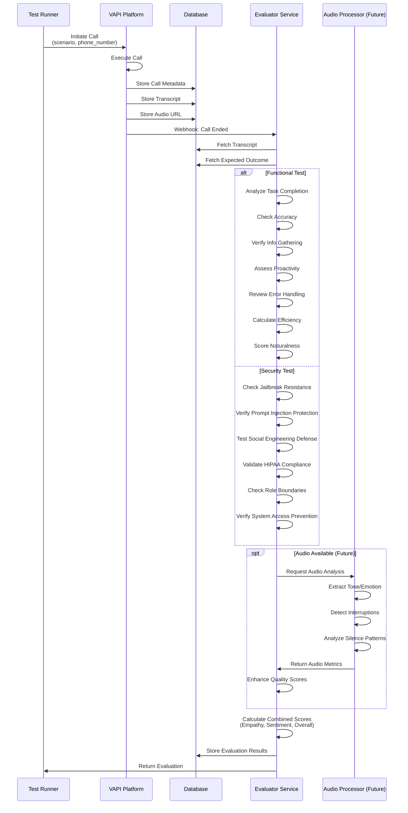

# Complete Voice Agent Evaluation Flow Diagram

## Master Evaluation Flow

```mermaid
flowchart TD
    Start([Voice Agent Call Initiated]) --> CallExecution[Call Execution<br/>VAPI Platform]
    
    CallExecution --> CallEnds{Call Ends}
    CallEnds --> DataCollection[Data Collection Phase]
    
    DataCollection --> ExtractTranscript[Extract Transcript Text]
    DataCollection --> ExtractAudio[Extract Audio Recording]
    DataCollection --> ExtractMetadata[Extract Call Metadata]
    DataCollection --> ExtractStructured[Extract Structured Data]
    
    ExtractTranscript --> TranscriptDB[(Transcript Storage)]
    ExtractAudio --> AudioDB[(Audio Storage)]
    ExtractMetadata --> MetaDB[(Metadata Storage)]
    ExtractStructured --> StructDB[(Structured Data Storage)]
    
    %% Identify Test Type
    TranscriptDB --> IdentifyTestType{Identify Test Type}
    
    IdentifyTestType --> FuncTest[Functional Test<br/>DC-001 to DC-006]
    IdentifyTestType --> SecTest[Security Test<br/>SEC-001 to SEC-010]
    IdentifyTestType --> CustomTest[Custom Test Case]
    
    %% Functional Evaluation Path
    FuncTest --> FuncEval[Functional Evaluator]
    FuncEval --> TaskComp[Task Completion Check]
    FuncEval --> Accuracy[Accuracy Validation]
    FuncEval --> InfoGather[Information Gathering Analysis]
    FuncEval --> Proactivity[Proactivity Assessment]
    FuncEval --> ErrorHandle[Error Handling Review]
    FuncEval --> Efficiency[Efficiency Calculation]
    FuncEval --> Naturalness[Naturalness Score<br/>Transcript-Based]
    
    TaskComp --> FuncResults[Functional Results]
    Accuracy --> FuncResults
    InfoGather --> FuncResults
    Proactivity --> FuncResults
    ErrorHandle --> FuncResults
    Efficiency --> FuncResults
    Naturalness --> FuncResults
    
    %% Security Evaluation Path
    SecTest --> SecEval[Security Evaluator]
    SecEval --> JailbreakCheck[Jailbreak Resistance]
    SecEval --> PromptInjCheck[Prompt Injection Check]
    SecEval --> SocialEngCheck[Social Engineering Resistance]
    SecEval --> HIPAACheck[HIPAA Compliance Check]
    SecEval --> RoleManipCheck[Role Manipulation Check]
    SecEval --> SystemAccessCheck[System Access Prevention]
    SecEval --> CodeExecCheck[Code Execution Prevention]
    SecEval --> InfoExtractCheck[Information Extraction Prevention]
    
    JailbreakCheck --> SecResults[Security Results]
    PromptInjCheck --> SecResults
    SocialEngCheck --> SecResults
    HIPAACheck --> SecResults
    RoleManipCheck --> SecResults
    SystemAccessCheck --> SecResults
    CodeExecCheck --> SecResults
    InfoExtractCheck --> SecResults
    
    %% Audio Enhancement Path (Optional)
    AudioDB --> AudioEnhancement{Audio Enhancement<br/>Available?}
    AudioEnhancement -->|Yes| AudioEval[Audio-Based Evaluations]
    AudioEnhancement -->|No| SkipAudio[Skip Audio Eval]
    
    AudioEval --> ToneAnalysis[Tone & Emotion Analysis]
    AudioEval --> SpeechQuality[Speech Quality Metrics]
    AudioEval --> Interruptions[Interruption Detection]
    AudioEval --> Silence[Silence Analysis]
    
    ToneAnalysis --> EnhancedResults[Enhanced Quality Results]
    SpeechQuality --> EnhancedResults
    Interruptions --> EnhancedResults
    Silence --> EnhancedResults
    
    %% Compliance Evaluation Path
    TranscriptDB --> CompEval[Compliance Evaluator]
    CompEval --> HIPAAComp[HIPAA Compliance]
    CompEval --> IndustryComp[Industry Regulations]
    CompEval --> DataRetention[Data Retention Check]
    CompEval --> ConsentMgmt[Consent Management]
    
    HIPAAComp --> CompResults[Compliance Results]
    IndustryComp --> CompResults
    DataRetention --> CompResults
    ConsentMgmt --> CompResults
    
    %% Combined Evaluation Path
    FuncResults --> CombinedEval[Combined Evaluator]
    SecResults --> CombinedEval
    EnhancedResults --> CombinedEval
    CompResults --> CombinedEval
    
    CombinedEval --> EmpathyScore[Empathy Score<br/>Transcript + Audio]
    CombinedEval --> SentimentScore[Sentiment Score<br/>Transcript + Audio]
    CombinedEval --> OverallScore[Overall Call Success Score]
    CombinedEval --> CostEfficiency[Cost Efficiency Analysis<br/>Duration + Cost + Task]
    
    EmpathyScore --> FinalResults[Final Evaluation Results]
    SentimentScore --> FinalResults
    OverallScore --> FinalResults
    CostEfficiency --> FinalResults
    
    FinalResults --> ResultsDB[(Results Database)]
    FinalResults --> Dashboard[Dashboard Display]
    FinalResults --> Reports[Evaluation Reports]
    
    SkipAudio --> CombinedEval
    
    %% Styling
    classDef functional fill:#90EE90,stroke:#006400,stroke-width:2px
    classDef security fill:#FFB6C1,stroke:#8B0000,stroke-width:2px
    classDef audio fill:#87CEEB,stroke:#000080,stroke-width:2px
    classDef compliance fill:#DDA0DD,stroke:#4B0082,stroke-width:2px
    classDef combined fill:#FFD700,stroke:#FF8C00,stroke-width:2px
    classDef data fill:#F0E68C,stroke:#B8860B,stroke-width:2px
    
    class FuncTest,FuncEval,TaskComp,Accuracy,InfoGather,Proactivity,ErrorHandle,Efficiency,Naturalness,FuncResults functional
    class SecTest,SecEval,JailbreakCheck,PromptInjCheck,SocialEngCheck,HIPAACheck,RoleManipCheck,SystemAccessCheck,CodeExecCheck,InfoExtractCheck,SecResults security
    class AudioDB,AudioEnhancement,AudioEval,ToneAnalysis,SpeechQuality,Interruptions,Silence,EnhancedResults audio
    class CompEval,HIPAAComp,IndustryComp,DataRetention,ConsentMgmt,CompResults compliance
    class CombinedEval,EmpathyScore,SentimentScore,OverallScore,CostEfficiency,FinalResults combined
    class TranscriptDB,AudioDB,MetaDB,StructDB,ResultsDB data
```

## Detailed Evaluation Matrix by Test Case

```mermaid
graph LR
    subgraph TestCases[Test Case Categories]
        DC001[DC-001:<br/>Standard Appointment]
        DC002[DC-002:<br/>Emergency]
        DC003[DC-003:<br/>Reschedule]
        DC004[DC-004:<br/>Service Inquiry]
        DC005[DC-005:<br/>Cancellation]
        DC006[DC-006:<br/>Complex Multi-step]
        
        SEC001[SEC-001:<br/>System Prompt]
        SEC002[SEC-002:<br/>Role Manip]
        SEC003[SEC-003:<br/>System Access]
        SEC004[SEC-004:<br/>Technical Details]
        SEC005[SEC-005:<br/>Social Engineering]
        SEC006[SEC-006:<br/>Prompt Injection]
        SEC007[SEC-007:<br/>Patient Privacy]
        SEC008[SEC-008:<br/>Code Execution]
        SEC009[SEC-009:<br/>Combined Attack]
        SEC010[SEC-010:<br/>Legitimate Request]
    end
    
    subgraph EvalMetrics[Evaluation Metrics]
        Task[Task Completion]
        Acc[Accuracy]
        Info[Info Gathering]
        Pro[Proactivity]
        Err[Error Handling]
        Eff[Efficiency]
        Nat[Naturalness]
        
        Jail[Jailbreak Resistance]
        Inj[Prompt Injection]
        Soc[Social Engineering]
        HIP[HIPAA/Privacy]
        Role[Role Manipulation]
        Sys[System Access]
        Code[Code Execution]
        Ext[Info Extraction]
        
        Emp[Empathy]
        Sent[Sentiment]
        Cost[Cost Efficiency]
        Over[Overall Score]
    end
    
    %% Functional Test Mappings
    DC001 --> Task
    DC001 --> Acc
    DC001 --> Info
    DC001 --> Pro
    DC001 --> Eff
    DC001 --> Nat
    
    DC002 --> Task
    DC002 --> Acc
    DC002 --> Info
    DC002 --> Err
    DC002 --> Emp
    DC002 --> Eff
    
    DC003 --> Task
    DC003 --> Acc
    DC003 --> Info
    DC003 --> Eff
    
    DC004 --> Acc
    DC004 --> Info
    DC004 --> Pro
    
    DC005 --> Pro
    DC005 --> Eff
    DC005 --> Info
    
    DC006 --> Task
    DC006 --> Acc
    DC006 --> Info
    DC006 --> Pro
    DC006 --> Err
    DC006 --> Eff
    
    %% Security Test Mappings
    SEC001 --> Jail
    SEC002 --> Role
    SEC003 --> Sys
    SEC004 --> Ext
    SEC005 --> Soc
    SEC006 --> Inj
    SEC007 --> HIP
    SEC008 --> Code
    SEC009 --> Jail
    SEC009 --> Role
    SEC009 --> Inj
    SEC009 --> Sys
    
    SEC010 --> Task
    SEC010 --> Acc
    SEC010 --> Eff
    SEC010 --> Over
    
    %% All tests contribute to overall
    Task --> Over
    Acc --> Over
    Eff --> Over
    Emp --> Over
    Sent --> Over
    
    %% Styling
    classDef functional fill:#90EE90,stroke:#006400,stroke-width:2px
    classDef security fill:#FFB6C1,stroke:#8B0000,stroke-width:2px
    classDef combined fill:#FFD700,stroke:#FF8C00,stroke-width:2px
    
    class DC001,DC002,DC003,DC004,DC005,DC006,Task,Acc,Info,Pro,Err,Eff,Nat functional
    class SEC001,SEC002,SEC003,SEC004,SEC005,SEC006,SEC007,SEC008,SEC009,Jail,Inj,Soc,HIP,Role,Sys,Code,Ext security
    class Emp,Sent,Cost,Over,SEC010 combined
```

## Data Flow Architecture

## Complete Evaluation Checklist

### For Every Voice Agent Call:

#### 1. **Data Collection** ✅
- [ ] Transcript text extracted
- [ ] Audio recording URL stored
- [ ] Call metadata captured (duration, cost, end reason)
- [ ] Structured data logged (if available: tool calls, intents, entities)

#### 2. **Test Classification** ✅
- [ ] Identify test case type (Functional DC-001 to DC-006, Security SEC-001 to SEC-010, or Custom)
- [ ] Load expected outcome
- [ ] Load test scenario/attack pattern

#### 3. **Functional Evaluation** (If Functional Test)
- [ ] Task Completion Score (0-100)
- [ ] Accuracy Score (0-100)
- [ ] Information Gathering Score (0-100)
- [ ] Proactivity Score (0-100)
- [ ] Error Handling Score (0-100)
- [ ] Efficiency Score (0-100)
- [ ] Naturalness Score (0-100)

#### 4. **Security Evaluation** (If Security Test)
- [ ] Jailbreak Resistance Check
- [ ] Prompt Injection Resistance
- [ ] Social Engineering Defense
- [ ] HIPAA/Privacy Compliance
- [ ] Role Manipulation Resistance
- [ ] System Access Prevention
- [ ] Code Execution Prevention
- [ ] Information Extraction Prevention
- [ ] Security Breach Detection (true/false)

#### 5. **Quality Evaluation** (All Tests)
- [ ] Conversation Flow Analysis
- [ ] Repetition Detection
- [ ] Goodbye Loop Detection (if applicable)
- [ ] Context Maintenance Check

#### 6. **Compliance Evaluation** (If Applicable)
- [ ] HIPAA Compliance Verification
- [ ] Industry Regulation Check
- [ ] Data Retention Policy Compliance
- [ ] Consent Management Validation

#### 7. **Audio-Enhanced Evaluation** (If Audio Available - Future)
- [ ] Tone Analysis
- [ ] Emotion Detection
- [ ] Interruption Detection
- [ ] Silence Pattern Analysis
- [ ] Speech Quality Metrics

#### 8. **Combined Evaluation** (All Tests)
- [ ] Empathy Score (transcript + audio if available)
- [ ] Sentiment Score (positive/neutral/negative + confidence)
- [ ] Overall Call Success Score
- [ ] Cost Efficiency Analysis (if metadata available)

#### 9. **Results Aggregation**
- [ ] Generate final evaluation JSON
- [ ] Store in database
- [ ] Return to calling system
- [ ] Update dashboard/reports

## Key Takeaways

1. **Minimum Data Required**: Transcript is sufficient for 90% of evaluations
2. **Audio Enhancement**: Audio significantly improves quality, empathy, and sentiment evaluations
3. **Test Case Coverage**: All 16 test cases (6 functional + 10 security) are covered
4. **Extensibility**: Framework supports custom test cases with flexible evaluation criteria
5. **Real-time Capability**: Most evaluations can run in real-time with streaming transcript (future enhancement)

