# Voice Agent Call Evaluation Framework

This document outlines all possible evaluation types for voice agent calls and the data formats required for each evaluation.

```mermaid
graph TB
    Start([Voice Agent Call]) --> DataExtraction[Call Data Extraction]
    
    DataExtraction --> Transcript[Transcript Text]
    DataExtraction --> Audio[Audio Recording]
    DataExtraction --> Metadata[Call Metadata]
    DataExtraction --> Structured[Structured Data]
    
    Metadata --> Duration[Duration]
    Metadata --> Cost[Cost]
    Metadata --> EndReason[End Reason]
    Metadata --> Timestamps[Timestamps]
    
    Structured --> ToolCalls[Tool/Function Calls]
    Structured --> Intents[Detected Intents]
    Structured --> Entities[Extracted Entities]
    Structured --> Actions[Agent Actions]
    
    %% Evaluation Categories
    Transcript --> FunctionalEvals[Functional Evaluations]
    Transcript --> SecurityEvals[Security Evaluations]
    Transcript --> QualityEvals[Quality Evaluations]
    Transcript --> ComplianceEvals[Compliance Evaluations]
    
    Audio --> AudioEvals[Audio-Based Evaluations]
    
    Transcript --> CombinedEvals[Combined Evaluations]
    Audio --> CombinedEvals
    Metadata --> CombinedEvals
    Structured --> CombinedEvals
    
    %% Functional Evaluations (Transcript Required)
    FunctionalEvals --> TaskCompletion[Task Completion<br/>✅ Transcript]
    FunctionalEvals --> Accuracy[Accuracy<br/>✅ Transcript]
    FunctionalEvals --> InfoGathering[Information Gathering<br/>✅ Transcript]
    FunctionalEvals --> Proactivity[Proactivity<br/>✅ Transcript]
    FunctionalEvals --> ErrorHandling[Error Handling<br/>✅ Transcript]
    
    %% Security Evaluations (Transcript Required)
    SecurityEvals --> Jailbreak[Jailbreak Resistance<br/>✅ Transcript<br/>✅ Expected Behavior]
    SecurityEvals --> PromptInjection[Prompt Injection<br/>✅ Transcript<br/>✅ Attack Pattern]
    SecurityEvals --> SocialEng[Social Engineering<br/>✅ Transcript<br/>✅ Authority Claims]
    SecurityEvals --> DataPrivacy[Data Privacy/HIPAA<br/>✅ Transcript<br/>✅ PII Detection]
    SecurityEvals --> RoleManip[Role Manipulation<br/>✅ Transcript<br/>✅ Expected Role]
    SecurityEvals --> SystemAccess[System Access Attempts<br/>✅ Transcript<br/>✅ Tool Usage Logs]
    SecurityEvals --> CodeExecution[Code Execution Prevention<br/>✅ Transcript<br/>✅ Command Patterns]
    SecurityEvals --> InfoExtraction[Information Extraction<br/>✅ Transcript<br/>✅ Sensitive Data]
    
    %% Quality Evaluations
    QualityEvals --> Naturalness[Naturalness<br/>✅ Transcript<br/>📊 Audio Enhanced]
    QualityEvals --> Efficiency[Efficiency<br/>✅ Transcript<br/>✅ Duration Metadata]
    QualityEvals --> ConversationFlow[Conversation Flow<br/>✅ Transcript<br/>📊 Audio Enhanced]
    QualityEvals --> Clarity[Clarity & Comprehension<br/>✅ Transcript<br/>📊 Audio Enhanced]
    
    %% Compliance Evaluations
    ComplianceEvals --> HIPAA[HIPAA Compliance<br/>✅ Transcript<br/>✅ PII Logs]
    ComplianceEvals --> IndustryReg[Industry Regulations<br/>✅ Transcript<br/>✅ Reg Guidelines]
    ComplianceEvals --> DataRetention[Data Retention Policies<br/>✅ Metadata<br/>✅ Transcript]
    ComplianceEvals --> Consent[Consent Management<br/>✅ Transcript<br/>✅ Structured Data]
    
    %% Audio-Based Evaluations
    AudioEvals --> ToneAnalysis[Tone & Emotion Analysis<br/>📊 Audio Required<br/>✅ Transcript Context]
    AudioEvals --> SpeechQuality[Speech Quality<br/>📊 Audio Required<br/>✅ Technical Metrics]
    AudioEvals --> Interruptions[Interruption Handling<br/>📊 Audio Required<br/>✅ Transcript]
    AudioEvals --> SilenceDetection[Silence Detection<br/>📊 Audio Required<br/>✅ Transcript]
    AudioEvals --> BackgroundNoise[Background Noise<br/>📊 Audio Required]
    AudioEvals --> VoiceQuality[Voice Quality Metrics<br/>📊 Audio Required]
    
    %% Combined Evaluations
    CombinedEvals --> Empathy[Empathy Assessment<br/>✅ Transcript<br/>📊 Audio Tone]
    CombinedEvals --> Sentiment[Sentiment Analysis<br/>✅ Transcript<br/>📊 Audio Emotion]
    CombinedEvals --> UrgencyHandling[Urgency Handling<br/>✅ Transcript<br/>📊 Audio Stress]
    CombinedEvals --> CustomerSatisfaction[Customer Satisfaction<br/>✅ All Data Sources]
    CombinedEvals --> CostEfficiency[Cost Efficiency<br/>✅ Duration<br/>✅ Cost<br/>✅ Task Completion]
    CombinedEvals --> CallSuccess[Overall Call Success<br/>✅ All Metrics]
    
    %% Test Case Categories
    TaskCompletion -.-> FuncCases[Functional Test Cases<br/>DC-001 to DC-006]
    InfoGathering -.-> FuncCases
    Proactivity -.-> FuncCases
    ErrorHandling -.-> FuncCases
    
    Jailbreak -.-> SecCases[Security Test Cases<br/>SEC-001 to SEC-010]
    PromptInjection -.-> SecCases
    SocialEng -.-> SecCases
    DataPrivacy -.-> SecCases
    RoleManip -.-> SecCases
    SystemAccess -.-> SecCases
    
    %% Styling
    classDef transcriptReq fill:#90EE90,stroke:#006400,stroke-width:2px
    classDef audioReq fill:#FFB6C1,stroke:#8B0000,stroke-width:2px
    classDef combinedReq fill:#87CEEB,stroke:#000080,stroke-width:2px
    classDef metadataReq fill:#DDA0DD,stroke:#4B0082,stroke-width:2px
    
    class TaskCompletion,Accuracy,InfoGathering,Proactivity,ErrorHandling transcriptReq
    class Jailbreak,PromptInjection,SocialEng,DataPrivacy,RoleManip,SystemAccess,CodeExecution,InfoExtraction transcriptReq
    class Naturalness,ConversationFlow,Clarity transcriptReq
    class HIPAA,IndustryReg,Consent transcriptReq
    
    class ToneAnalysis,SpeechQuality,Interruptions,SilenceDetection,BackgroundNoise,VoiceQuality audioReq
    
    class Empathy,Sentiment,UrgencyHandling,CustomerSatisfaction combinedReq
    class Efficiency,CostEfficiency,DataRetention metadataReq
```

## Evaluation Type Matrix

### Legend
- ✅ **Required**: Evaluation cannot work without this data
- 📊 **Enhanced**: Evaluation works with transcript but significantly better with audio
- ⚠️ **Optional**: Nice to have but not essential

### Evaluation Categories

#### 1. **Functional Evaluations** (Transcript-Based)
Evaluate the agent's ability to complete tasks and handle business logic.

| Evaluation Type | Transcript | Audio | Metadata | Structured Data | Current Status |
|----------------|:----------:|:-----:|:--------:|:---------------:|:--------------:|
| Task Completion | ✅ | ⚠️ | ⚠️ | ✅ | ✅ Implemented |
| Accuracy | ✅ | ⚠️ | ⚠️ | ⚠️ | ✅ Implemented |
| Information Gathering | ✅ | ⚠️ | ⚠️ | ✅ | ✅ Implemented |
| Proactivity | ✅ | 📊 | ⚠️ | ⚠️ | ✅ Implemented |
| Error Handling | ✅ | 📊 | ⚠️ | ⚠️ | ✅ Implemented |
| Intent Recognition | ✅ | ⚠️ | ⚠️ | ✅ | 🔲 Not Yet |
| Entity Extraction | ✅ | ⚠️ | ⚠️ | ✅ | 🔲 Not Yet |
| Multi-step Task Handling | ✅ | ⚠️ | ✅ | ✅ | 🔲 Not Yet |

#### 2. **Security Evaluations** (Transcript-Based with Attack Patterns)
Evaluate resistance to attacks and security breaches.

| Evaluation Type | Transcript | Audio | Metadata | Attack Pattern | Current Status |
|----------------|:----------:|:-----:|:--------:|:--------------:|:--------------:|
| Jailbreak Resistance | ✅ | ⚠️ | ⚠️ | ✅ | ✅ Implemented |
| Prompt Injection | ✅ | ⚠️ | ⚠️ | ✅ | ✅ Implemented |
| Social Engineering | ✅ | 📊 | ⚠️ | ✅ | ✅ Implemented |
| Data Privacy/HIPAA | ✅ | ⚠️ | ⚠️ | ✅ | ✅ Implemented |
| Role Manipulation | ✅ | ⚠️ | ⚠️ | ✅ | ✅ Implemented |
| System Access Attempts | ✅ | ⚠️ | ⚠️ | ✅ | ✅ Implemented |
| Code Execution Prevention | ✅ | ⚠️ | ⚠️ | ✅ | ✅ Implemented |
| Information Extraction | ✅ | ⚠️ | ⚠️ | ✅ | ✅ Implemented |
| Authority Impersonation | ✅ | 📊 | ⚠️ | ✅ | ✅ Implemented |
| Bulk/Abuse Prevention | ✅ | ⚠️ | ✅ | ✅ | 🔲 Not Yet |
| PII Leak Detection | ✅ | ⚠️ | ⚠️ | ✅ | 🔲 Not Yet |
| Tool/Function Abuse | ✅ | ⚠️ | ⚠️ | ✅ | 🔲 Not Yet |

#### 3. **Quality Evaluations** (Transcript-Based, Audio-Enhanced)
Evaluate conversation quality and user experience.

| Evaluation Type | Transcript | Audio | Metadata | Current Status |
|----------------|:----------:|:-----:|:--------:|:--------------:|
| Naturalness | ✅ | 📊 | ⚠️ | ✅ Implemented |
| Efficiency | ✅ | ⚠️ | ✅ | ✅ Implemented |
| Conversation Flow | ✅ | 📊 | ⚠️ | ✅ Implemented |
| Clarity & Comprehension | ✅ | 📊 | ⚠️ | 🔲 Not Yet |
| Repetition Detection | ✅ | ⚠️ | ⚠️ | ✅ Implemented* |
| Goodbye Loop Detection | ✅ | ⚠️ | ⚠️ | ✅ Implemented* |
| Context Maintenance | ✅ | ⚠️ | ⚠️ | 🔲 Not Yet |
| Turn-taking Quality | ✅ | 📊 | ⚠️ | 🔲 Not Yet |

*Partially implemented in efficiency evaluation

#### 4. **Audio-Based Evaluations** (Audio Required)
Require audio analysis for accurate assessment.

| Evaluation Type | Transcript | Audio | Metadata | Current Status |
|----------------|:----------:|:-----:|:--------:|:--------------:|
| Tone Analysis | ✅ | ✅ | ⚠️ | 🔲 Not Yet |
| Emotion Detection | ✅ | ✅ | ⚠️ | 🔲 Not Yet |
| Speech Quality | ⚠️ | ✅ | ⚠️ | 🔲 Not Yet |
| Interruption Handling | ✅ | ✅ | ⚠️ | 🔲 Not Yet |
| Silence Detection | ✅ | ✅ | ⚠️ | 🔲 Not Yet |
| Background Noise | ⚠️ | ✅ | ⚠️ | 🔲 Not Yet |
| Voice Quality Metrics | ⚠️ | ✅ | ⚠️ | 🔲 Not Yet |
| Speaking Rate Analysis | ✅ | ✅ | ⚠️ | 🔲 Not Yet |
| Accent/Clarity | ⚠️ | ✅ | ⚠️ | 🔲 Not Yet |

#### 5. **Compliance Evaluations** (Transcript + Guidelines)
Ensure regulatory and policy compliance.

| Evaluation Type | Transcript | Audio | Guidelines | Current Status |
|----------------|:----------:|:-----:|:----------:|:--------------:|
| HIPAA Compliance | ✅ | ⚠️ | ✅ | ✅ Implemented |
| Industry Regulations | ✅ | ⚠️ | ✅ | 🔲 Not Yet |
| Data Retention | ✅ | ⚠️ | ✅ | 🔲 Not Yet |
| Consent Management | ✅ | ⚠️ | ✅ | 🔲 Not Yet |
| Disclosure Requirements | ✅ | ⚠️ | ✅ | 🔲 Not Yet |
| Right to Information | ✅ | ⚠️ | ✅ | 🔲 Not Yet |

#### 6. **Combined Evaluations** (Multiple Data Sources)
Require multiple data types for comprehensive assessment.

| Evaluation Type | Transcript | Audio | Metadata | Structured | Current Status |
|----------------|:----------:|:-----:|:--------:|:----------:|:--------------:|
| Empathy Assessment | ✅ | 📊 | ⚠️ | ⚠️ | ✅ Implemented |
| Sentiment Analysis | ✅ | 📊 | ⚠️ | ⚠️ | ✅ Implemented |
| Urgency Handling | ✅ | 📊 | ⚠️ | ⚠️ | 🔲 Not Yet |
| Customer Satisfaction | ✅ | 📊 | ✅ | ✅ | 🔲 Not Yet |
| Cost Efficiency | ✅ | ⚠️ | ✅ | ⚠️ | 🔲 Not Yet |
| Overall Call Success | ✅ | 📊 | ✅ | ✅ | ✅ Implemented |

## Test Case Categories Mapping

### Functional Test Cases (DC-001 to DC-006)
**Data Needed**: Transcript ✅, Expected Outcome ✅

- **DC-001**: Standard Appointment - Tests Task Completion, Info Gathering, Efficiency
- **DC-002**: Emergency Appointment - Tests Empathy, Error Handling, Urgency Handling
- **DC-003**: Reschedule - Tests Info Gathering, Accuracy, Efficiency
- **DC-004**: Service Inquiry - Tests Accuracy, Info Gathering, Proactivity
- **DC-005**: Cancellation - Tests Proactivity, Efficiency, Info Gathering
- **DC-006**: Complex Multi-step - Tests All Functional Metrics

### Security Test Cases (SEC-001 to SEC-010)
**Data Needed**: Transcript ✅, Attack Scenario ✅, Expected Behavior ✅

- **SEC-001**: System Prompt Extraction - Tests Jailbreak Resistance
- **SEC-002**: Role Manipulation - Tests Role Manipulation Resistance
- **SEC-003**: System Access - Tests System Access Prevention
- **SEC-004**: Technical Details - Tests Information Extraction Prevention
- **SEC-005**: Social Engineering - Tests Authority Impersonation Resistance
- **SEC-006**: Prompt Injection - Tests Prompt Injection Resistance
- **SEC-007**: Patient Data Privacy - Tests HIPAA Compliance, Data Privacy
- **SEC-008**: Code Execution - Tests Code Execution Prevention
- **SEC-009**: Combined Attack - Tests Multiple Security Boundaries
- **SEC-010**: Legitimate Request - Tests False Positive Prevention

## Data Format Requirements Summary

### Transcript-Based Evaluations (Current Implementation)
✅ **Works Now** - All functional, security, quality, and compliance evaluations can run with just transcripts.

**Required Data**:
- Full call transcript (text)
- Test scenario/expected outcome
- For security tests: attack pattern and expected behavior

**Current Limitations**:
- Cannot detect audio-specific issues (tone, interruptions, silence)
- Limited emotion/empathy detection (text-based only)
- Cannot assess speech quality

### Audio-Enhanced Evaluations (Future Implementation)
📊 **Enhanced with Audio** - Better accuracy when audio is available.

**Additional Data Needed**:
- Audio recording URL (MP3/WAV)
- Audio analysis tools (speech-to-text quality, tone analysis, emotion detection)

**Benefits**:
- More accurate empathy and sentiment analysis
- Detect interruptions and awkward pauses
- Assess speech quality and naturalness
- Better tone analysis

### Combined Evaluations (Optimal Implementation)
✅ **Works Best** - Uses multiple data sources for comprehensive assessment.

**Data Needed**:
- Transcript ✅
- Audio (for enhanced metrics) 📊
- Call metadata (duration, cost, timestamps) ✅
- Structured data (tool calls, intents, entities) ⚠️

## Implementation Roadmap

### Phase 1: Current (Transcript-Only) ✅
- [x] Functional evaluations
- [x] Security evaluations
- [x] Quality evaluations (text-based)
- [x] Compliance checks (text-based)
- [x] Basic sentiment analysis

### Phase 2: Enhanced (Audio Integration) 🔄
- [ ] Audio processing pipeline
- [ ] Tone and emotion analysis
- [ ] Interruption detection
- [ ] Silence analysis
- [ ] Enhanced empathy scoring

### Phase 3: Advanced (Combined Analytics) 🔲
- [ ] Structured data extraction
- [ ] Multi-source evaluation aggregation
- [ ] Predictive analytics
- [ ] Cost efficiency analysis
- [ ] Customer satisfaction scoring

## Notes

1. **Minimum Viable Evaluation**: Most evaluations work with transcript only (✅ Current state)
2. **Enhanced Accuracy**: Adding audio significantly improves quality, empathy, and sentiment evaluations (📊 Phase 2)
3. **Comprehensive Analysis**: Full evaluation requires transcript + audio + metadata + structured data (✅ Phase 3)
4. **Real-time vs Post-Call**: Most evaluations happen post-call, but some could be real-time with streaming transcript
5. **Cost Considerations**: Audio processing adds computational cost, but improves accuracy for quality metrics

